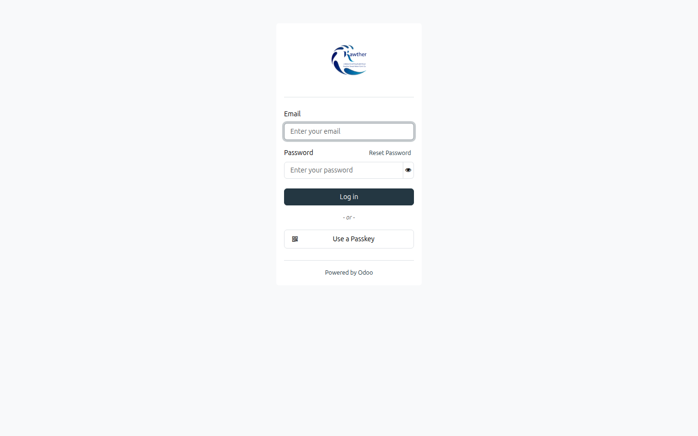
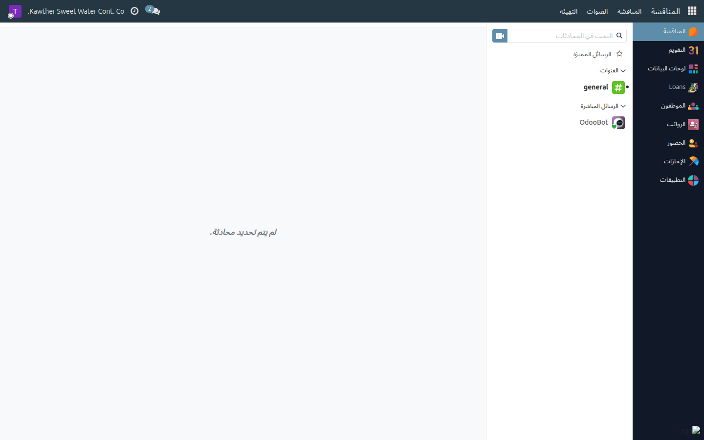
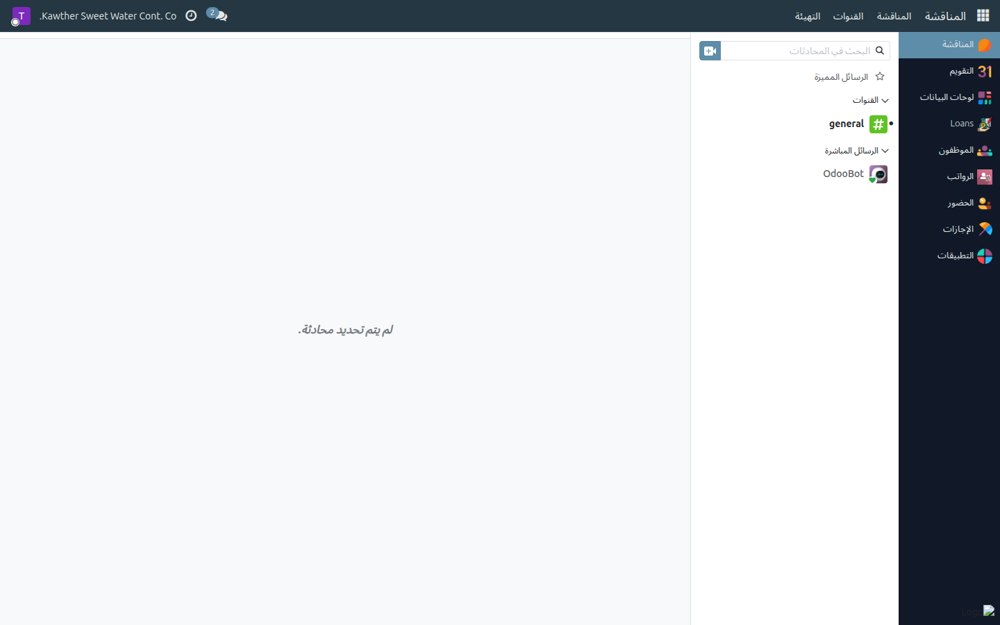
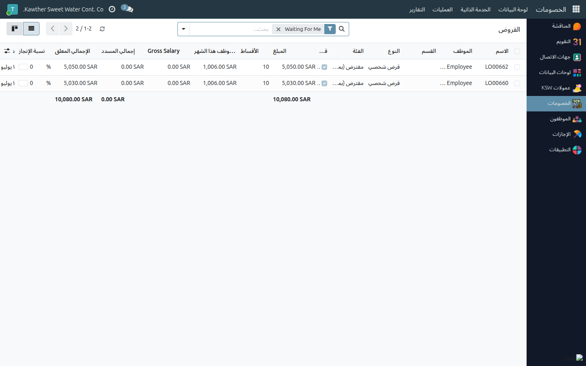
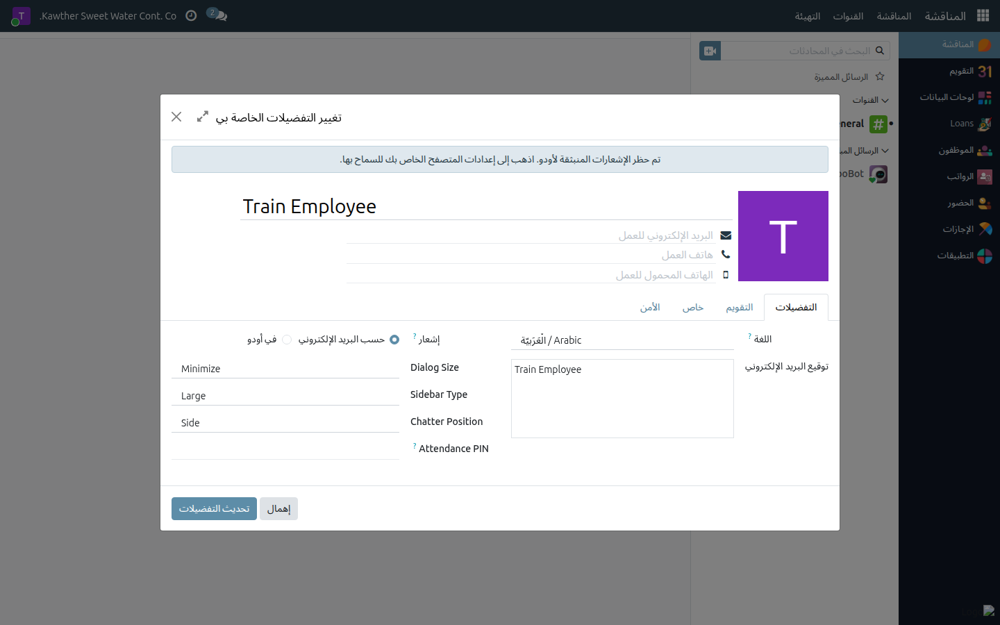

# دليل البدء السريع — النظام الموحّد لإدارة الموارد البشرية

**الجمهور المستهدف:** جميع المستخدمين — ابدأ هنا قبل أي دليل آخر
**الوقت المقدّر:** ٥ دقائق

---

## الدخول إلى النظام

أدخِل عنوان النظام الداخلي في المتصفح (يزوّدك به مسؤول تقنية المعلومات)، ثم عبّئ
**اسم المستخدم** وكلمة المرور وأكِّد بالضغط على **تسجيل الدخول**.

بمجرد تسجيل الدخول تظهر **الصفحة الرئيسية** — مجموعة أيقونات التطبيقات المتاحة
لحسابك. لن تظهر التطبيقات التي تتجاوز صلاحياتك.

---

## التنقّل بين الأقسام والشاشات

| العنصر | الوظيفة |
|--------|---------|
| **القائمة الجانبية** (أيقونات اليمين) | الانتقال بين تطبيقات النظام: الإجازات، السلف الخاصة، الحضور، الرواتب… |
| **القوائم الفرعية** (أعلى الصفحة) | تصفية العرض داخل التطبيق (مثلًا: إجازاتي / الإدارة) |
| **شريط البحث** | البحث السريع عن موظف أو سجل بعينه |
| **أيقونة الجرس** | صندوق الوارد — يتضمّن كل الإشعارات والطلبات الواردة |

---

## صندوق الوارد والإشعارات

الجرس في أعلى اليمين هو مركز الإشعارات؛ يصلك فيه كل طلب اعتماد أو ردّ عليه أو
رسالة تخصّك داخل سير العمل. اضغط الإشعار مباشرةً لفتح السجل المرتبط دون الحاجة
إلى التنقّل اليدوي.

> **تنبيه:** إن وصلك إشعار لطلب اعتماد، افتحه في أقرب وقت؛ تأخير الاعتماد قد يُؤثّر
> على مسارات الرواتب أو الإجازات المرتبطة.

---

## مرشّح «بانتظاري»

افتح أي قائمة (إجازات، سلف خاصة، خصومات…) وستجد مرشّح **بانتظاري** في شريط التصفية.
فعّله ليُظهر فقط السجلات التي تنتظر إجراءً منك أنت — مثالي للبدء في يوم العمل
دون تصفّح طويل.

---

## ضبط لغة الواجهة

١. اضغط **اسم حسابك** (أو صورته) في أعلى اليمين.
٢. اختر **التفضيلات**.
٣. حدّد **اللغة** ← **العربية** (أو الإنجليزية حسب رغبتك).
٤. اضغط **حفظ** — تُعاد تحميل الصفحة بالإعدادات الجديدة.

---

## تغيير كلمة المرور

من **التفضيلات ← كلمة المرور** يمكنك تغيير كلمة مرورك بنفسك. في حال نسيانها أو
قفل حسابك، تواصل مع **مسؤول تقنية المعلومات** لإعادة التعيين.

---

## مشكلات بدء الاستخدام الشائعة

| العَرَض | السبب المحتمل | الحل |
|---------|--------------|------|
| فشل تسجيل الدخول | اسم مستخدم أو كلمة مرور خاطئة | تحقّق من الإدخال؛ اطلب إعادة التعيين من تقنية المعلومات |
| تطبيق غير ظاهر في الصفحة الرئيسية | صلاحياتك لا تشمله | اطلب من مسؤول النظام منحك الوصول المناسب |
| إشعارات لا تصل | إعدادات البريد أو الإشعارات | راجع صندوق الوارد يدويًا؛ أبلغ مسؤول النظام إن استمرّت المشكلة |
| الصفحة بطيئة أو لا تستجيب | اتصال الشبكة أو التصفّح المتراكم | أعِد تحميل الصفحة (F5)؛ جرّب متصفحًا آخر |

