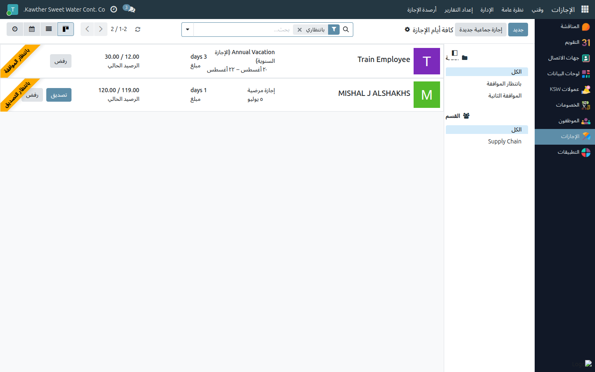
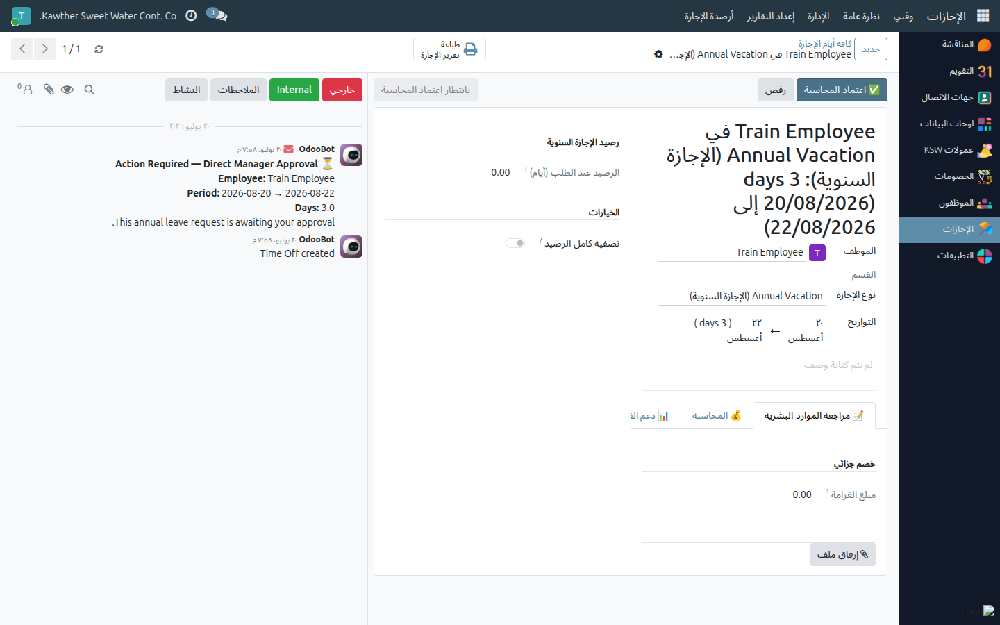

# الإجازات: اعتماد المحاسبة

**الفئة المستهدفة:** المحاسبة
**الوقت المقدّر:** ١–٢ دقيقة لكل طلب

## نظرة عامة

يُتيح لك هذا الدليل إتمام **اعتماد المحاسبة** في مسار الإجازة السنوية — المرحلة
الرابعة بعد الاعتماد الأولي للمدير العام، وقبل الاعتماد النهائي له. مهمّتك
إدخال الأرقام المالية المتعلقة بأجر الإجازة.

## أين تجد الطلبات

افتح تطبيق **الإجازات ← الإدارة ← الإجازات**. ابحث عن الطلبات في مرحلة
**بانتظار اعتماد المحاسبة**.

## الخطوات

1. **افتح الإجازات ← الإدارة ← الإجازات** وافتح الطلب عند مرحلة
   **بانتظار اعتماد المحاسبة**.
   

2. افتح تبويب **المحاسبة** — أكمِل حقول **أجر الإجازة** وأي بيانات أخرى تُطلَب
   في هذه الخطوة.
   

3. اضغط **اعتماد (المحاسبة)** — تنتقل الإجازة إلى **بانتظار الاعتماد النهائي
   للمدير العام**. (أو **رفض** مع ذكر السبب إن وجد خلل في الأرقام.)

## ما يحدث بعد ذلك

ينتقل الطلب إلى **الاعتماد النهائي للمدير العام**، ثم بعد اعتماده ينتقل إلى
**الموارد البشرية** لتأكيد النموذج الموقَّع وإتمام الاعتماد.

## مشكلات شائعة

| العَرَض | السبب | الحل |
|---|---|---|
| لا يوجد زر الاعتماد | الطلب ليس في مرحلة المحاسبة | راجع شريط الحالة |
| أرقام الإجازة تبدو غلطة | بيانات الراتب أو المدة غير دقيقة | تواصل مع الموارد البشرية للمراجعة قبل الاعتماد |

## أدلة ذات صلة

- [السلف الخاصة: الاعتماد والصرف](02-loan-approval-disbursement.md)

