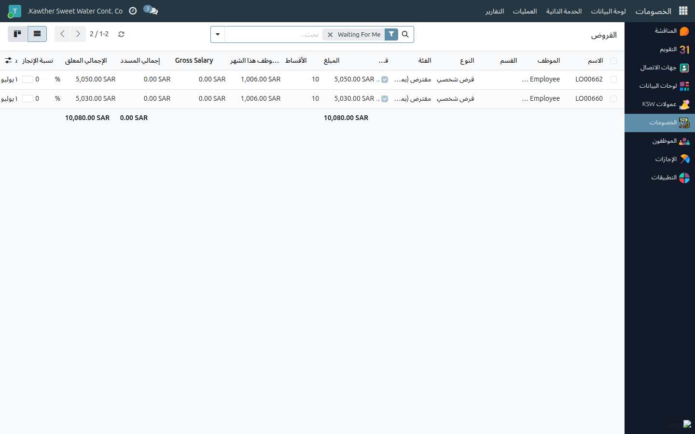
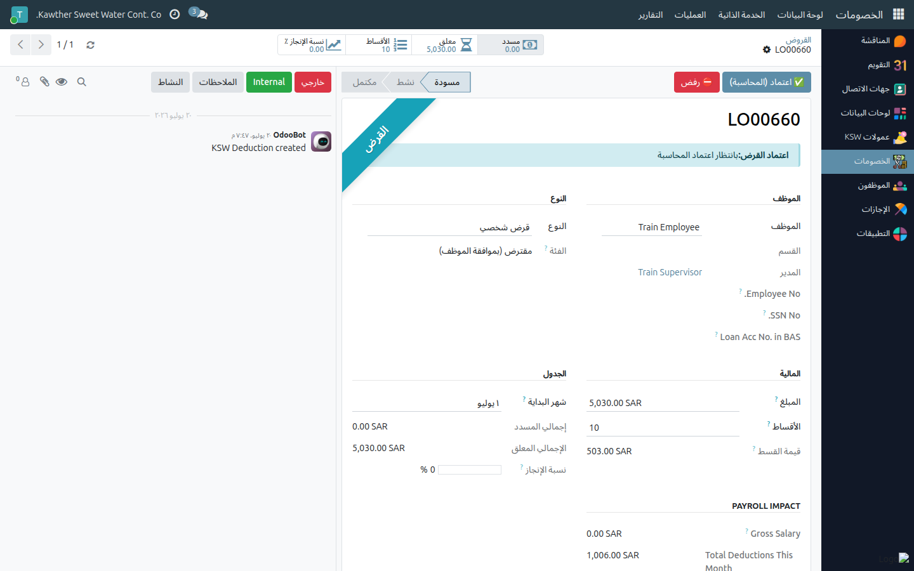
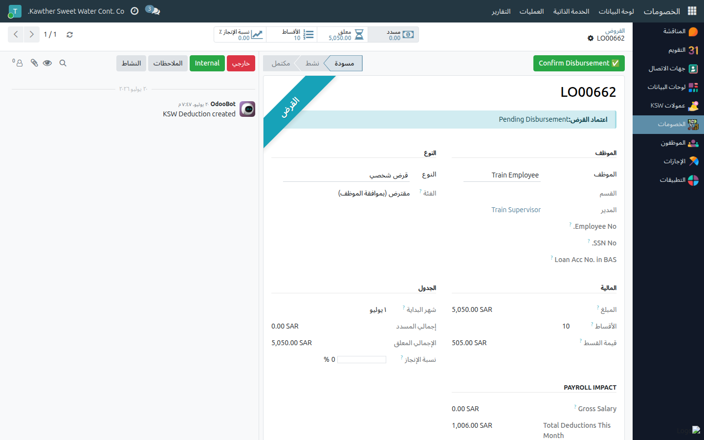

# السلف الخاصة: الاعتماد والصرف

**الفئة المستهدفة:** المحاسبة
**الوقت المقدّر:** ١–٢ دقيقة لكل سلفة

## نظرة عامة

تتضمّن مسؤوليتك في مسار السلف الخاصة **مرحلتين** رئيسيتين:
1. **اعتماد المحاسبة** (بعد الموارد البشرية، وقبل المدير العام).
2. **تأكيد الصرف** — الإجراء الأخير الذي يُفعّل السلفة الخاصة ويُطلِق أقساطها.

## ملاحظات أولية

- تجد السلف الخاصة في **الخصومات ← العمليات ← السلف الخاصة**؛ تفتح القائمة على **بانتظاري**
  تلقائيًا.

## الخطوات — اعتماد المحاسبة

1. **افتح الخصومات ← العمليات ← السلف الخاصة.** تفتح القائمة على **بانتظاري** تلقائيًا.
   

2. **افتح السلفة الخاصة**، وراجع المبلغ وعدد الأقساط وخصومات الموظف الأخرى في تبويب
   **دعم القرار**. ضع إشارة تأكيد الميزانية عند الاقتضاء.

3. اضغط **اعتماد (المحاسبة)** — تنتقل السلفة الخاصة إلى **بانتظار الاعتماد النهائي
   للمدير العام**. (أو اضغط **رفض** مع ذكر السبب.)
   

## الخطوات — تأكيد الصرف

بعد الاعتماد النهائي للمدير العام، تصل السلفة الخاصة إلى **بانتظار الصرف** ويُشعَر
الموظف بجاهزية صرف مبلغها.

1. افتح السلفة الخاصة واضغط **تأكيد الصرف**.
   

2. تصبح السلفة الخاصة **نشطة**. تظهر أقساطها تلقائيًا على كشوف رواتب الموظف.

## ما يحدث بعد ذلك

بعد تفعيل السلفة الخاصة يُخصَم كل قسط معلّق عند تشغيل دفعة الرواتب. إن سدّد الموظف
خارج الرواتب لاحقًا، تتولّى **الموارد البشرية** ذلك — راجع
[الموارد البشرية ← تعديل الخصومات وإدارة الأقساط](../hr/04-modify-deductions.md).

## مشكلات شائعة

| العَرَض | السبب | الحل |
|---|---|---|
| لا يوجد زر **تأكيد الصرف** | السلفة الخاصة لم تصل مرحلة الصرف أو تنقصك صلاحية الصرف | راجع الحالة الراهنة؛ تحقّق من صلاحياتك |
| الأقساط لا تُخصَم | السلفة الخاصة لم تُصرَف بعد | يجب أن تكون السلفة الخاصة **نشطة** أولًا |

## أدلة ذات صلة

- [إنشاء جزاء](05-create-penalties.md)

