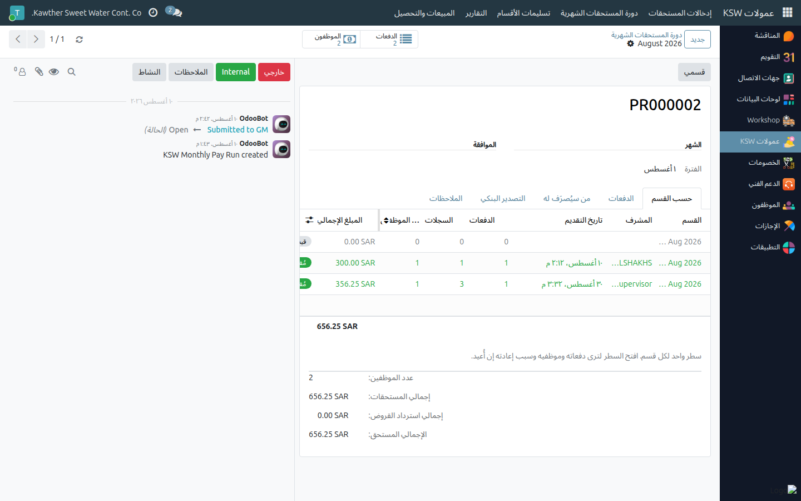
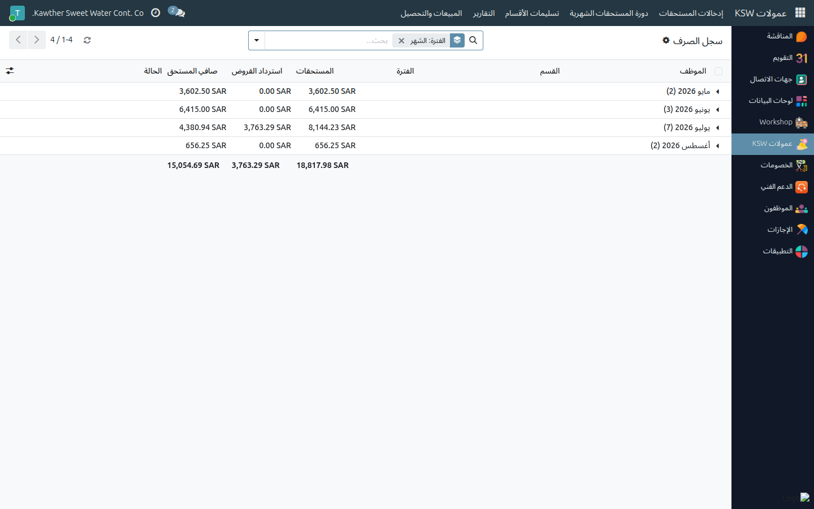
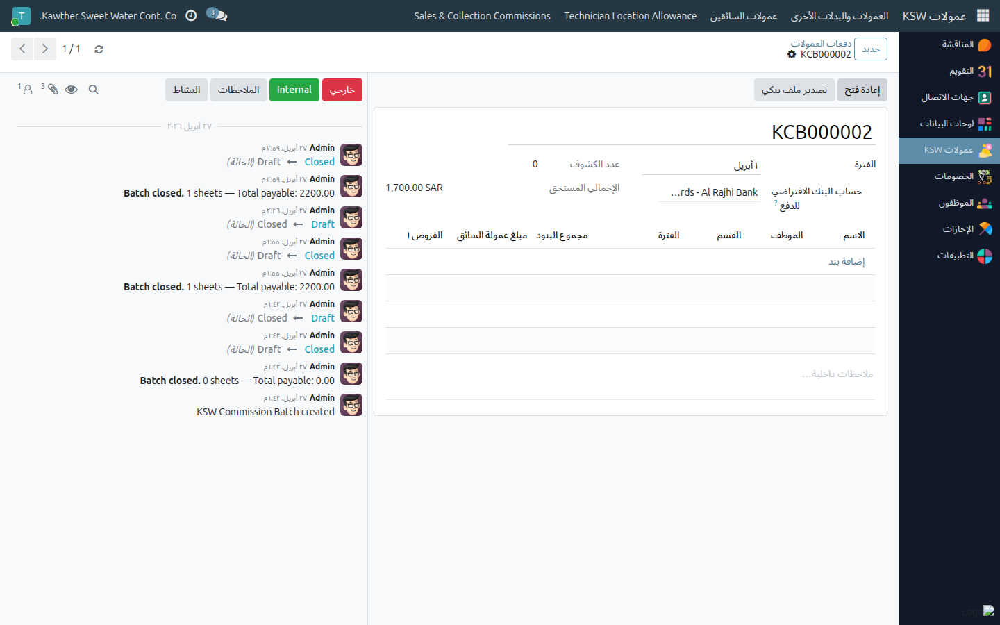

# تصدير العمولات والمستحقات (المحاسبة)

**الفئة المستهدفة:** المحاسبة (محاسب العمولات)
**الوقت المقدّر:** ٥–١٠ دقائق شهريًا

## نظرة عامة

بعد أن يعتمد المديرون العامّون عمولات الشهر ومستحقاته، تُراجع **سجل الصرف**،
وتُصدّر **ملف التحويل البنكي**، ثم تُعلّم الشهر **مصروفًا**.

> **هذا حلّ محلّ كشوف العمولات القديمة.** لم تعد هناك كشوف عمولات لكل موظف
> تُعتمَد، ولا دفعة عمولات تُقفَل. يُبنى سجل الصرف تلقائيًا
> عند اعتماد الشهر — سطر واحد لكل موظف، لا يُكتَب يدويًا.

> **عمولات المبيعات والتحصيل ليست في هذا الملف.** تُحتسَب في صفحتها الخاصة
> وتُصرَف بشكل منفصل.

## ملاحظات أولية

- يجب أن يكون الشهر في حالة **معتمد**. فإن كان ما زال مفتوحًا أو مُقدَّمًا،
  فهناك مدير عام لم يُنهِ اعتماده — ولن يظهر زر **تصدير ملف التحويل البنكي**.
- يُصرَف للموظفين على حساباتهم البنكية الخاصة بالراتب؛ ومن ليس له حساب يُصرَف له
  على **الحساب البنكي الصارف الافتراضي** المحدّد في الشهر. اضبطه قبل التصدير إن كان
  لديك موظفون من هذا النوع.

## الخطوات

1. **افتح العمولات ← دورة المستحقات الشهرية** واختر الشهر المعتمد.
   

2. **راجع السجل.** يعرض تبويب **من سيُصرَف له** كل موظف: **المستحقات**
   و**استرداد القروض** و**صافي المستحق** (= المستحقات − استرداد القروض). افتح إدخالات السطر لترى بالتفصيل ما كوّن المستحقات.
   

3. **صحّح مبلغ القرض إن كان خاطئًا.** ما زال بإمكانك تعديل **استرداد القروض**
   لموظف في شهر معتمد قبل إصدار الملف؛ ويُعاد احتساب الصافي.

4. اضغط **تصدير ملف التحويل البنكي**، واختر الصيغة في النافذة
   ونزّل الملف. تُجمَّع الأسطر حسب الحساب البنكي الصارف لكل موظف.
   

5. اضغط **تعليم كمصروف** بعد تنفيذ التحويل.

## التقارير

**العمولات ← التقارير ← سجل الصرف** هو البيانات نفسها في قائمة قابلة
للبحث عبر الأشهر ومُجمَّعة حسب القسم — استخدمها للمطابقة بدل فتح كل شهر على حدة.

## ما يحدث بعد ذلك

يبقى الشهر مُقفَلًا. وأقساط القروض المُسوّاة صارت مُعلَّمة مسدَّدة على قروض
الموظفين، فلا حاجة إلى تسجيلها مرتين.

وإن لزم تصحيح حقيقي بعد الاعتماد، فلا يستطيع **إعادة فتح** الشهر إلا **المدير
العام للشركة** — وهو ما يُعيد الأقساط المُسوّاة إلى «منتظِرة» ويُحوّل السجل إلى
معاينة. اطلب ذلك بدل الالتفاف عليه.

## مشكلات شائعة

| العَرَض | السبب | الحل |
|---|---|---|
| لا يظهر زر **تصدير ملف التحويل البنكي** | الشهر غير معتمد بعد | ما زال لدى أحد المديرين العامّين أقسام لاعتمادها — راجع **حسب القسم** |
| موظف غائب عن السجل | قسمه لم يُعتمَد أو لم يُسلَّم أصلًا | رسالة الاعتماد في المحادثة تذكر الأقسام المستبعدة وسببها |
| موظف بلا حساب بنكي في الملف | لا يوجد حساب راتب في سجله | اضبط **الحساب البنكي الصارف الافتراضي** للشهر، أو اطلب من الموارد البشرية إضافة حسابه |
| الصافي غير ما توقّعه المشرف | سُوّيت أقساط قروض من العمولة | افتح إدخالات السطر وقرض الموظف لترى ما استُقطع |
| أحتاج تعديل مبلغ | الشهر مُقفَل | لا يُعيد فتحه إلا المدير العام للشركة |

## أدلة ذات صلة

- المشرف: [الدورة الشهرية](../supervisor/06-commission-monthly-cycle.md)
- المدير العام: [اعتماد عمولات الشهر](../gm/04-commission-approval.md)
- الرواتب: [تصدير ملف التحويل البنكي](../payroll/03-bank-file-export.md)

