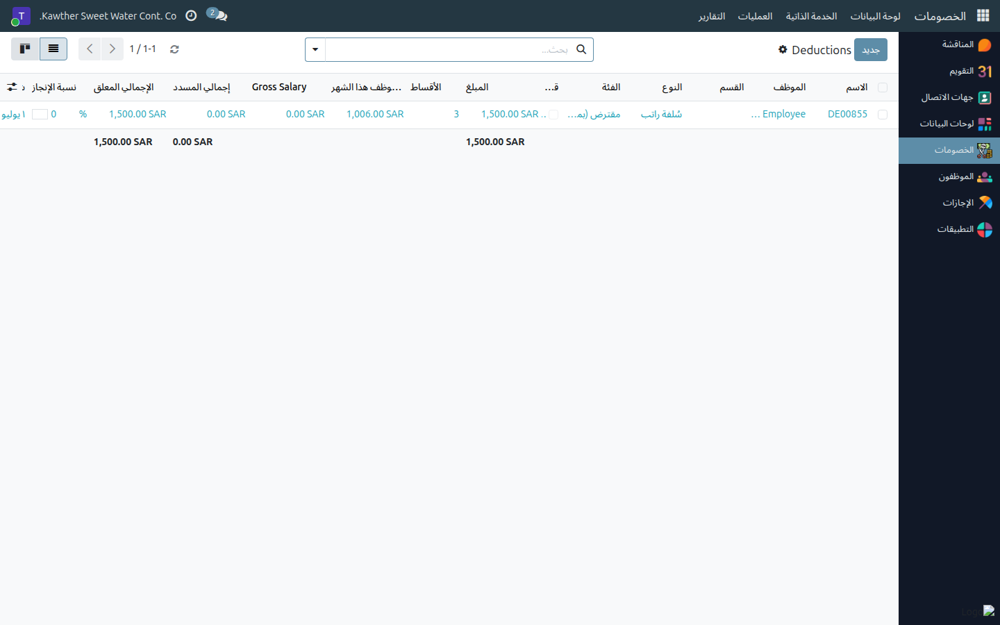
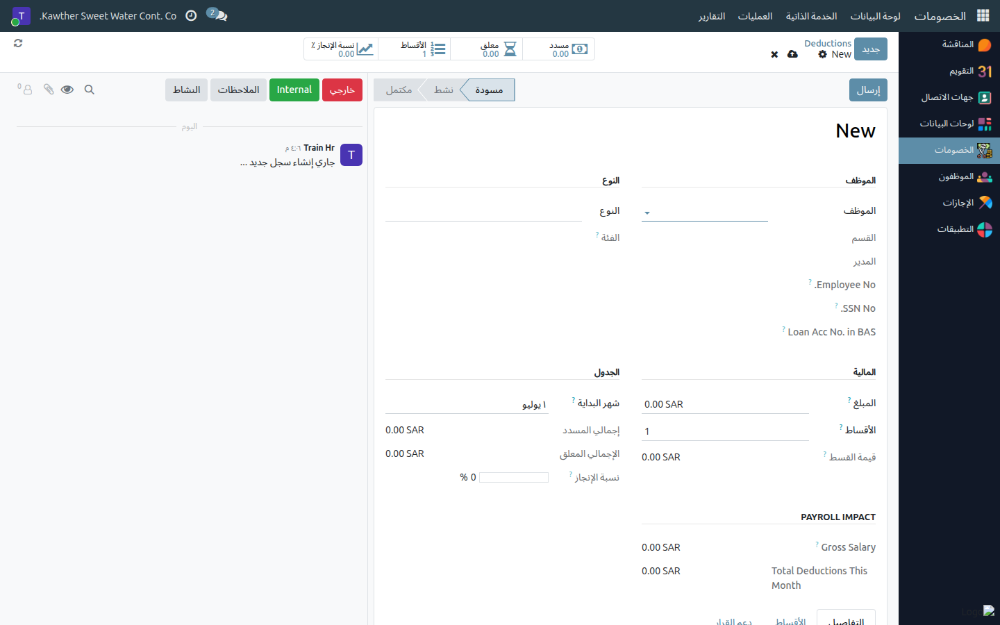

# إنشاء جزاء حكومي أو جزاء داخلي

**الفئة المستهدفة:** المحاسبة
**الوقت المقدّر:** دقيقتان

---

## الجزاءات — اختصاص المحاسبة حصرًا

الجزاءات بنوعيها — الحكومي والداخلي — تُنشئها المحاسبة مباشرةً في النظام؛
وتُوزَّع خصوماتها تلقائيًا على كشوف رواتب الأشهر المحدَّدة.

| نوع الجزاء | أمثلة |
|-----------|-------|
| **جزاء حكومي** | غرامات هيئة التأمينات الاجتماعية (GOSI)، وزارة الموارد البشرية |
| **جزاء داخلي** | مخالفات لوائح الشركة، التأخر المتكرّر |

> **ملاحظة:** سلف الرواتب تُنشئها **الموارد البشرية** لا المحاسبة — راجع
> [إنشاء سلفة راتب](../hr/03-create-deductions.md).

---

## ما تحتاجه قبل البدء

- اسم الموظف.
- نوع الجزاء: حكومي أو داخلي.
- المبلغ الإجمالي وعدد الأقساط (غالبًا قسط واحد للجزاءات الفورية).
- مرجع القرار أو رقم المخالفة (للتوثيق).

---

## الخطوات

١. افتح **الخصومات ← العمليات ← الخصومات** من القائمة الجانبية، ثم اضغط
   **جديد**.

   

٢. اختر **الموظف** من القائمة، ثم حدّد نوع الخصم: **جزاء حكومي** أو
   **جزاء داخلي**.

٣. أدخِل **المبلغ الإجمالي** و**عدد الأقساط** و**شهر البدء**. يُنشئ النظام
   جدول الأقساط تلقائيًا في تبويب **الأقساط**.

   

٤. أضف **ملاحظة** في الحقل المخصّص: رقم القرار، تاريخ المخالفة، المرجع
   الرسمي. هذا التوثيق ضروري للمراجعات الداخلية والخارجية.

٥. اضغط **إرسال** — يُفعَّل الجزاء ويبدأ الاقتطاع في الشهر المحدَّد.

---

## ما يحدث بعد التفعيل

- كل قسط معلّق يُدرَج تلقائيًا في دفعة الرواتب الشهرية.
- يظهر الخصم للموظف في بند **إجمالي الخصومات** بكشف راتبه بوضوح.
- عند سداد جميع الأقساط، يُعلَّم الجزاء **مكتملًا** تلقائيًا دون تدخّل يدوي.

---

## مشكلات شائعة

| العَرَض | السبب | الحل |
|---------|-------|------|
| لا أجد نوع «جزاء حكومي / داخلي» في القائمة | أنواع الخصومات لم تُضبَط في النظام | تواصل مع مسؤول النظام لإضافة هذه الأنواع |
| الخصم لا يظهر في راتب الموظف | السجل في حالة مسودة | تأكّد من الضغط على **إرسال** لا على حفظ فقط |
| أريد تعديل قسط بعد التفعيل | الجزاء نشط | راجع [تعديل الخصومات](../hr/04-modify-deductions.md) للتحديث اليدوي |

---

## أدلة ذات صلة

- [السلف الخاصة: الاعتماد والصرف](02-loan-approval-disbursement.md)
- [تعديل الخصومات وإدارة الأقساط](../hr/04-modify-deductions.md)

