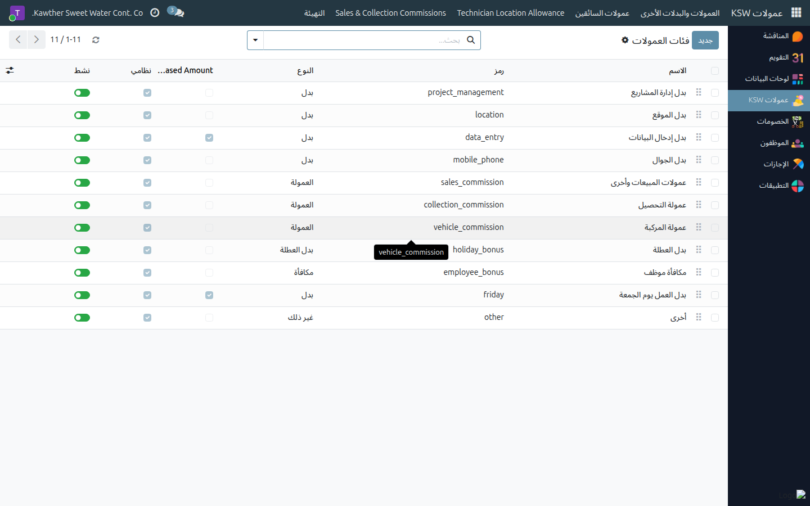
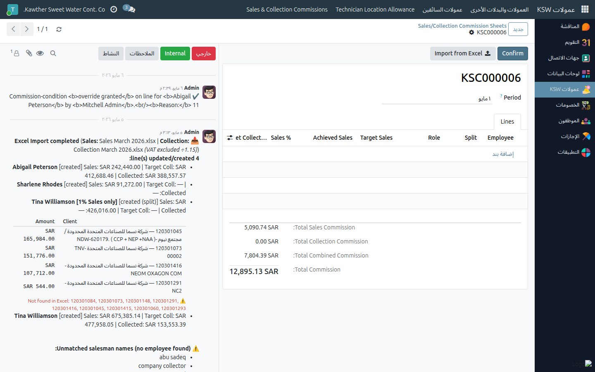

# ضبط إعدادات العمولات (المسؤول)

**الفئة المستهدفة:** مسؤول النظام / مسؤول العمولات
**الوقت المقدّر:** حسب الحاجة

## نظرة عامة

يُتيح لك هذا الدليل ضبط الإعدادات الأساسية لمنظومة العمولات: الفئات، والمواقع،
وشرائح الرحلات، وملفات مندوبي المبيعات، والتجاوزات.

## الخطوات الأساسية

1. **افتح العمولات ← الإعدادات.** تعرض هذه الصفحة جميع ثوابت المنظومة.
   

2. **أضِف أو عدِّل** الفئات وشرائح الرحلات وبدلات الموقع حسب الحاجة.

3. للتجاوز على مستوى سطر المبيعات: افتح السجل المطلوب وعدِّل القيمة الافتراضية.
   

4. احفظ التغييرات؛ تنعكس تلقائيًا على كشوف العمولات القادمة.

## مشكلات شائعة

| العَرَض | السبب | الحل |
|---|---|---|
| فئة غير موجودة | لم تُنشأ بعد | أضِفها من **الإعدادات ← الفئات** |

