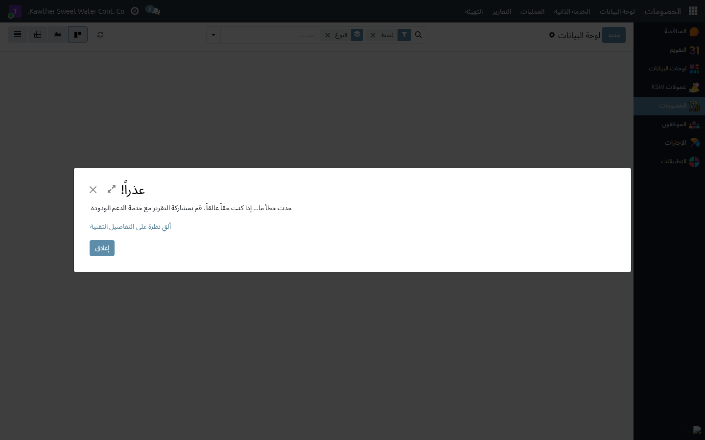
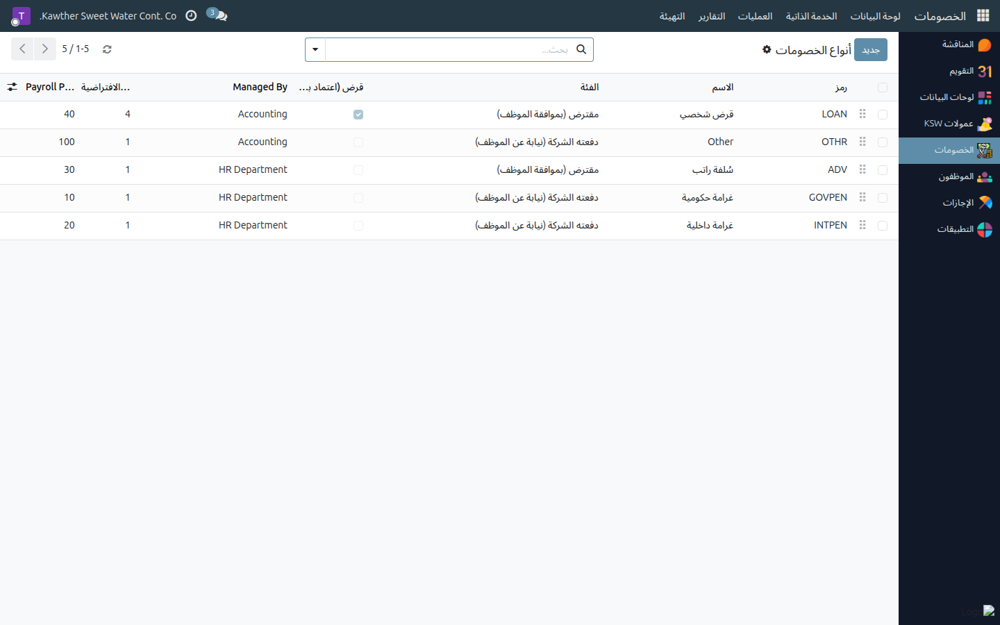

# ضبط إعدادات الخصومات (المسؤول)

**الفئة المستهدفة:** مسؤول النظام / مسؤول الخصومات
**الوقت المقدّر:** حسب الحاجة

## نظرة عامة

يُتيح لك هذا الدليل الاطّلاع على **لوحة إجماليات الخصومات** لجميع الموظفين،
وإدارة **أنواع الخصومات** (السلف الخاصة، سلف الرواتب، الجزاءات) التي تظهر في القوائم
المنسدلة عند إنشاء خصم.

## الخطوات

1. **افتح الخصومات ← التقارير ← لوحة المعلومات.** تعرض إجماليات الخصومات
   الشهرية لكل موظف.
   

2. لإدارة الأنواع: **الخصومات ← الإعدادات ← أنواع الخصومات.**
   - أضِف نوعًا جديدًا: اضغط **جديد**، أدخِل الاسم ومن يُديره (الموارد البشرية
     أو المحاسبة)، واحفظ.
   - عدِّل نوعًا قائمًا: افتحه وعدِّل ما تشاء.
   

## مشكلات شائعة

| العَرَض | السبب | الحل |
|---|---|---|
| نوع خصم غائب من قوائم المستخدمين | لم يُنشأ، أو مخفي | أضِفه أو تحقّق من حقل **الحالة** |

