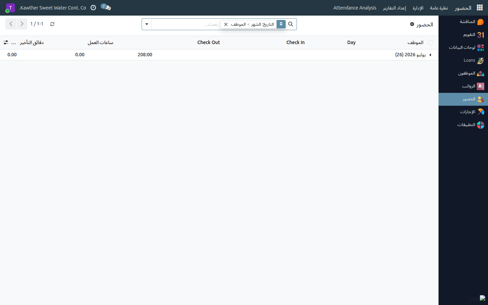
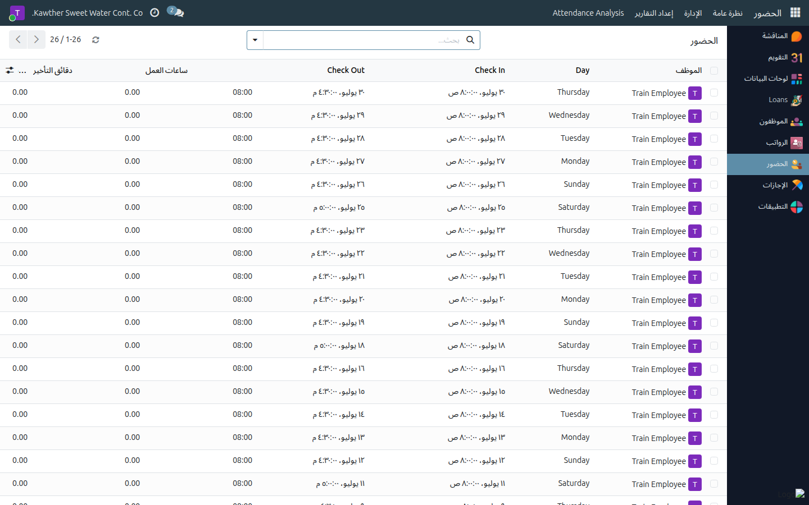

# الاطّلاع على سجل حضورك الشخصي

**الفئة المستهدفة:** الموظف
**الوقت المقدّر:** أقل من دقيقة

---

## ما الذي يمكنك الاطّلاع عليه

سجلّ حضورك يعكس كل بصمة ثبّتها جهاز الحضور الإلكتروني: وقتَي الدخول والخروج،
وساعات العمل الفعلية، وأي تأخر أو خروج مبكر. الصفحة للقراءة فحسب — لا تقبل
التعديل المباشر.

> **ملاحظة:** لا تظهر إلا **بياناتك الخاصة**؛ ليس بإمكانك الاطّلاع على سجلات
> زملائك.

---

## الخطوات

١. **افتح تطبيق الحضور والانصراف** من القائمة الجانبية. تظهر سجلاتك مرتّبةً
   تنازليًا من الأحدث فالأقدم.

   

٢. **اقرأ سجلاتك** — يعرض كل سطر:

   | العمود | المحتوى |
   |--------|---------|
   | التاريخ | اليوم والشهر والسنة |
   | وقت الدخول | أول بصمة صباحية |
   | وقت الخروج | آخر بصمة مسائية |
   | ساعات العمل | المدة الفعلية بين الدخول والخروج |
   | دقائق التأخر | الفارق بين وقت وصولك الفعلي وبداية دوامك |
   | الخروج المبكر | الفارق بين انصرافك الفعلي ونهاية دوامك |
   | غائب | ✔ إن لم تُسجَّل بصمة دخول لهذا اليوم |
   | مُغطَّى | ✔ إن كان الغياب مرتبطًا بإجازة معتمَدة |

   

---

## دلالة الألوان

الألوان في القائمة تخبرك دفعةً واحدة بحالة كل يوم دون الحاجة إلى فتح السجل:

| اللون | المعنى | ما تفعله |
|-------|---------|----------|
| **أخضر** | يوم غياب **مُغطَّى بإجازة معتمَدة** — لا خصم | لا شيء، الوضع سليم |
| **أصفر** | تأخر في الحضور، أو خروج مبكر، أو دوام منعدم غير مبرَّر | راجع الوقت مع مشرفك أو أبلغ الموارد البشرية |
| **أحمر** | **غياب تام** — لم تُسجَّل أي بصمة لهذا اليوم | تواصل مع الموارد البشرية لمراجعة البيانات أو تقديم إجازة |
| بلا لون | يوم حضور عادي، ساعات مكتملة، لا تأخير ولا خروج مبكر | لا شيء |

> **مثال عملي:**
> طلبتَ إجازة سنوية لأسبوع. قبل اعتماد الإجازة ستظهر أيامها **حمراء** (غياب).
> بعد اعتماد المدير لإجازتك يُحدِّث النظام هذه الأيام تلقائيًا لتصبح **خضراء**،
> وعمود «مُغطَّى» ✔ يُفعَّل في كل منها.

---

## كيف تعرف أن مشكلة الحضور قد عُولجت

عند الاطّلاع على يوم كان به إشكال (تأخر أو غياب)، تحقّق مما يلي:

| ما تراه في السجل | تفسيره |
|-----------------|--------|
| السطر **أخضر** + عمود **مُغطَّى** ✔ | الغياب مرتبط بإجازة معتمَدة — **المشكلة معالَجة، لا خصم** |
| السطر **أصفر** + دقائق تأخر = 0 | كان التأخر مُعفَى منه أو صُحِّح بعد مراجعة الموارد البشرية |
| السطر لا يزال **أحمر** + عمود **مُغطَّى** فارغ | الغياب لم يُبرَّر — **سيُخصَم من راتبك** ما لم تقدّم إجازة وتُعتمَد |
| السطر لا يزال **أصفر** | التأخر لم يُعالَج بعد — قد يُولِّد خصمًا في الراتب |

---

## الصلة بكشف راتبك

- الأيام **الحمراء** التي لم تتحوّل إلى **خضراء** قبل إصدار كشف الراتب تُولِّد
  **خصم الغياب**.
- الدقائق **الصفراء** المتبقّية بعد حساب نهاية الشهر تُولِّد **خصم التأخير**.
- بمجرد اعتماد إجازتك يُعيد النظام احتساب التأثير تلقائيًا حتى لو كانت الأيام
  قد مرّت.

---

## إن وجدت خطأً في السجلات

تواصل مع **الموارد البشرية** مباشرةً — هي المخوَّلة بمراجعة بيانات جهاز البصمة
وإجراء التصحيح. لا تنتظر؛ خصم الغياب والتأخير يُحتسب تلقائيًا عند إصدار كشوف
الرواتب.

---

## مشكلات شائعة

| العَرَض | السبب | الحل |
|---------|-------|------|
| يوم إجازة لا يزال أحمر | لم تُعتمَد إجازتك بعد أو أنها قيد الاعتماد | تابع حالة إجازتك من تطبيق **الإجازات** |
| يوم أخضر لكنه يظهر في الخصومات | كشف الراتب أُصدِر قبل اعتماد الإجازة | أبلغ الموارد البشرية لمراجعة كشف الراتب |
| سجل وقت خاطئ أو مفقود | خطأ في جهاز البصمة أو التوقيت | أبلغ الموارد البشرية للمراجعة والتصحيح |
| لا تظهر بياناتي أصلًا | الحساب غير مرتبط بسجل الحضور | تواصل مع تقنية المعلومات أو الموارد البشرية |

---

## أدلة ذات صلة

- [طلب إجازة](02-request-time-off.md)
- [الاطّلاع على كشف راتبي](04-view-payslip.md)

