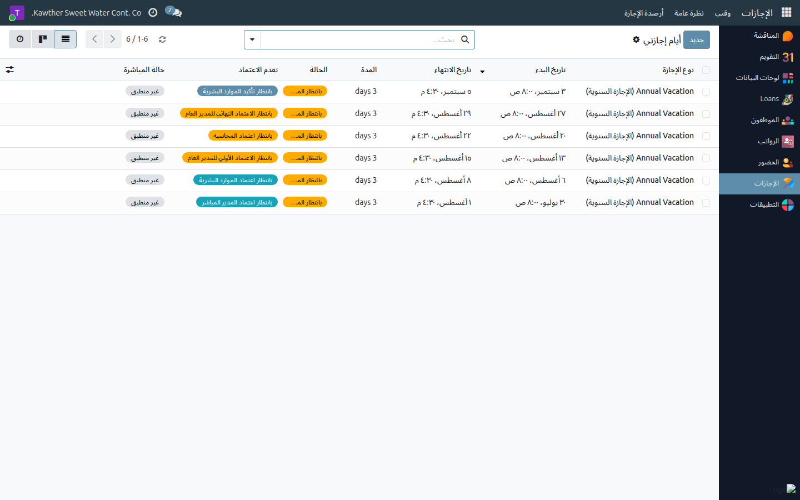
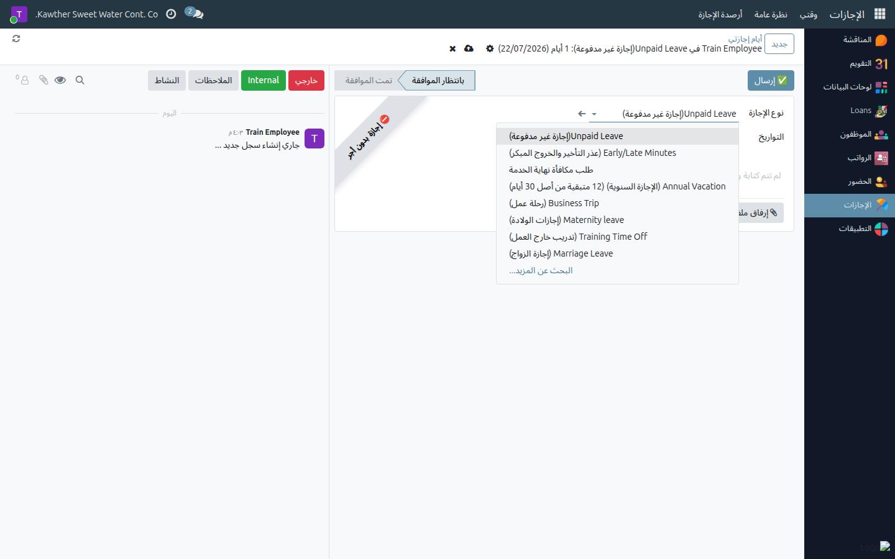
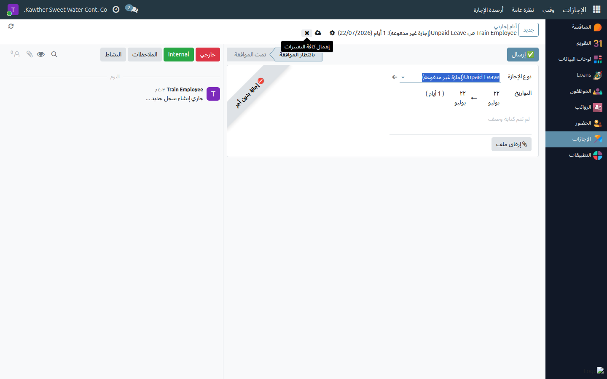

# تقديم طلب إجازة

**الفئة المستهدفة:** الموظف (تطلب لنفسك)
**الوقت المقدّر:** ٢–٣ دقائق

---

## قبل أن تبدأ — اقرأ هذا

- **احتساب المدة:** تُحتسب أيام الإجازة **بالأيام التقويمية** شاملةً أيام العطل
  ونهايات الأسبوع. إجازة من الأحد إلى الخميس تعادل ٧ أيام تقويمية، لا خمسة.
- **رصيد الإجازة السنوية:** اطّلع على رصيدك في **الإجازات ← رصيد الإجازات** قبل
  تقديم الطلب.
- **تأكيد المباشرة:** بعد عودتك من **الإجازة السنوية**، يُسجّل مديرك المباشر
  عودتك — ليس أنت. لا تحتاج إلى إجراء أي خطوة إضافية عند العودة.

---

## الخطوات

١. **افتح تطبيق الإجازات** من القائمة الجانبية، ثم اضغط **جديد** من
   قائمة **إجازاتي**.

   

٢. **حدّد نوع الإجازة:** الإجازة السنوية، المرضية، بدون أجر، أو غيرها. يتكيّف
   النموذج تلقائيًا حسب النوع المختار — بعض الأنواع تطلب وثيقة مساندة.

   

٣. **حدّد التواريخ** (من / إلى). يحتسب النظام عدد الأيام تلقائيًا ويعرضه
   أسفل حقول التاريخ.

٤. **(للإجازة السنوية فحسب)** إن طلبت أيامًا تتجاوز رصيدك المتاح، فعّل خيار
   **قبول الأيام الزائدة بدون أجر** ليُكمَل الطلب بدلًا من رفضه؛ الأيام التي تتجاوز رصيدك تُعدّ إجازةً بلا راتب وتُستقطع من مستحقاتك.

٥. أضف ملاحظة أو مرفقًا إن طُلب ذلك، ثم اضغط **إرسال**. احفظ السجل بعدها.

   

---

## مسار الاعتماد بعد الإرسال

يختلف المسار حسب نوع الإجازة:

**الإجازة السنوية — ٦ مراحل:**

| # | المرحلة |
|---|---------|
| ١ | المدير المباشر |
| ٢ | الموارد البشرية |
| ٣ | المدير العام (مراجعة أولية) |
| ٤ | المحاسبة |
| ٥ | المدير العام (اعتماد نهائي) |
| ٦ | الموارد البشرية — تأكيد النموذج الموقَّع |

**الإجازة المرضية / بدون أجر / غيرها — مرحلتان:**

| # | المرحلة |
|---|---------|
| ١ | المدير المباشر |
| ٢ | الموارد البشرية (اعتماد نهائي) |

تصلك إشعارات عند كل انتقال بين المراحل. لمتابعة وضع طلبك في أي وقت:
افتح **الإجازات ← إجازاتي** وراجع حقل **حالة الاعتماد** أو شريط التقدّم
في أعلى نموذج الإجازة.

---

## إعادة تقديم طلب مرفوض

إن رُفِض طلبك، يصلك إشعار يتضمّن سبب الرفض. افتح الطلب ← اضغط
**إعادة إلى مسودة** ← عدّل البيانات ← أرسل من جديد.

---

## مشكلات شائعة

| العَرَض | السبب | الحل |
|---------|-------|------|
| زر «إرسال» غير ظاهر | الطلب مُقدَّم بالفعل أو في مرحلة لاحقة | راجع شريط الحالة — الطلب تجاوز مرحلة المسودة |
| الأيام المحتسبة أكثر مما توقّعت | الاحتساب بالأيام التقويمية شاملًا الإجازات | هذا صحيح وفق نظام العمل السعودي — الإجازات تحتسب كاملةً |
| رُفِض طلبي | أحد المعتمِدين رفضه | اطّلع على التعليق في المحادثة؛ صحّح البيانات وأعِد الإرسال |
| مديري لا يرى طلبي | لا يوجد مدير مباشر مُسنَد لك | اطلب من الموارد البشرية تعيين مديرك أو اعتماد الخطوة الأولى نيابةً |

---

## أدلة ذات صلة

- [الاطّلاع على سجل حضوري](01-view-attendance.md)
- [الاطّلاع على كشف راتبي](04-view-payslip.md)

