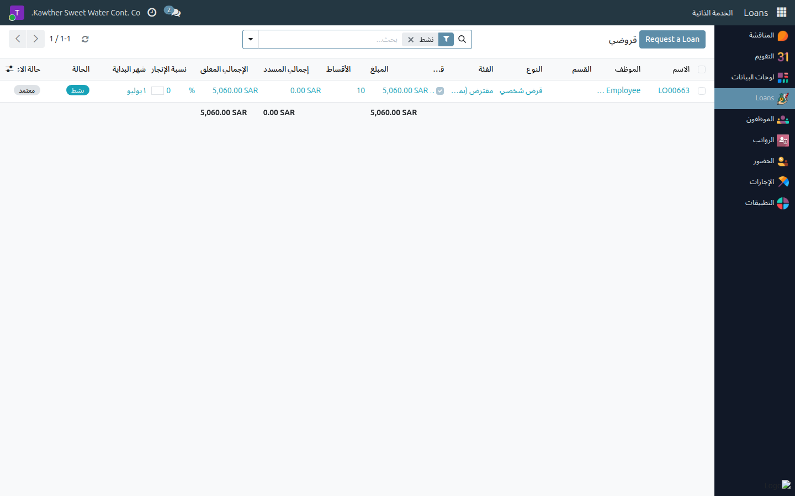
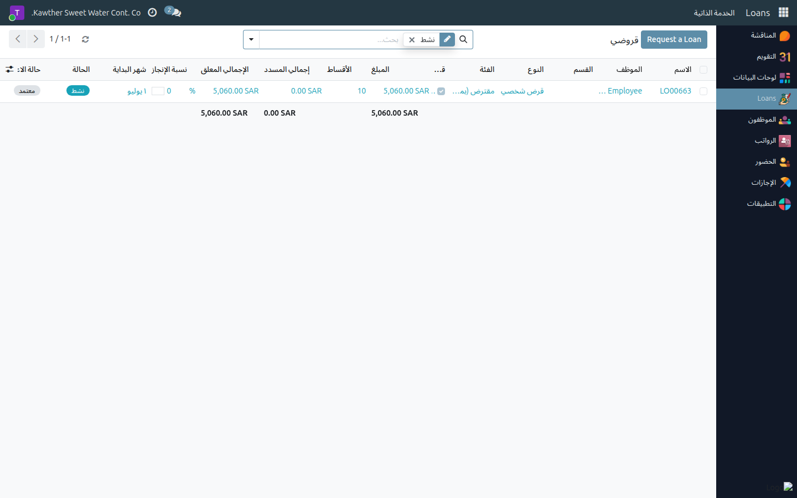
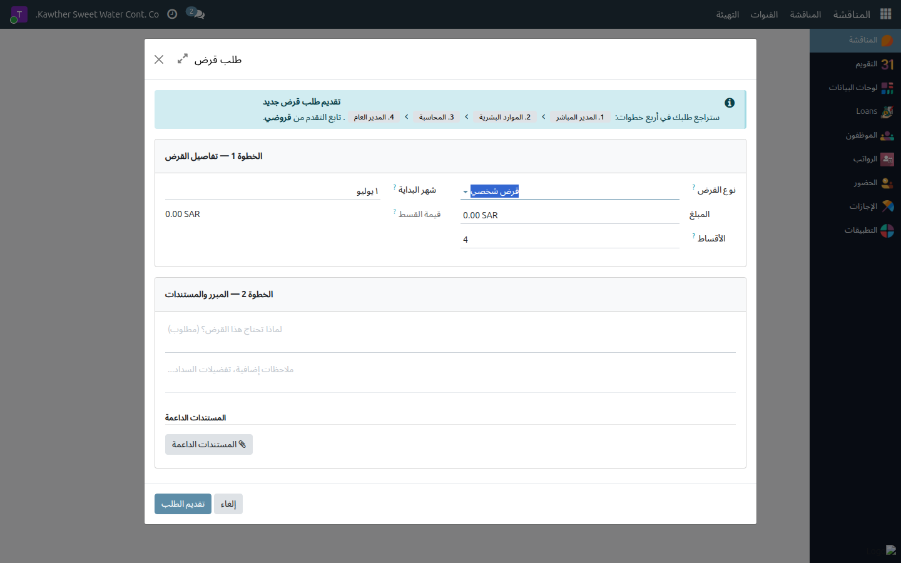

# طلب سلفة خاصة

**الفئة المستهدفة:** الموظف (تطلب لنفسك)
**الوقت المقدّر:** ٣–٥ دقائق

---

## كيف تسير السلفة الخاصة

تمرّ كل سلفة خاصة بأربع مراحل اعتماد متتالية قبل أن يُصرَف المبلغ؛ وبعد الصرف
تبدأ الأقساط بالخصم تلقائيًا من كشف راتبك الشهري. جهّز المعلومات التالية قبل
البدء:

- **المبلغ المطلوب** وعدد **الأقساط الشهرية** — يعرض النظام قيمة القسط
  تلقائيًا.
- **سبب الطلب** (حقل إلزامي).
- أي **مستندات مساندة** (كخطاب طبي أو عرض سعر) إن وُجدت.

---

## الخطوات

١. **افتح تطبيق الخصومات** من القائمة الجانبية، ثم انتقل إلى
   **الخدمة الذاتية ← سلفي الخاصة**.

   

٢. اضغط **طلب سلفة خاصة** في أعلى القائمة — الزر ظاهر دائمًا بصرف النظر عن عدد
   السلف الخاصة الحالية.

   

٣. **عبّئ تفاصيل السلفة الخاصة:** النوع، والمبلغ، وعدد الأقساط، وشهر بدء الاقتطاع.
   يُحتسب **مبلغ القسط الشهري** تلقائيًا أسفل الحقول.

   

٤. أدخِل **سبب الطلب** في الحقل المخصّص (إلزامي)، وأرفق أي مستندات مساندة
   باستخدام أيقونة المرفق.

٥. راجع **ملخّص السلفة الخاصة** في أسفل النافذة: المبلغ الإجمالي، عدد الأشهر، القسط
   الشهري، شهر البدء — ثم اضغط **تقديم الطلب**.

   

---

## مسار الاعتماد بعد تقديم السلفة

بعد تقديم طلبك تسير السلفة الخاصة وفق المراحل التالية:

| # | المرحلة |
|---|---------|
| ١ | المدير المباشر |
| ٢ | الموارد البشرية |
| ٣ | المحاسبة |
| ٤ | المدير العام (اعتماد نهائي) |
| ٥ | الصرف — استلام المبلغ من مسؤول الصرف |

- بعد **الاعتماد النهائي للمدير العام**، يصلك إشعار بأن سلفتك الخاصة معتمَدة وجاهزة
  للصرف؛ توجّه إلى مسؤول الصرف لاستلام المبلغ.
- يُسجّل مسؤول الصرف العملية في النظام بالضغط على **تأكيد الصرف**، وعندها فقط
  تصبح السلفة الخاصة **نشطة** وتبدأ أقساطها بالخصم من الشهر المحدَّد.
- إن رُفِض طلبك في أي مرحلة، يصلك إشعار مرفقًا بالسبب؛ افتح السلفة الخاصة واستخدم
  **إعادة إلى مسودة** لتعديلها وإعادة تقديمها.

---

## متابعة سير السلفة بعد التفعيل

من **الخصومات ← الخدمة الذاتية ← سلفي الخاصة** ترى:
- مرحلة الاعتماد الحالية (أو حالة «نشط»).
- **إجمالي المسدَّد** و**إجمالي المتبقي** وشريط التقدّم.
- تبويب **الأقساط** يعرض جدول السداد الكامل شهرًا بشهر.

---

## مشكلات شائعة

| العَرَض | السبب | الحل |
|---------|-------|------|
| لا أرى زر «طلب سلفة خاصة» | لست في قائمة «سلفي الخاصة» | انتقل إلى **الخصومات ← الخدمة الذاتية ← سلفي الخاصة** |
| زر التقديم غير مُفعَّل | حقل إلزامي غير مكتمل | تحقّق من إدخال **السبب** والمبلغ وعدد الأقساط |
| رُفِض طلبي | رفضه أحد المعتمِدين | اطّلع على سبب الرفض في سجل المحادثة، عدّل البيانات، وأعِد التقديم |
| لم تبدأ الأقساط بالخصم | السلفة لم تُصرَف بعد | السلفة تصبح نشطًا فقط بعد **تأكيد الصرف** — راجع شريط الحالة |

---

## أدلة ذات صلة

- [الاطّلاع على كشف راتبي](04-view-payslip.md) — حيث تظهر أقساط السلفة ضمن الخصومات

