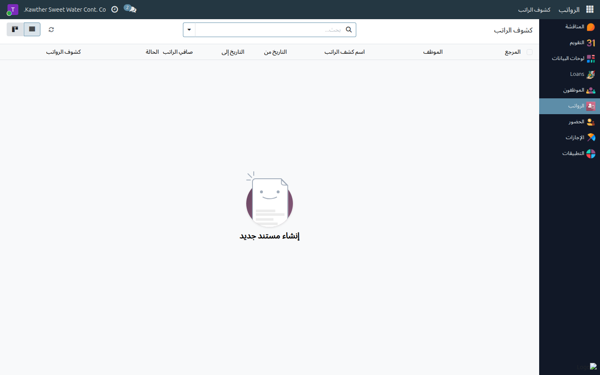
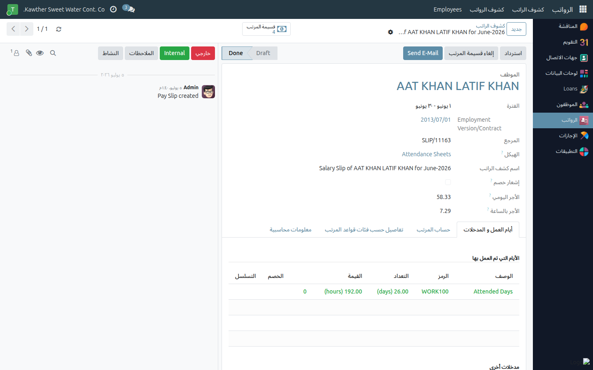

# كشف راتبك الشهري — القراءة والتحقّق

**الفئة المستهدفة:** الموظف
**الوقت المقدّر:** دقيقة واحدة

---

## ما تجده في كشف راتبك

صافي راتبك المحوَّل إلى حسابك البنكي هو محصّلة حسابية واضحة؛ إليك بنيتها:

| البند | المحتوى |
|------|---------|
| **الأجر الأساسي** | الراتب المتعاقَد عليه في عقد العمل |
| **البدلات** | بدل النقل، بدل السكن، وغيرها حسب عقدك |
| **الإجمالي** | الأجر الأساسي + مجموع البدلات |
| **خصم الغياب والتأخير** | يُخصَم مقابل الغياب غير المغطَّى أو التأخر عن أوقات العمل |
| **إجمالي الخصومات** | أقساط السلف الخاصة + الجزاءات السارية لهذا الشهر |
| **صافي الراتب** | الإجمالي − إجمالي الخصومات − خصم الغياب والتأخير |

---

## الخطوات

١. **افتح تطبيق الرواتب** من القائمة الجانبية، ثم اختر **كشوف رواتبي**.

   

٢. **اختر الشهر** المطلوب من القائمة. يظهر **صافي الراتب** على السطر مباشرةً
   دون الحاجة إلى فتح الكشف.

٣. **افتح الكشف** للاطّلاع على تفاصيل البنود — اقرأه من الأعلى إلى الأسفل:
   الإجمالي أولًا، ثم بنود الخصم واحدًا واحدًا، وصولًا إلى صافي الراتب.

   

٤. **نزّل الكشف أو اطبعه** باستخدام أيقونة الطباعة إن احتجت نسخة ورقية
   (للبنك أو جهة حكومية أو التأشيرة).

---

## تفسير الفروق الشائعة

**صافي الراتب أقل من المتوقّع؟** تحقّق بالترتيب:

١. هل هناك **خصم غياب أو تأخير**؟ — راجع [سجل حضورك](01-view-attendance.md)
   للتحقّق من الأيام المخصومة.
٢. هل هناك **قسط سلفة خاصة** جديد؟ — افتح سلفتك الخاصة من تطبيق **الخصومات** وراجع تبويب
   **الأقساط**.
٣. إن ظلّ الرقم غير مفهوم، تواصل مع **الموارد البشرية** أو قسم **الرواتب**
   مرفقًا باسم الشهر ورقم كشف الراتب.

---

## مشكلات شائعة

| العَرَض | السبب | الحل |
|---------|-------|------|
| لا يوجد كشف راتب لهذا الشهر | دفعة الرواتب لم تُصدَر بعد | انتظر؛ تصدر الدفعة بعد إتمام إجراءات الرواتب الشهرية |
| لا أستطيع تنزيل الكشف | مشكلة في المتصفح | جرّب متصفحًا آخر أو أبلغ تقنية المعلومات |

---

## أدلة ذات صلة

- [الاطّلاع على سجل حضوري](01-view-attendance.md)
- [طلب سلفة خاصة](03-request-a-loan.md)

