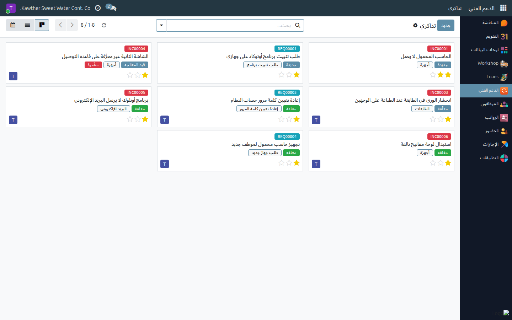
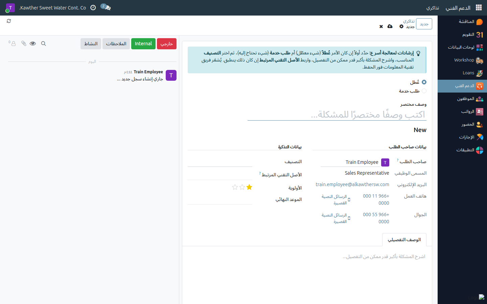
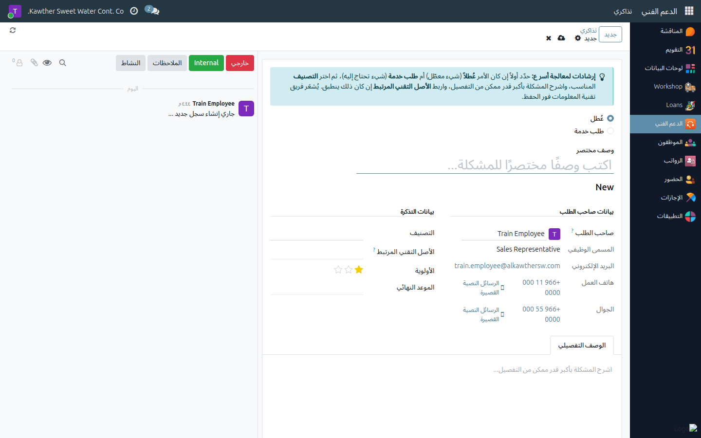
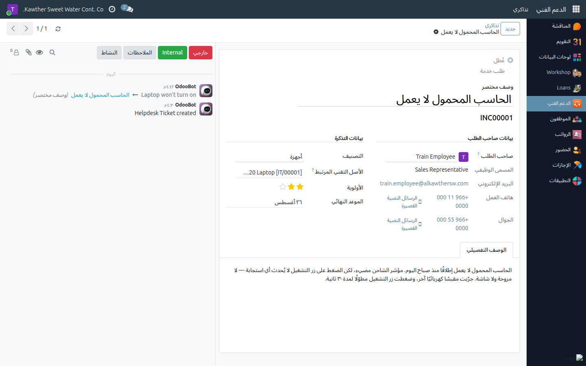

# رفع تذكرة دعم فني

**الفئة المستهدفة:** الموظف (لنفسه)
**الوقت المقدّر:** دقيقتان

---

## ما الذي تفعله هذه الشاشة

ترفع مشكلتك التقنية — أو طلبك من فريق تقنية المعلومات — على هيئة **تذكرة
موثّقة** بدل الاتصال الهاتفي أو الرسالة العابرة. يُشعَر الفريق فور حفظ التذكرة،
وتتابع أنت مسار معالجتها من الشاشة نفسها حتى الإغلاق.

لكل تذكرة **نوع واحد** تختاره أنت:

| النوع | متى تستخدمه | رقم التذكرة |
|---|---|---|
| **عُطل** | حين يكون هناك شيء معطّل أو لا يعمل كما يُفترض: الحاسب لا يعمل، لا يوجد إنترنت، الطابعة تحشر الورق، البريد لا يُرسل | `INC00001` |
| **طلب خدمة** | حين لا يوجد عطل، بل أنت بحاجة إلى شيء: برنامج جديد، جهاز جديد، صلاحية على مجلد، إعادة تعيين كلمة مرور، أو استفسار | `REQ00001` |

النوع الذي تختاره يحدّد **التصنيفات** المعروضة عليك، وهو **ثابت بعد إنشاء
التذكرة** لأنه يحدّد بادئة رقمها. فإن أخطأت في اختياره، أغلق التذكرة وارفع
واحدة جديدة بالنوع الصحيح.

---

## قبل أن تبدأ

- ترفع التذكرة **لنفسك**. وإن كنت مديرًا لموظفين، يمكنك رفعها لأحد موظفيك
  المباشرين — راجع
  [رفع تذكرة نيابة عن أحد موظفيك](../supervisor/07-ticket-for-team-member.md).
- جهّز التفاصيل: ما الذي يحدث بالضبط، ومتى بدأ، ونص رسالة الخطأ إن وُجدت،
  والجهاز المعني.

---

## الخطوات

١. **افتح تطبيق الدعم الفني** ثم **تذاكري**. تعرض هذه القائمة كل تذاكرك،
   المفتوحة والمغلقة.

   

٢. اضغط **جديد**.

٣. **اختر نوع التذكرة** في أعلى النموذج: **عُطل** أو **طلب خدمة**.

   

٤. **اكتب وصفًا مختصرًا** في سطر العنوان — جملة واحدة واضحة مثل:
   «الحاسب المحمول لا يعمل»، لا «مشكلة عاجلة».

٥. **اختر التصنيف** المناسب (أجهزة، برامج، الشبكة والإنترنت، البريد
   الإلكتروني، الطابعات، الوصول والصلاحيات، أخرى — ولطلبات الخدمة: طلب جهاز
   جديد، طلب تثبيت برنامج، طلب وصول أو صلاحية، إعادة تعيين كلمة المرور،
   استفسار أو إرشاد). لا تُعرض عليك إلا التصنيفات التابعة للنوع الذي اخترته.

٦. **اربط الأصل التقني المرتبط** إن كانت التذكرة تخصّ جهازًا بعينه. لا تعرض
   القائمة إلا الأجهزة المسجّلة **بعهدتك** أنت: حاسبك، جوالك، شاشتك. اتركه
   فارغًا إن لم ينطبق.

٧. **حدّد الأولوية** بصدق (منخفضة / متوسطة / مرتفعة / عاجلة). القيمة
   الافتراضية «متوسطة» وهي المناسبة لأغلب التذاكر.

٨. **عبّئ تبويب «الوصف التفصيلي»** — وهو حقل إلزامي، وهو ما يُسرّع المعالجة
   فعلًا. اذكر ما كنت تفعله، ونص رسالة الخطأ حرفيًا، وهل تتكرر المشكلة في كل
   مرة.

   

٩. **احفظ.** تحصل التذكرة على رقمها (`INC…` أو `REQ…`) وتدخل مرحلة
   **جديدة**.

   

---

## ما الذي يحدث بعد ذلك

- تصل تذكرتك إلى قائمة فريق تقنية المعلومات في مرحلة **جديدة**. وحين يتسلّمها
  أحد أعضاء الفريق تنتقل إلى **قيد المعالجة** ويظهر اسمه في حقل **المكلَّف
  بالمعالجة**.
- **تواصل مع الفريق داخل التذكرة نفسها.** في صندوق الرسائل أسفل التذكرة اضغط
  **خارجي** ثم اكتب رسالتك — يصل الإشعار إلى كل متابعي التذكرة. أرفق صورة
  للشاشة أو للخطأ بالطريقة نفسها. بهذا يبقى سجل الحالة كاملًا في مكان واحد.
- إن احتاج الفريق شيئًا منك ولم يستطع المتابعة، يضع التذكرة في حالة
  **متوقّفة**، وتظهر عليها علامة حمراء.
- عند انتهاء المعالجة يُغلق الفريق التذكرة: تنتقل إلى **مغلقة**، ويُسجَّل تاريخ
  الإغلاق ومن أغلقها، ويظهر لك في التذكرة قسم **تقييم المعالجة**: **ممتاز** أو
  **مقبول** أو **غير مُرضٍ**. نرجو تعبئته — فهو التقييم الوحيد الذي يصل الفريق.

> **ما الذي يمكنك تعديله وما لا يمكنك.** أنت صاحب محتوى التذكرة: العنوان
> والوصف والتصنيف والأصل المرتبط والأولوية والموعد النهائي. أما **المرحلة**
> و**المكلَّف بالمعالجة** و**حالة المعالجة** فهي من صلاحية فريق تقنية
> المعلومات وحده؛ تراها ولا تغيّرها.

---

## أسئلة ومشكلات شائعة

| ما تراه | السبب | المعالجة |
|---|---|---|
| قائمة التصنيفات فارغة أو ينقصها التصنيف الذي أريده | التصنيفات مقسّمة حسب النوع | راجع اختيار **عُطل / طلب خدمة** في الأعلى؛ تتغيّر القائمة بتغيّره |
| لا أستطيع تحويل «عُطل» إلى «طلب خدمة» | النوع ثابت بعد الإنشاء لأنه يحدّد رقم التذكرة | أغلق التذكرة وارفع أخرى بالنوع الصحيح |
| **الأصل التقني المرتبط** لا يعرض حاسبي | الجهاز غير مسجّل بعهدتك في النظام | ارفع التذكرة بدونه واذكر الجهاز في الوصف، وسيصحّح الفريق السجل |
| لا أستطيع تغيير المرحلة أو تكليف أحد بالتذكرة | هذه صلاحية فريق تقنية المعلومات | اكتب طلبك في صندوق رسائل التذكرة؛ يصل الفريق إشعار به |
| تظهر رسالة: لا يمكنك إنشاء أو تعديل تذاكر إلا لنفسك أو لموظفيك المباشرين | حقل **صاحب الطلب** يشير إلى شخص ليس أنت ولا أحد موظفيك | أعِد **صاحب الطلب** إلى اسمك |
| لا أرى تذكرة رفعها زميلي | لا ترى إلا تذاكرك (وتذاكر موظفيك المباشرين) | هذا هو السلوك المقصود |

---

## أدلة ذات صلة

- [رفع تذكرة نيابة عن أحد موظفيك](../supervisor/07-ticket-for-team-member.md) — للمديرين
- [البدء في استخدام النظام](../00-getting-started.md) — الدخول والتنقّل والإشعارات

