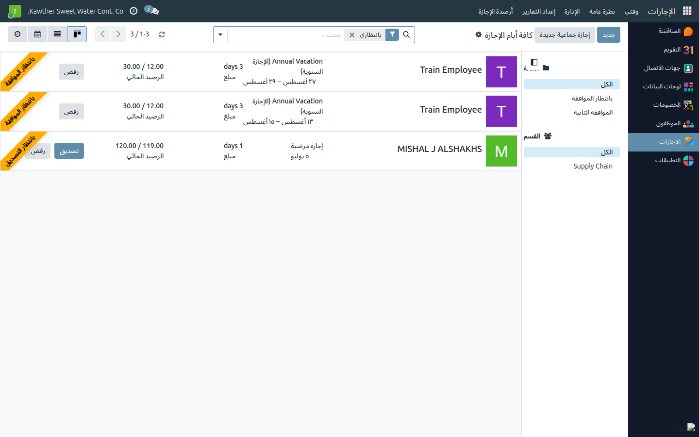
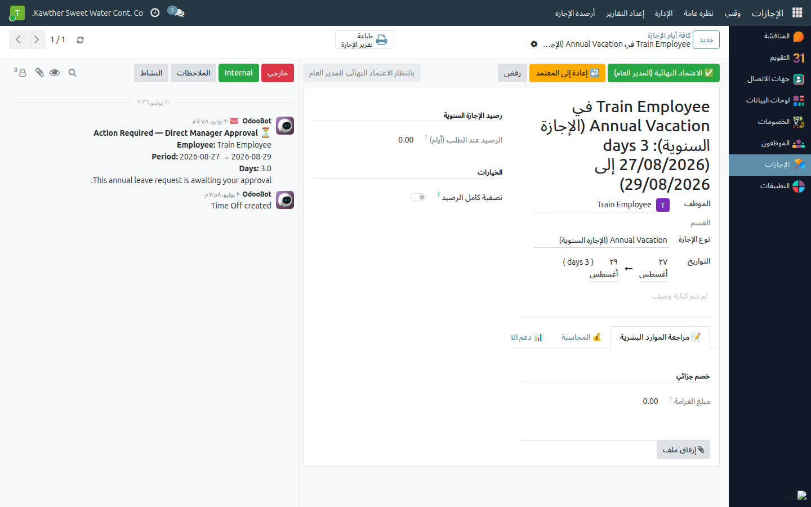

# الإجازات: اعتماد المدير العام

**الفئة المستهدفة:** المدير العام
**الوقت المقدّر:** ١–٢ دقيقة لكل طلب

## نظرة عامة

تشمل مشاركتك في مسار الإجازة السنوية **نقطتي اعتماد**:
1. **الاعتماد الأولي** (المرحلة ٣) — مراجعة بعد الموارد البشرية.
2. **الاعتماد النهائي** (المرحلة ٥) — بعد المحاسبة؛ يُنشئ كشف راتب الإجازة
   ويُحيل الطلب للتأكيد النهائي من الموارد البشرية.

## أين تجد الطلبات

افتح تطبيق **الإجازات**، ثم اختر **الإدارة ← الإجازات**. ابحث عن الطلبات
في مرحلة **بانتظار الاعتماد الأولي للمدير العام** أو **بانتظار الاعتماد النهائي
للمدير العام**.

## الخطوات — الاعتماد الأولي

1. **افتح الإجازات ← الإدارة ← الإجازات** وافتح طلب الموظف (المرحلة: بانتظار
   الاعتماد الأولي للمدير العام).
   

2. **راجع** تفاصيل الموارد البشرية وبيانات دعم القرار (للقراءة فقط في هذه
   المرحلة).

3. اضغط **الاعتماد الأولي (المدير العام)** — تنتقل الإجازة إلى المحاسبة.
   (أو استخدم **إعادة إلى المعتمِد** — راجع الدليل التالي.)
   

## الخطوات — الاعتماد النهائي

1. افتح الإجازة (المرحلة: بانتظار الاعتماد النهائي للمدير العام) وراجع أرقام
   تبويب **المحاسبة**.

2. اضغط **الاعتماد النهائي (المدير العام)**.
   

   تُنشئ هذه الخطوة **كشف راتب الإجازة** وتُحيل الطلب إلى **بانتظار تأكيد
   الموارد البشرية** (ترفع الموارد البشرية النموذج الموقَّع لإتمام الاعتماد).

## ما يحدث بعد ذلك

- الاعتماد الأولي: تُكمِل المحاسبة البيانات المالية.
- الاعتماد النهائي: يُنشأ كشف راتب الإجازة؛ تُتمّ الموارد البشرية التأكيد
  النهائي.

## مشكلات شائعة

| العَرَض | السبب | الحل |
|---|---|---|
| لا يوجد زر الاعتماد | الإجازة ليست في مرحلة المدير العام | راجع شريط الحالة |
| لا تريد الرفض لكن تحتاج تعديلًا | استخدم **إعادة إلى المعتمِد** | راجع [إعادة إلى المعتمِد](02-return-to-approver.md) |

## أدلة ذات صلة

- [إعادة إلى المعتمِد](02-return-to-approver.md)
- [السلف الخاصة: الاعتماد النهائي للمدير العام](03-loan-gm-approval.md)

