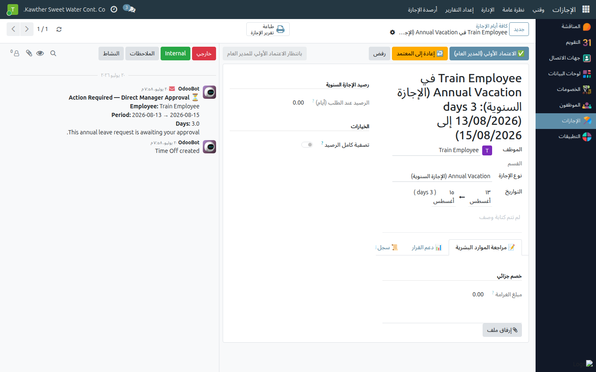
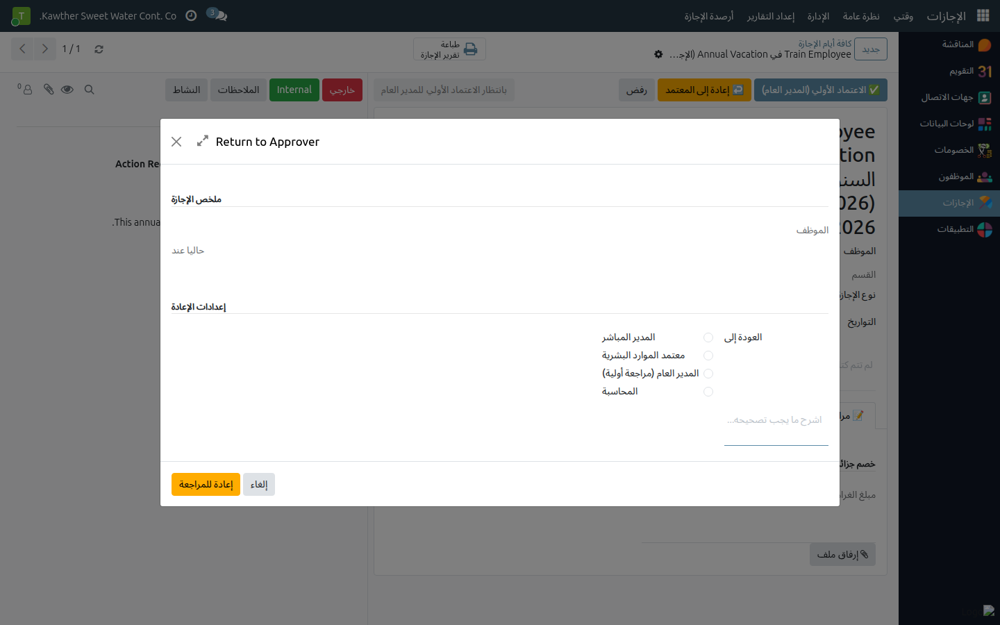

# إعادة الإجازة إلى معتمِد سابق (المدير العام)

**الفئة المستهدفة:** المدير العام
**الوقت المقدّر:** دقيقتان

## نظرة عامة

بدلًا من الرفض القاطع، يُتيح لك هذا الدليل **إعادة إجازة سنوية** إلى معتمِد
سابق لإجراء تعديلات أو توضيحات، ثم إعادة سير الاعتماد من تلك النقطة.

## متى تستخدم هذا الخيار

- **بانتظار الاعتماد الأولي للمدير العام (المرحلة ٣):** أعِد إلى المدير المباشر
  أو الموارد البشرية.
- **بانتظار الاعتماد النهائي للمدير العام (المرحلة ٥):** أعِد إلى المدير المباشر
  أو الموارد البشرية أو المدير العام (الأولي) أو المحاسبة.

## الخطوات

1. افتح الإجازة السنوية من **الإجازات ← الإدارة ← الإجازات** (في إحدى مرحلتي
   المدير العام).

2. اضغط **إعادة إلى المعتمِد** — تفتح نافذة الإعادة.
   

3. **اختر المعتمِد المستهدف** من القائمة (الخيارات المتاحة تعتمد على المرحلة
   الراهنة كما هو موضَّح أعلاه).

4. **أدخِل سبب الإعادة** (إلزامي — يُرسَل كإشعار للمعتمِد المستهدف).

5. اضغط **تأكيد الإعادة**.
   

## ما يحدث بعد ذلك

- تعود الإجازة إلى حالة المعتمِد المختار ويُشعَر بها.
- تُمسَح **ختوم** الاعتماد اللاحقة لتلك المرحلة؛ يُحفَظ ختم المراحل السابقة.
- يُكمَل مسار الاعتماد من النقطة التي عادت إليها الإجازة.

## مشكلات شائعة

| العَرَض | السبب | الحل |
|---|---|---|
| زر **إعادة إلى المعتمِد** غير ظاهر | الإجازة ليست في مرحلة المدير العام | تحقّق من الحالة الراهنة في شريط الاعتماد |
| الخيار المطلوب غير موجود في القائمة | المرحلة الراهنة لا تُتيح ذلك الخيار | راجع جدول المراحل أعلاه |

## أدلة ذات صلة

- [الإجازات: الاعتماد الأولي والنهائي للمدير العام](01-leave-gm-approvals.md)

