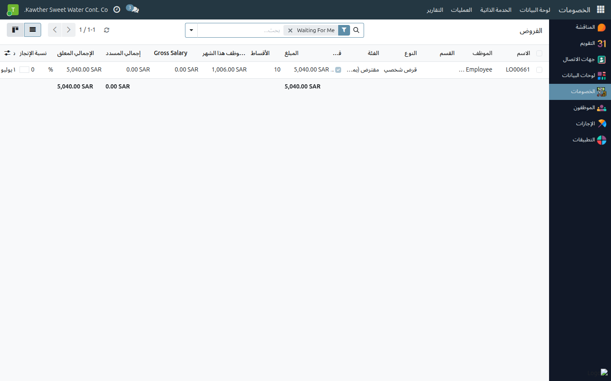
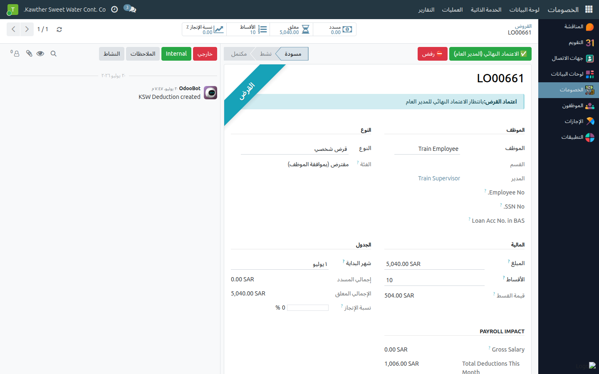

# السلف الخاصة: الاعتماد النهائي للمدير العام

**الفئة المستهدفة:** المدير العام
**الوقت المقدّر:** دقيقة واحدة لكل سلفة

## نظرة عامة

يُتيح لك هذا الدليل منح **الاعتماد النهائي** على السلفة الخاصة بعد مرورها بالموارد البشرية
والمحاسبة. اعتمادك يُحيل السلفة الخاصة إلى مرحلة الصرف.

## ملاحظات أولية

- تجد السلف الخاصة في **الخصومات ← العمليات ← السلف الخاصة** (تفتح على **بانتظاري** تلقائيًا).

## الخطوات

1. **افتح الخصومات ← العمليات ← السلف الخاصة.** تعرض القائمة السلف الخاصة عند **بانتظار
   الاعتماد النهائي للمدير العام**.
   

2. **افتح السلفة الخاصة** وراجع: المبلغ وعدد الأقساط وملخّص **دعم القرار** (رصيد
   الإجازة، الخصومات الأخرى، الأثر على الراتب الإجمالي).

3. اضغط **الاعتماد النهائي (المدير العام)** — تنتقل السلفة الخاصة إلى **بانتظار
   الصرف**. (أو **رفض** مع ذكر السبب.)
   

## ما يحدث بعد ذلك

تُؤكِّد المحاسبة الصرف، وعندها تصبح السلفة الخاصة **نشطة** وتبدأ أقساطها.

## مشكلات شائعة

| العَرَض | السبب | الحل |
|---|---|---|
| لا يوجد زر الاعتماد النهائي | السلفة الخاصة لم تصل مرحلة المدير العام | راجع شريط حالة الاعتماد |

## أدلة ذات صلة

- المحاسبة: [السلف الخاصة: الاعتماد والصرف](../accounting/02-loan-approval-disbursement.md)

