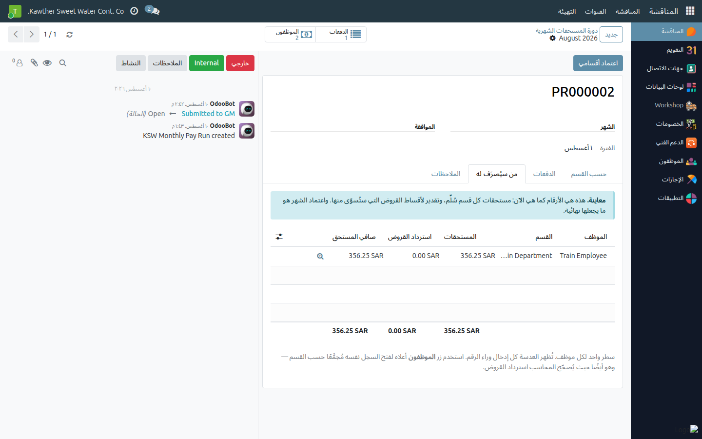
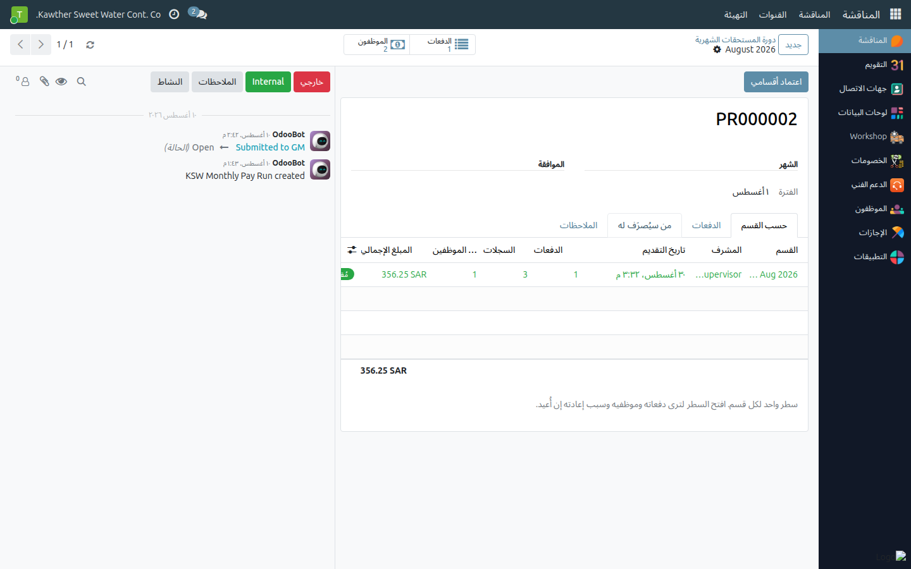
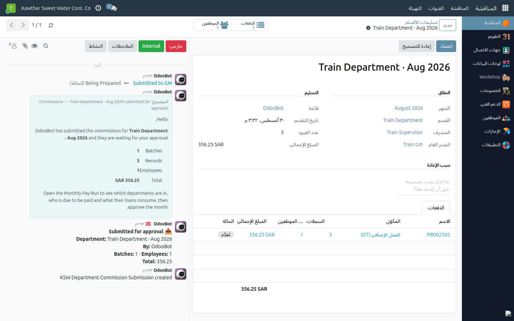

# اعتماد عمولات ومستحقات الشهر

**الفئة المستهدفة:** المدير العام (مدير القسم العام)، والمدير العام للشركة في آخر قسمين
**الوقت المقدّر:** ١٠–١٥ دقيقة شهريًا

## نظرة عامة

في كل شهر يُسجّل المشرفون ما استحقّه فرقهم زيادةً على الراتب — العمل الإضافي،
ردود السائقين، الوجبات، البدلات، المكافآت — ثم يُسلّمون أقسامهم إليك. تراجعها ثم
تعتمدها أو تُعيدها. واعتمادك هو ما يحوّل الأرقام إلى مبالغ تُصرَف: فهو يُسوّي أقساط
قروض الموظفين الموقوفة، ويُقفل الشهر تمهيدًا للصرف.

> **عمولات المبيعات والتحصيل ليست جزءًا من هذا.** تُحتسَب في صفحتها الخاصة
> وتُصرَف بشكل منفصل، ولا تصل إلى اعتمادك هنا.

## ملاحظات أولية

- تعتمد **الأقسام التي عُيّنت مديرًا عامًا لها فقط**. والقسم الذي مديره العام شخص
  آخر يبقى لديه، مهما كان موقعك.
- لا يصلك القسم إلا حين يضغط مشرفه **تقديم إدخالاتي**. والدفعة المُعلَّمة
  *مُقدَّم* ليست مُسلَّمة بعد.

## الخطوات

1. **افتح العمولات ← دورة المستحقات الشهرية** واختر الشهر. تبويب **حسب القسم**
   يعرض سطرًا لكل قسم: اسم المشرف، وعدد السجلات، وعدد الموظفين، والإجمالي،
   والحالة، ووقت الوصول.
   

   ويُنبّهك شريط أزرق بالأقسام التي **لم** تُسلَّم بعد.

2. **راجع قبل الاعتماد.**
   - **من سيُصرَف له** يعرض كل موظف مستحق للصرف: المستحقات، واسترداد القروض،
     والصافي.
   - افتح سطر أي قسم ← **الموظفون** لترى الإدخالات وراء إجماليه.
   - في أي إدخال، تعرض أيقونة **الآلة الحاسبة** كيف نتج المبلغ بالضبط — الراتب
     والمقسوم عليه ومعامل العمل الإضافي، أو كل شريحة ردود بسعرها.
   

3. **اعتمد.** إمّا **اعتماد** على تسليم قسم واحد، أو **اعتماد أقسامي**
   في شاشة الشهر لاعتماد جميع أقسامك دفعةً واحدة.
   

4. **أو أعِده.** في تسليم القسم، اكتب **سبب الإعادة** ثم اضغط
   **إعادة للتصحيح**. السبب إلزامي — فالمشرف يحتاج أن يعرف ما يُصحّحه.
   

## ما يحدث بعد ذلك

- **عند الإعادة:** يعود القسم إلى مشرفه، ويُكتَب السبب على كل دفعة فيه، ويصله
  إشعار في صندوق الوارد.
- **عند الاعتماد مع بقاء أقسام أخرى:** تُقفَل أقسامك ويبقى الشهر مفتوحًا للبقية.
- **عند الاعتماد ولم يبقَ منتظِر:** يُنهى الشهر تلقائيًا. يُبنى **سجل الصرف
** من الأقسام المعتمدة فقط، وتُسوَّى أقساط القروض الموقوفة من
  العمولة، وتُقفَل الفترة — فلا يستطيع أي مشرف إضافة شيء أو تغييره فيها. ثم تُصدّر
  المحاسبة ملف التحويل البنكي.

## إقفال شهر ما زال ناقصًا — للمدير العام للشركة وحده

إن لم يُسلّم قسم ما، يبقى على أحدهم أن يقرّر أن الشهر انتهى. وهذا قرار على مستوى
الشركة، يخصّ **المدير العام للشركة** لا مدير قسم عام:

- **إقفال الشهر الآن** — يصرف ما اعتُمد فقط. والقسم الذي لم يُسلّم يبقى عمله
  مسودةً للشهر التالي.
- **إعادة فتح** — يفتح شهرًا معتمدًا، ويُعيد الأقساط المُسوّاة إلى «منتظِرة»، ويُحوّل
  السجل إلى معاينة من جديد. وهو يفكّ تسوية **كل** الأقسام دفعةً واحدة، ولهذا لا
  يملكه أيّ مدير قسم عام بمفرده.

فإن احتجت أحدهما ولم يظهر الزر، فراجع المدير العام للشركة.

## مشكلات شائعة

| العَرَض | السبب | الحل |
|---|---|---|
| لا يظهر زر **اعتماد** على قسم | القسم ليس لك — مديره العام شخص آخر | الرسالة تذكر اسم من ينتظره القسم |
| رسالة «لا يوجد بين الأقسام المنتظِرة في … ما هو من اعتمادك» | السبب نفسه، من زر شاشة الشهر | اعتمد أقسامك أنت، أو راجع المدير المذكور |
| رسالة «لم يُعيَّن مدير عام لـ …» | القسم بلا مدير عام ولا يوجد افتراضي للشركة | اطلب من الموارد البشرية تعيين المدير العام للقسم |
| **إعادة للتصحيح** يرفض | حقل السبب فارغ | اكتب السبب في الحقل أعلى الزر أولًا |
| قسم غائب عن الشهر | لم يُسلَّم بعد | الشريط الأزرق يعدّدها؛ تابع مع المشرف |
| السجل يبدو ناقصًا بعد الاعتماد | لا يُدرَج إلا ما اعتُمد من الأقسام | راجع رسالة المحادثة — تذكر ما استُبعد ولماذا |

## أدلة ذات صلة

- المشرف: [الدورة الشهرية](../supervisor/06-commission-monthly-cycle.md)
- المحاسبة: [تصدير العمولات](../accounting/04-commission-export.md)
- [إعادة الطلب إلى معتمِد سابق](02-return-to-approver.md)

