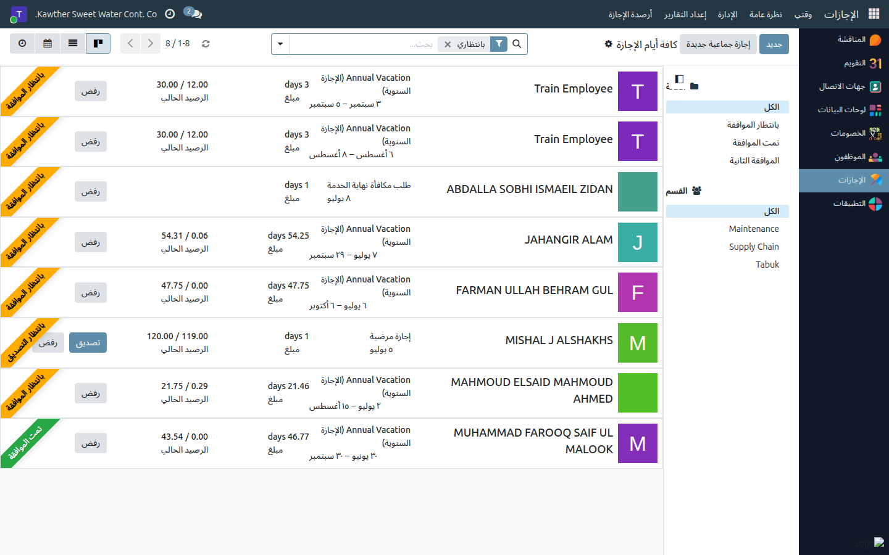
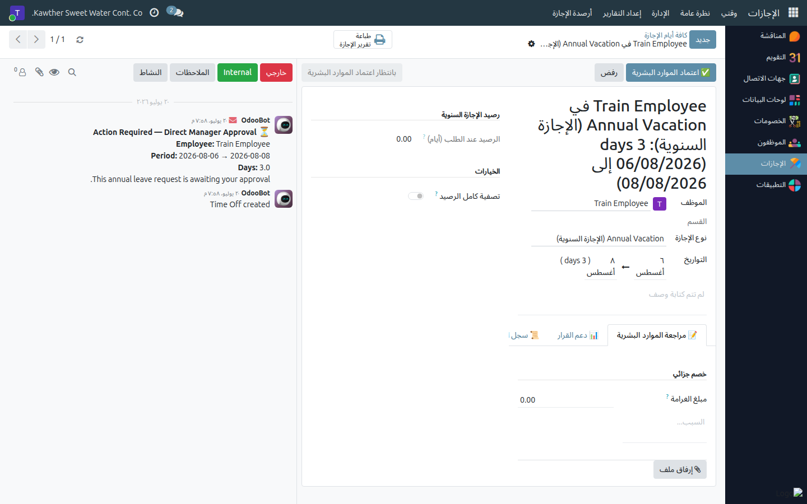
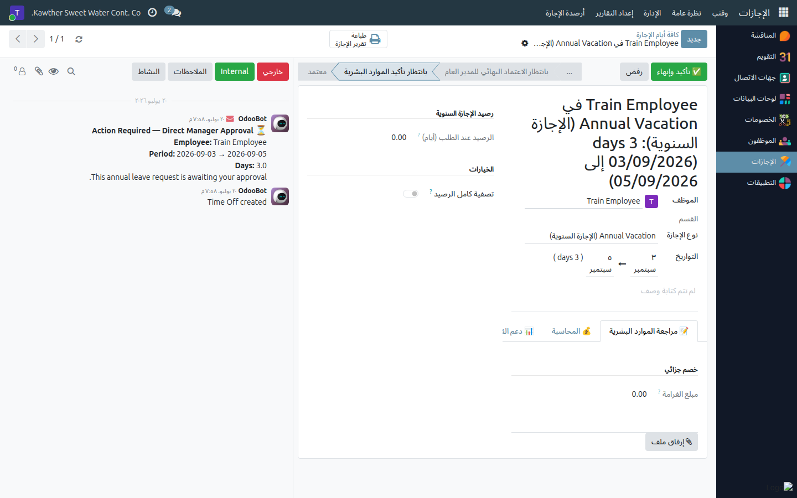

# الإجازات — دور الموارد البشرية في الاعتماد والتوثيق

**الفئة المستهدفة:** موظف الموارد البشرية
**الوقت المقدّر:** دقيقة إلى دقيقتين لكل طلب

---

## المهمتان الرئيسيتان للموارد البشرية في مسار الإجازات

تضطلع الموارد البشرية بمسؤوليتين متمايزتين ضمن دورة اعتماد الإجازات:

| المهمة | متى تُطلَب | الإجازات المعنية |
|--------|-----------|-----------------|
| **اعتماد الموارد البشرية** (المرحلة ٢) | بعد موافقة المدير المباشر | الإجازة السنوية |
| **التصديق النهائي** | بعد موافقة المدير المباشر | المرضية، بدون أجر، وغيرها |
| **تأكيد الموارد البشرية + رفع النموذج** (المرحلة ٦) | بعد الاعتماد النهائي للمدير العام | الإجازة السنوية فحسب |

---

## أين تجد الطلبات

افتح تطبيق **الإجازات** ← **الإدارة ← الإجازات**. تعرض هذه القائمة إجازات
الشركة كاملةً؛ استخدم مرشّح **بانتظاري** لتصفية الطلبات التي في دورك.

---

## المهمة الأولى — اعتماد الموارد البشرية

### للإجازة السنوية (المرحلة ٢)

١. افتح الطلب الواصل إليك بعد موافقة المدير المباشر.
٢. راجع التواريخ والأيام وبيانات الموظف.
٣. أكمِل تبويب **مراجعة الموارد البشرية** عند الحاجة (ملاحظات، مبلغ جزاء
   مترتّب إن وُجد).

   

٤. اضغط **اعتماد (الموارد البشرية)**. ينتقل الطلب إلى المدير العام للمراجعة
   الأولية.

### للإجازة المرضية وبدون أجر وغيرها (اعتماد نهائي)

بعد موافقة المدير المباشر تصل هذه الإجازات إليك للاعتماد النهائي مباشرةً:
افتح الطلب واضغط **تصديق** — تُمنَح الإجازة فورًا وتنتهي الدورة.

---

## المهمة الثانية — تأكيد الموارد البشرية والنموذج الموقَّع (المرحلة ٦)

> **تنبيه:** هذه المرحلة حصرية للموارد البشرية فقط — لا يملك الموظف ولا المدير
> المباشر إتمامها. لا تُعتمَد الإجازة السنوية نهائيًا إلا بعد رفع النموذج هنا.

بعد الاعتماد النهائي للمدير العام، تعود الإجازة السنوية إليك عند حالة
**بانتظار تأكيد الموارد البشرية**:

١. افتح الإجازة من **الإدارة ← الإجازات** (ابحث عن حالة «بانتظار تأكيد
   الموارد البشرية»).
٢. اضغط **تأكيد وإنهاء**.
٣. **ارفع النموذج الموقَّع** (PDF) في النافذة المنبثقة — هذا الحقل إلزامي؛
   لا يمكن إتمام الخطوة بدونه.
٤. أكِّد — تُعتمَد الإجازة نهائيًا وتُخصَم الأيام من رصيد الموظف.

   

---

## سير العمل الكامل للإجازة السنوية (للمرجعية)

| # | المرحلة |
|---|---------|
| ١ | المدير المباشر |
| ٢ | **الموارد البشرية ← أنت هنا** |
| ٣ | المدير العام (مراجعة أولية) |
| ٤ | المحاسبة |
| ٥ | المدير العام (اعتماد نهائي) |
| ٦ | **الموارد البشرية — تأكيد النموذج الموقَّع ← أنت هنا أيضًا** |
| ✔ | معتمدة |

---

## مشكلات شائعة

| العَرَض | السبب | الحل |
|---------|-------|------|
| لا أعثر على الطلب | القائمة المفتوحة غير صحيحة | استخدم **الإجازات ← الإدارة ← الإجازات** لا «إجازاتي» |
| لا يوجد زر «تأكيد وإنهاء» | الإجازة لم تصل المرحلة ٦ بعد | يظهر الزر فقط بعد الاعتماد النهائي للمدير العام |
| لا يمكن إتمام التأكيد | لم يُرفَق النموذج الموقَّع | ارفع ملف PDF في النافذة المنبثقة أولًا |
| لا أستطيع الاعتماد على الإطلاق | لست ضمن مجموعة معتمدي الموارد البشرية | اطلب من المسؤول مراجعة صلاحياتك |

---

## أدلة ذات صلة

- [السلف الخاصة: اعتماد الموارد البشرية](02-loan-hr-approval.md)
- [إنشاء سلفة راتب](03-create-deductions.md)

