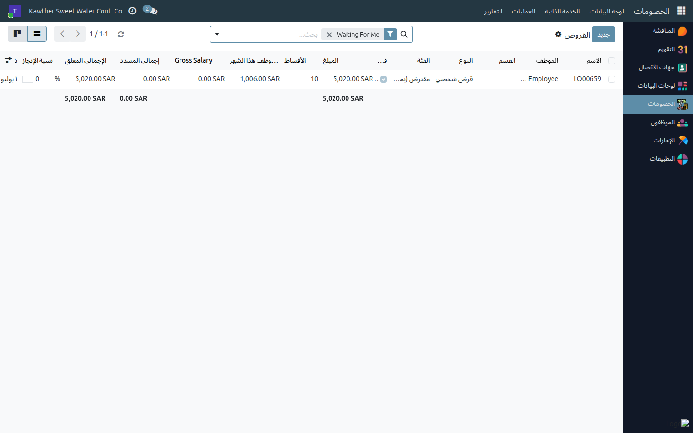
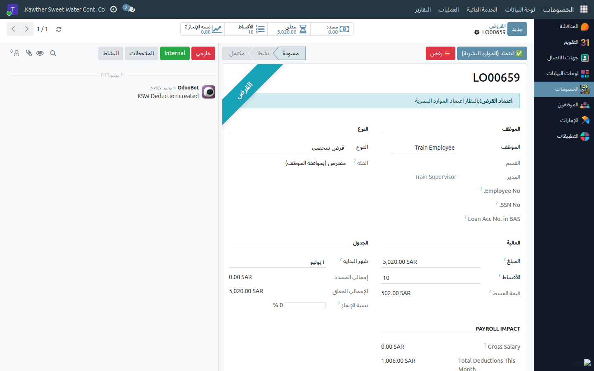

# السلف الخاصة: اعتماد الموارد البشرية

**الفئة المستهدفة:** الموارد البشرية
**الوقت المقدّر:** ١–٢ دقيقة لكل طلب

## نظرة عامة

يُتيح لك هذا الدليل اعتماد السلف الخاصة أو ردّها في **مرحلة الموارد البشرية** — المرحلة
الثانية بعد المدير المباشر وقبل المحاسبة.

## ملاحظات أولية

- تجد السلف الخاصة في **الخصومات ← العمليات ← السلف الخاصة**؛ تفتح القائمة على **بانتظاري**
  وتعرض السلف الخاصة عند **بانتظار اعتماد الموارد البشرية**.

## الخطوات

1. **افتح الخصومات ← العمليات ← السلف الخاصة.** تفتح القائمة على **بانتظاري** تلقائيًا.
   

2. **افتح السلفة الخاصة** وراجع تبويب **دعم القرار**، الذي يلخّص وضع الموظف (رصيد
   الإجازة، الخصومات الأخرى النشطة، الأثر الشهري المتوقّع) لمساعدتك في اتخاذ
   القرار. ضع إشارة تأكيد الموارد البشرية عند الاقتضاء.

3. **اتخذ قرارك:**
   - **اعتماد (الموارد البشرية)** — تنتقل السلفة الخاصة إلى **بانتظار اعتماد
     المحاسبة**.
     
   - **ردّ**: أدخِل السبب؛ يُشعَر الموظف بذلك.

## ما يحدث بعد ذلك

تتابع السلفة الخاصة المعتمَدة مسارها: **المحاسبة ← المدير العام (نهائي) ← الصرف ← نشطة**.
أما المردودة فتعود إلى الموظف مرفقةً بالسبب.

## مشكلات شائعة

| العَرَض | السبب | الحل |
|---|---|---|
| لا يوجد زر الاعتماد | السلفة الخاصة ليست في مرحلة الموارد البشرية | راجع شريط حالة الاعتماد |
| أريد مزيدًا من المعلومات | استخدم تبويب دعم القرار | يعرض الأرصدة والخصومات الأخرى |

## أدلة ذات صلة

- [إنشاء سلفة راتب](03-create-deductions.md)
- [الإجازات: اعتماد الموارد البشرية](01-leave-hr-approval.md)

