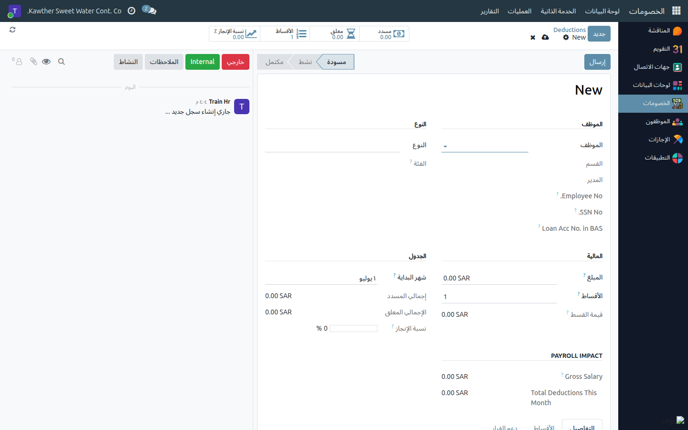

# إنشاء سلفة راتب

**الفئة المستهدفة:** موظف الموارد البشرية
**الوقت المقدّر:** دقيقتان

---

## الموارد البشرية تُنشئ السلف — والمحاسبة تُنشئ الجزاءات

قبل البدء، وضّح هذا التوزيع لتجنّب الخلط:

| النوع | من يُنشئه |
|-------|----------|
| **سلفة راتب** | ✅ الموارد البشرية |
| **جزاء داخلي / جزاء حكومي** | المحاسبة — راجع [إنشاء جزاء](../accounting/05-create-penalties.md) |
| **السلف الخاصة** | مسار اعتماد مستقل — راجع أدلة السلف الخاصة |

سلفة الراتب لا تمرّ بمسار اعتماد السلف الخاصة؛ تُنشئها مباشرةً وتُفعَّل فورًا.

---

## ما تحتاجه قبل البدء

- اسم الموظف.
- مبلغ السلفة.
- عدد الأقساط الشهرية (غالبًا قسط واحد).
- شهر بدء الاقتطاع.

---

## الخطوات

١. افتح **الخصومات ← العمليات ← الخصومات** من القائمة الجانبية.

   

٢. اضغط **جديد**، ثم اختر **الموظف** ونوع الخصم **سلفة راتب**.

٣. أدخِل **المبلغ** و**عدد الأقساط** و**شهر البدء**. يُنشئ النظام **جدول
   الأقساط الشهرية** تلقائيًا في تبويب الأقساط أسفل النموذج.

   

٤. أضف **ملاحظة** تُوضّح السبب أو المرجع (اختياري لكن مفيد للمراجعات اللاحقة).

٥. اضغط **إرسال** — تُفعَّل السلفة فورًا ويبدأ الخصم في الشهر المحدَّد.

---

## ما يحدث بعد التفعيل

- كل قسط معلّق يُخصَم تلقائيًا مع دفعة الرواتب الشهرية.
- يرى الموظف قيمة القسط في بند **إجمالي الخصومات** في كشف راتبه.
- بعد سداد جميع الأقساط، تُعلَّم السلفة **مكتملة** تلقائيًا.

---

## مشكلات شائعة

| العَرَض | السبب | الحل |
|---------|-------|------|
| المبلغ لا يُخصَم | السجل لا يزال في المسودة | تأكّد من الضغط على **إرسال** لا **حفظ** |
| أحتاج إنشاء جزاء لا سلفة | الجزاءات من اختصاص المحاسبة | راجع [إنشاء جزاء](../accounting/05-create-penalties.md) |
| لا أجد الموظف في القائمة | الاسم مكتوب بشكل مختلف | ابحث بأول ثلاثة أحرف أو برقم الموظف |

---

## أدلة ذات صلة

- [تعديل الخصومات وإدارة الأقساط](04-modify-deductions.md)
- [السلف الخاصة: اعتماد الموارد البشرية](02-loan-hr-approval.md)

