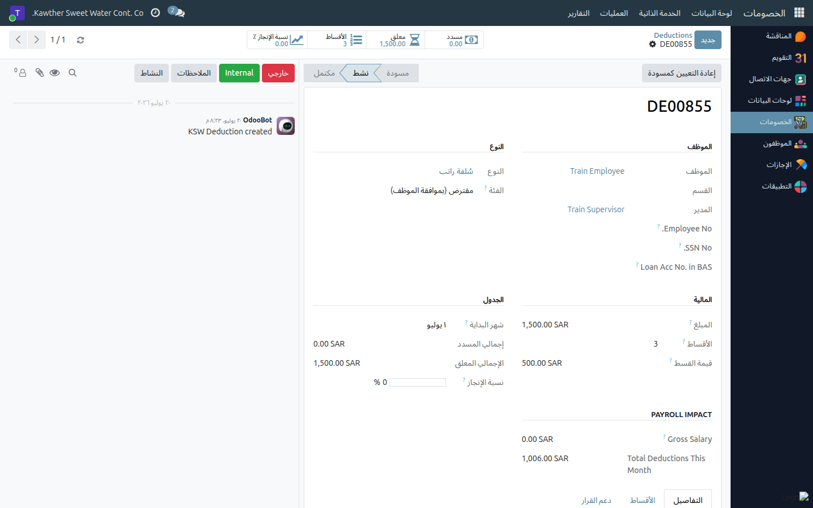
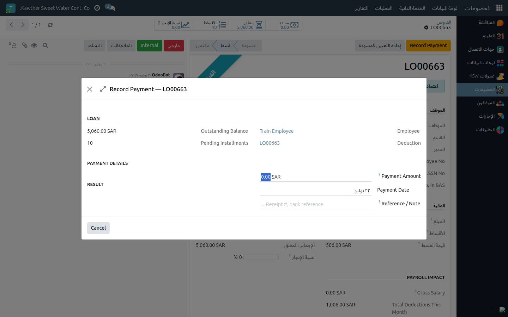

# تعديل الخصومات وإدارة الأقساط

**الفئة المستهدفة:** موظف الموارد البشرية
**الوقت المقدّر:** ١–٣ دقائق حسب نوع التعديل

---

## نطاق هذا الدليل

ثمّة ثلاثة إجراءات مختلفة تندرج تحت «تعديل الخصومات»؛ حدّد ما تحتاجه أولًا:

| الإجراء | متى تستخدمه |
|---------|------------|
| تعديل جدول الأقساط | تغيير مواعيد أو قيم الأقساط المعلّقة |
| تحديد قسط كمدفوع | الموظف سدّد قسطًا نقدًا خارج نظام الرواتب |
| تسجيل سداد سلفة خاصة (كلي أو جزئي) | سداد مبلغ إضافي لتسريع إنهاء السلفة الخاصة |

---

## تعديل خصم قبل تفعيله (حالة المسودة)

افتح الخصم (في حالة **مسودة**) ← عدّل **المبلغ** أو **عدد الأقساط** مباشرةً ←
احفظ. يتحدّث جدول الأقساط تلقائيًا. بعد الضغط على **إرسال** يثبت المبلغ ولا
يمكن تعديله.

---

## تحديد قسط منفرد كمدفوع

١. افتح سجل الخصم أو السلفة الخاصة.
٢. انتقل إلى تبويب **الأقساط**.
٣. في السطر المعلّق الذي سُدِّد، أضف **ملاحظة** (رقم الإيصال أو تاريخ الاستلام
   النقدي).
٤. اضغط **تحديد كمدفوع** — يتحوّل السطر إلى اللون الأخضر ويُستثنى من دفعة
   الرواتب القادمة.

   

٥. إن كان هذا القسط الأخير، يُعلَّم السجل **مكتملًا** تلقائيًا.

---

## تسجيل سداد سلفة خاصة (كلي أو جزئي)

استخدم هذا الإجراء حين يُسدِّد الموظف مبلغًا إضافيًا لتقليل رصيد سلفته الخاصة خارج
نظام الرواتب:

١. افتح السلفة الخاصة النشطة من **الخصومات ← العمليات ← السلف الخاصة**.
٢. اضغط **تسجيل سداد**.
٣. أدخِل **مبلغ السداد** و**تاريخه** وملاحظة اختيارية. يعرض النظام معاينة
   للتأثير:

   | نوع السداد | ما يحدث |
   |-----------|---------|
   | **كلي** (يساوي الرصيد المتبقي) | تُعلَّم **جميع** الأقساط المعلّقة مدفوعةً |
   | **جزئي** (أقل من الرصيد المتبقي) | يُوزَّع الرصيد المتبقي على الأقساط؛ يُضاف سطر جديد للسداد |

   

٤. اضغط **تأكيد السداد**.

---

## تعديل جدول الأقساط المعلّقة

١. افتح السجل ← تبويب **الأقساط**.
٢. عدّل **الشهر/السنة** أو **المبلغ** في الأسطر المعلّقة. الأسطر المدفوعة
   محجوبة ولا تقبل التعديل.
٣. يمكن إضافة سطر يدوي جديد إن احتجت توزيعًا مختلفًا.

---

## إلغاء خصم كامل

افتح السجل ← اضغط **إلغاء** (أكِّد عند المطالبة). الإلغاء الكامل غير مقيّد
قبل سداد أي قسط؛ بعد السداد يُلغى ما تبقّى فحسب.

---

## ما يحدث بعد التعديلات

الأقساط المدفوعة والمعلَّقة المعدَّلة تؤثّر فورًا في دفعات الرواتب القادمة؛
يرى الموظف التحديث مباشرةً في إجمالي المسدَّد / المتبقي داخل سجله.

---

## مشكلات شائعة

| العَرَض | السبب | الحل |
|---------|-------|------|
| لا أستطيع تعديل المبلغ | الخصم نشط بالفعل (تجاوز المسودة) | ألغِ السجل وأنشئ سجلًا جديدًا إن كان خطأً |
| لا يوجد زر «تسجيل سداد» | السلفة الخاصة غير نشطة أو لا توجد أقساط معلّقة | يجب أن تكون السلفة الخاصة **نشطة** بأقساط معلّقة |
| لا يمكن تعديل سطر مدفوع | الأسطر المدفوعة محجوبة نظامًا | يمكن تعديل المعلّقة فقط |

---

## أدلة ذات صلة

- [إنشاء سلفة راتب](03-create-deductions.md)
- [السلف الخاصة: اعتماد الموارد البشرية](02-loan-hr-approval.md)

