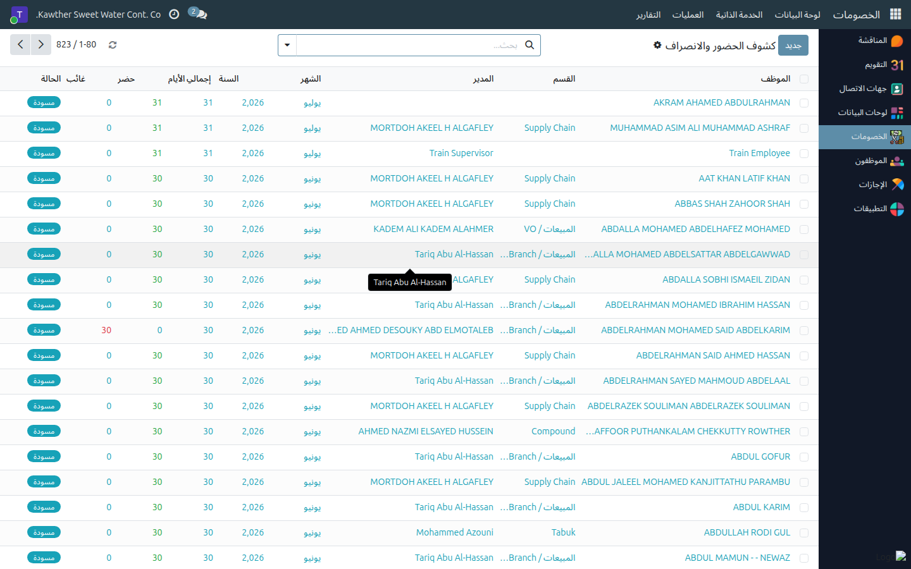

# إدارة كشوف الحضور (الموارد البشرية)

**الفئة المستهدفة:** الموارد البشرية / مسؤول الحضور
**الوقت المقدّر:** ٥ دقائق

## نظرة عامة

يُتيح لك هذا الدليل الاطّلاع على كشوف حضور الموظفين غير المرتبطين بجهاز البصمة
وإدارتها على مستوى الشركة: **إقفالها** في نهاية الشهر أو **إعادتها إلى مسودة**
لإجراء تصحيح.

## الخطوات

1. **افتح الحضور والانصراف ← كشوف الحضور.** تظهر جميع الكشوف الشهرية لجميع
   الموظفين.
   

2. للتصحيح بعد إقفال الشهر: افتح الكشف المراد تعديله ← اضغط **إعادة إلى
   مسودة**. يصبح قابلًا للتعديل من قِبَل المشرف مجدّدًا.
   

3. بعد التصحيح، يمكن إقفال الكشف مجدّدًا أو تركه للمشرف ليُقفِله.

## مشكلات شائعة

| العَرَض | السبب | الحل |
|---|---|---|
| لا أرى كشف موظف | الكشوف لم تُنشأ بعد | استخدم **إنشاء جميع الكشوف** من قائمة المشرف |
| الكشف للقراءة فقط | الشهر منتهٍ وأُقفِل | استخدم **إعادة إلى مسودة** |

## أدلة ذات صلة

- المشرف: [كشوف الحضور](../supervisor/03-attendance-sheets.md)

