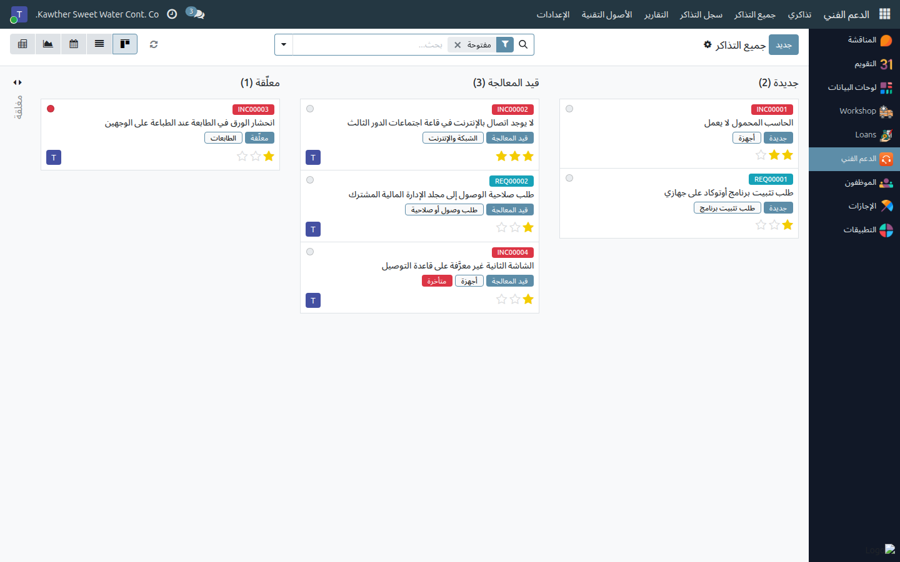
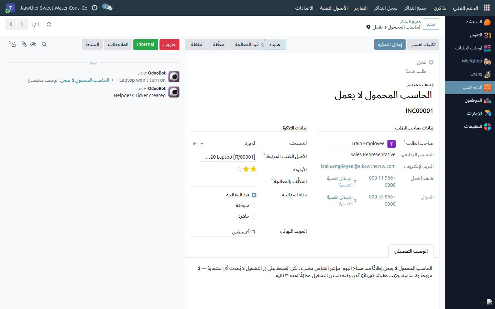
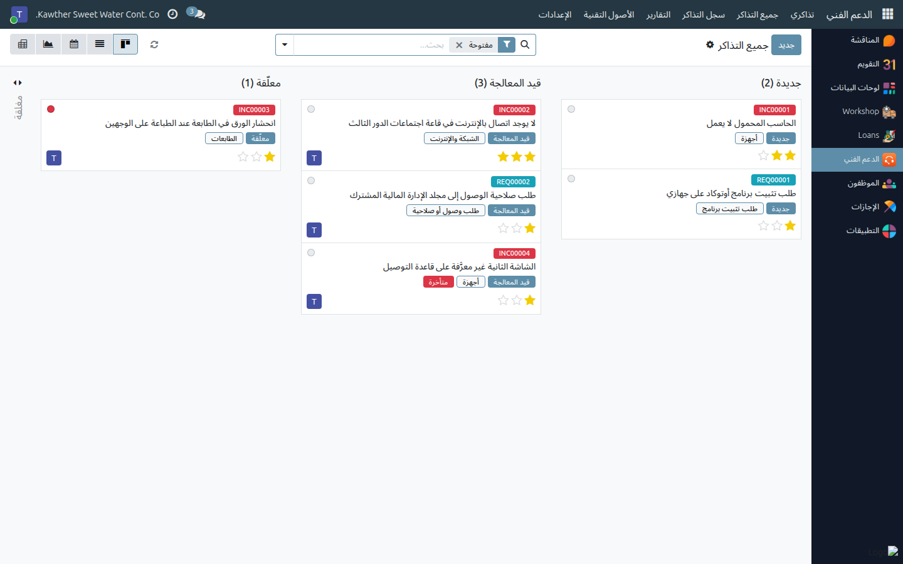

# إدارة قائمة التذاكر

**الفئة المستهدفة:** فريق تقنية المعلومات
**الوقت المقدّر:** دقائق لكل جولة فرز

---

## ما الذي تفعله هذه الشاشة

قائمة التذاكر هي صندوق الوارد الوحيد للفريق. كل ما يرفعه الموظفون — من جميع
الأقسام — يصل إليها في مرحلة **جديدة**، والفرز هو تحويل هذه الأكوام إلى عمل
محدّد: ما نوع الطلب، وما درجة إلحاحه، ومن يتولّاه، ومتى موعده النهائي.

---

## قبل أن تبدأ

- تحتاج إلى دور **فريق تقنية المعلومات**، وهو الدور الوحيد في التطبيق إلى
  جانب دور الموظف العادي، ويمنحك كل شيء: جميع التذاكر، وسجل الأصول التقنية،
  وقوائم الإعدادات.
- الموظفون لا يرون إلا تذاكرهم (وتذاكر موظفيهم المباشرين)، أما أنتم فترون
  الجميع.

---

## لوحة العمل

افتح **الدعم الفني ← جميع التذاكر**. تُفتح لوحة كانبان مقسّمة حسب المرحلة،
ومصفّاة مسبقًا على التذاكر **المفتوحة**.

والمراحل أربع:

| المرحلة | معناها |
|---|---|
| **جديدة** | لم يتسلّمها أحد بعد |
| **قيد المعالجة** | العمل جارٍ عليها |
| **معلّقة** | متوقفة بانتظار قطعة غيار أو مورّد أو اعتماد |
| **مغلقة** | تمت معالجتها. تُطوى في اللوحة |

تحمل كل بطاقة ما يكفي للفرز بنظرة واحدة: رقم التذكرة بلون **أحمر للعُطل**
و**أزرق لطلب الخدمة**، والوصف المختصر، والمرحلة والتصنيف، وشارة **متأخرة** إن
تجاوزت موعدها النهائي، ونجوم الأولوية، وصورة المكلَّف بمعالجتها.

**اسحب البطاقة إلى مرحلة أخرى** لنقلها — وهذا متاح لكم وحدكم؛ الموظف يرى
اللوحة نفسها للاطّلاع فقط.

---

## الخطوات — فرز تذكرة جديدة

١. **افتح التذكرة** من عمود **جديدة**.

   

٢. **اقرأ بيانات صاحب الطلب** على جانب النموذج: المسمى الوظيفي والقسم والبريد
   وهاتف العمل والجوال، مسحوبة مباشرة من بطاقة الموظف. هذا من تتصل به.

٣. **راجع النوع والتصنيف.** كثيرًا ما يرفع الموظف طلب خدمة على أنه عُطل.
   التصنيف يمكنك تصحيحه، أما **النوع فثابت** لأنه حدّد رقم التذكرة؛ فإن كان
   خطأً جسيمًا فأغلقها مع بيان السبب واطلب رفع تذكرة جديدة.

٤. **حدّد الأولوية** من النجوم في النموذج أو من البطاقة مباشرة.

   | الأولوية | متى تُستخدم |
   |---|---|
   | **عاجلة** | العمل متوقف الآن لموظف أو لفريق كامل |
   | **مرتفعة** | الأثر كبير، لكن يوجد حل مؤقت |
   | **متوسطة** | الوضع الطبيعي — وهي الافتراضية |
   | **منخفضة** | تحسين مطلوب بلا أثر تشغيلي |

٥. **تسلّمها أو كلّف بها غيرك.** اضغط **تكليف نفسي** في أعلى النموذج، أو اختر
   زميلًا في حقل **المكلَّف بالمعالجة**. لا يقبل الحقل إلا أعضاء فريق تقنية
   المعلومات. وبمجرد التكليف يصبح المكلَّف متابعًا للتذكرة ويصله إشعار بكل
   رسالة عليها.

٦. **حدّد الموعد النهائي** إن كان للتذكرة موعد. وبعد تجاوز ذلك التاريخ وهي ما
   تزال مفتوحة، يتحوّل سطرها إلى الأحمر في القائمة، وتظهر شارة **متأخرة** على
   البطاقة وشريط **متأخرة** في النموذج، ويمكن حصرها بمرشّح **متأخرة**. كما
   تظهر المواعيد النهائية في عرض **التقويم**.

٧. **انقلها إلى «قيد المعالجة»** بالضغط على المرحلة في شريط الحالة أعلى
   النموذج، أو بسحب البطاقة.

---

## البحث السريع

توفّر لوحة البحث المرشّحات التي يحتاجها الفرز فعلًا:

- **المكلَّف بها أنا** — حجم عملك أنت
- **غير مكلَّف بها أحد** — كومة الفرز: ما لم يتسلّمه أحد بعد
- **الأعطال** / **طلبات الخدمة** — للفصل بين النوعين
- **مفتوحة** / **مغلقة** / **متأخرة**
- **أولوية مرتفعة** — المرتفعة والعاجلة معًا
- التجميع حسب **المرحلة** أو **النوع** أو **التصنيف** أو **المكلَّف بالمعالجة**
  أو **الأولوية**

والكتابة في صندوق البحث تطابق **رقم التذكرة وعنوانها ووصفها** في آنٍ واحد،
فيعمل البحث بـ `INC00042` وبكلمة «طابعة» وبعبارة من داخل الوصف.

---

## علامة التوقّف / الجاهزية

إلى جانب المرحلة، تحمل كل تذكرة علامة ثلاثية (**قيد المعالجة** / **متوقّفة** /
**جاهزة**) — وهي النقطة الملوّنة على البطاقة، وأزرار الاختيار في النموذج.
استخدمها لتوضيح **سبب** جمود التذكرة:

- **متوقّفة** — تنتظر طرفًا آخر: الموظف، أو مورّدًا، أو اعتمادًا. اذكر من
  تنتظر في رسالة حتى تشرح التذكرة نفسها.
- **جاهزة** — العمل انتهى وينتظر التأكيد أو التسليم فقط.

الموظف يرى العلامة ولا يغيّرها.

---

## أسئلة ومشكلات شائعة

| ما تراه | السبب | المعالجة |
|---|---|---|
| رسالة: لا يمكن تكليف أحد بالتذكرة إلا أعضاء فريق تقنية المعلومات | المستخدم المختار ليس ضمن مجموعة **فريق تقنية المعلومات** | أضفه إلى المجموعة من **الإعدادات ← المستخدمون**، أو اختر غيره |
| زميلي لا يستطيع سحب البطاقات | ليس ضمن مجموعة فريق تقنية المعلومات | تغيير المرحلة والتكليف وحالة المعالجة مقصورة على الفريق |
| اللوحة تبدو فارغة | الشاشة تُفتح مصفّاة على **مفتوحة** | أزل المرشّح، أو استخدم **سجل التذاكر** للمغلقة |
| التصنيف لا يناسب نوع التذكرة | كل تصنيف تابع لنوع واحد | صحّح التصنيف؛ أما النوع فلا يُعدّل بعد الإنشاء |
| لا تظهر بيانات صاحب الطلب | بطاقة الموظف تفتقر إلى بيانات التواصل | استكمل بطاقته لدى الموارد البشرية |

---

## أدلة ذات صلة

- [معالجة التذكرة وإغلاقها](02-resolve-and-close.md)
- [التقارير وسجل التذاكر](06-reporting-and-history.md)
- [الإعدادات](07-configuration.md)

