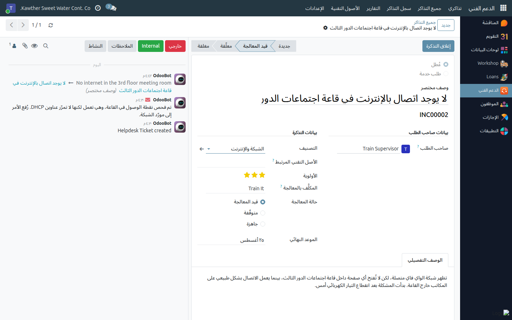
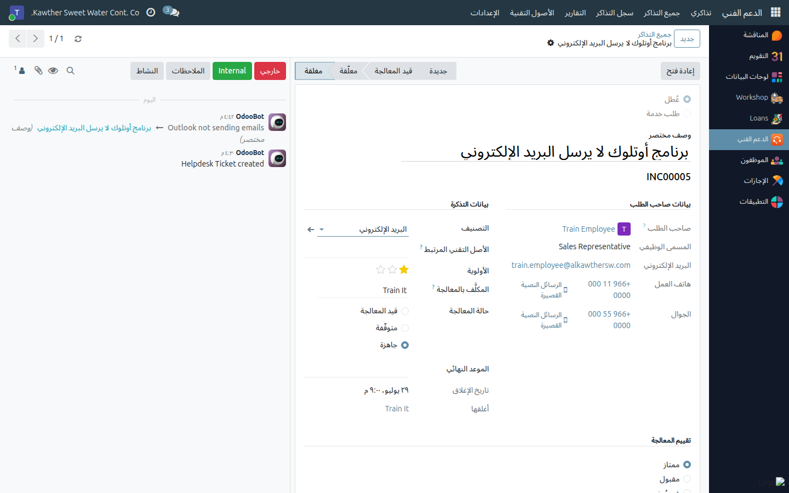

# معالجة التذكرة وإغلاقها

**الفئة المستهدفة:** فريق تقنية المعلومات
**الوقت المقدّر:** دقيقة واحدة للإغلاق بعد انتهاء العمل

---

## ما الذي تفعله هذه الشاشة

تنقل التذكرة من «مكلَّف بها» إلى سجل مغلق ومكتمل: الحوار مدوّن في التذكرة،
والمعالجة موثّقة، والإغلاق مختوم بالتاريخ وباسمك، والموظف مدعو لتقييم النتيجة.

---

## قبل أن تبدأ

- يُفترض أن تكون التذكرة **مكلَّفًا بها أنت** (أو تغلقها نيابة عن الفريق).
  استخدم **تكليف نفسي** إن كانت بلا مكلَّف.
- كل ما تفعله خارج النظام — اتصال هاتفي، زيارة للمكتب، طلب قطعة غيار — مكانه
  التذكرة. التذكرة هي السجل.

---

## الخطوات

١. **اعمل على التذكرة من صندوق الرسائل أسفلها.** الزر الذي تختاره يحدّد من
   يصله الإشعار:

   | الزر | من يصله الإشعار | متى تستخدمه |
   |---|---|---|
   | **خارجي** | كل متابعي التذكرة — من رفعها والمكلَّف بها | سؤال للموظف، أو تحديث عن سير المعالجة، أو «جرّب هذا وأخبرني» |
   | **Internal** | المتابعون الداخليون فقط | تسليم المهمة لزميل، أو طلب رأي من عضو في الفريق |
   | **الملاحظات** | لا أحد | التشخيص وأرقام القطع والأرقام التسلسلية وما جرّبته — السجل المكتوب |
   | **النشاط** | من تُسنِد إليه النشاط | جدولة متابعة: «الاتصال يوم الأحد»، «متابعة المورّد» |

   ويمكنك إرفاق صور الشاشة أو السجلات مع أيٍّ منها.

   > **من هم المتابعون فعلًا؟** منشئ التذكرة والمكلَّف بمعالجتها. فإن رفع
   > المشرف التذكرة نيابة عن موظف، فالموظف **ليس** متابعًا لها — أضفه من
   > أيقونة المتابعين أعلى صندوق الرسائل قبل أن تتوقع وصول رسائلك إليه.

٢. **علّقها بصراحة إن كنت تنتظر.** انقلها إلى **معلّقة** واضبط العلامة على
   **متوقّفة**، مع رسالة تبيّن ما تنتظره. فتذكرة تبقى أسبوعًا في «قيد
   المعالجة» بلا تدوين هي بالضبط ما وُجد هذا النظام لمنعه.

٣. **عالج المشكلة، ودوّن ما فعلته.** رسالة واحدة تصف المعالجة الفعلية:
   الإعداد الذي غيّرته، أو القطعة التي استبدلتها، أو الحساب الذي فتحته. هذا ما
   يجعل **سجل التذاكر** ذا قيمة عند البحث لاحقًا.

٤. **حدّث بيانات الأصل إن كانت المعالجة تخصّه.** استبدلت حاسبًا محمولًا؟
   أرسِل القديم للصيانة أو سجّله مفقودًا، وسلّم الجديد كعهدة — راجع
   [تسليم العهد واسترجاعها](04-assign-and-return-assets.md). وحقل **الأصل
   التقني المرتبط** في التذكرة هو ما يربط السجلّين.

٥. **اضغط «إغلاق التذكرة»** في أعلى النموذج.

   

   الإغلاق يقوم بأربعة أمور دفعة واحدة: ينقل التذكرة إلى مرحلة **مغلقة**،
   ويختم **تاريخ الإغلاق**، ويسجّل **من أغلقها** باسمك، ويضبط العلامة على
   **جاهزة**.

---

## ما الذي يحدث بعد ذلك

- تخرج التذكرة من لوحة العمل (عمود **مغلقة** مطويّ) وتظهر في **سجل التذاكر**
  وفي **التقارير**.
- يُحتسب **زمن المعالجة** تلقائيًا: عدد الساعات بين الإنشاء والإغلاق. وهو
  المقياس الذي تقوم عليه التقارير، ولهذا فإن توقيت الإغلاق أهم مما يبدو.
- يظهر في التذكرة قسم **تقييم المعالجة** ليعبّئه الموظف: **ممتاز** أو
  **مقبول** أو **غير مُرضٍ**. اطلبه منه عند تسليم العمل؛ فهو مؤشر الرضا
  الوحيد في النظام.

---

## إعادة الفتح

إن عادت المشكلة، افتح التذكرة المغلقة واضغط **إعادة فتح**. تعود إلى مرحلة
**جديدة**، ويُمحى تاريخ الإغلاق ومن أغلقها، وتعود العلامة إلى «قيد المعالجة»،
ويبقى الحوار كاملًا كما هو.

أعِد الفتح بدل رفع تذكرة مكرّرة ما دامت المشكلة نفسها — ليبقى السجل في مكان
واحد. وارفع تذكرة جديدة حين تكون المشكلة مختلفة وإن بدت شبيهة.

---

## أسئلة ومشكلات شائعة

| ما تراه | السبب | المعالجة |
|---|---|---|
| لا يظهر زر **إغلاق التذكرة** | التذكرة مغلقة أصلًا | يظهر مكانه زر **إعادة فتح** |
| لا يظهر زر **تكليف نفسي** | التذكرة مكلَّف بها أحد، أو مغلقة | غيّر حقل **المكلَّف بالمعالجة** مباشرة |
| الموظف يقول إنه لم يُبلَّغ | كتبت في **الملاحظات** (لا تُشعِر أحدًا) بدل **خارجي**، أو أنه ليس متابعًا | اكتب عبر **خارجي**، وأضفه متابعًا إن كانت التذكرة مرفوعة نيابة عنه |
| أغلقت التذكرة الخطأ | — | اضغط **إعادة فتح**؛ لا يضيع شيء |
| زمن المعالجة يبدو غير منطقي | يُحسب بالساعات الفعلية من الإنشاء إلى الإغلاق، لا بساعات العمل | أغلق التذاكر عند انتهاء العمل فعلًا، لا في جولة تنظيف أسبوعية |
| لا يصل أي تقييم | الموظفون لا يعرفون أن عليهم التقييم | اذكره لهم عند تسليم المعالجة |

---

## أدلة ذات صلة

- [إدارة قائمة التذاكر](01-ticket-queue.md)
- [التقارير وسجل التذاكر](06-reporting-and-history.md)
- [تسليم العهد واسترجاعها](04-assign-and-return-assets.md)

