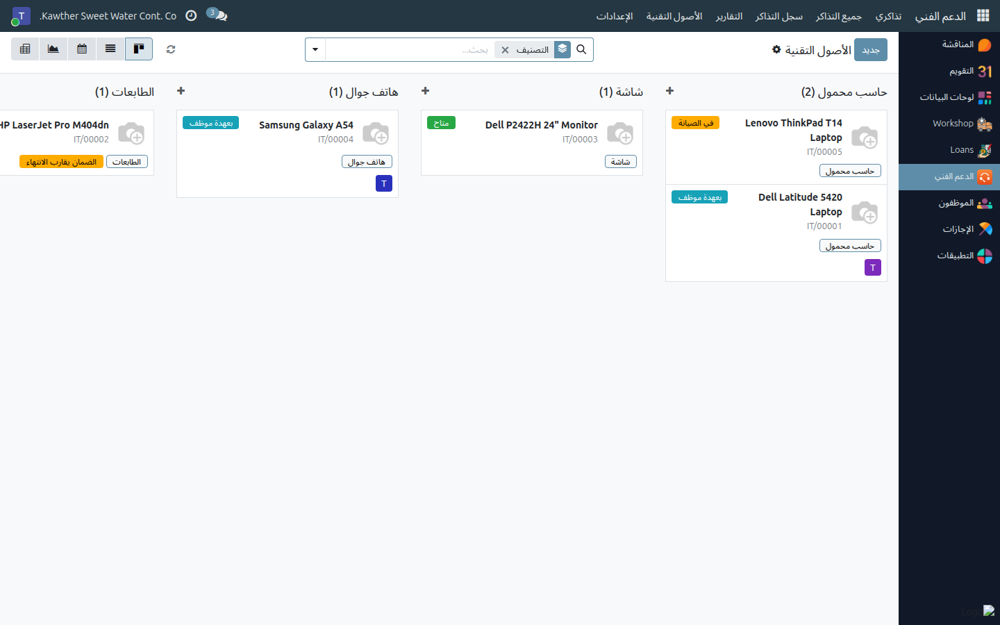
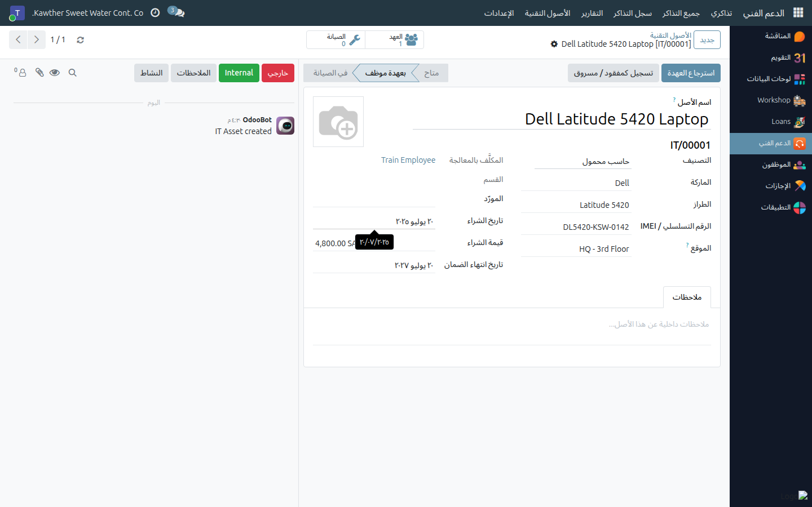

# سجل الأصول التقنية

**الفئة المستهدفة:** فريق تقنية المعلومات (لا يراه أحد غيره)
**الوقت المقدّر:** دقيقتان لتسجيل أصل

---

## ما الذي تفعله هذه الشاشة

تحفظ قائمة واحدة معتمدة بكل ما تملكه الشركة من أجهزة تقنية — حواسب محمولة
ومكتبية، وشاشات، وهواتف، وطابعات، وأجهزة شبكات، ورخص برامج، وملحقات — مع بيان
ما هو الجهاز، وكم كلّف، وهل ما يزال تحت الضمان، و**من يحمله الآن**.

كما يغذّي هذا السجل الدعم الفني: حقل **الأصل التقني المرتبط** في التذكرة لا
يعرض للموظف إلا الأجهزة المسجّلة بعهدته، فتصبح تذكرة «حاسبي المحمول» مرتبطة
برقم تسلسلي محدّد.

---

## قبل أن تبدأ

- **الأصول التقنية لفريق تقنية المعلومات وحده.** لا يملك أي دور آخر — مديرًا
  كان أو غيره — القائمة ولا الشاشات ولا التقارير. والاستثناء الوحيد: يستطيع
  الموظف الاطّلاع على الأصل الذي بعهدته فقط، لا لشيء إلا ليعمل حقل التذكرة.
- جهّز بيانات الجهاز: الماركة والطراز والرقم التسلسلي (أو IMEI)، ومصدره
  وتاريخ شرائه، وتاريخ انتهاء الضمان إن وُجد.

---

## السجل

افتح **الدعم الفني ← الأصول التقنية ← الأصول**. يُفتح عرض كانبان مجمّع حسب
التصنيف، تعرض كل بطاقة فيه صورة الجهاز واسمه ورقمه وتصنيفه وحالته.

ولكل أصل حالة واحدة في أي وقت:

| الحالة | معناها |
|---|---|
| **متاح** | في المستودع، جاهز للتسليم |
| **بعهدة موظف** | مسلَّم لموظف |
| **في الصيانة** | خارج للإصلاح |
| **خارج الخدمة** | انتهى عمره التشغيلي. مؤرشف، فلا يظهر إلا بمرشّح |
| **مفقود / مسروق** | غير معلوم المصير |

---

## الخطوات — تسجيل أصل جديد

١. **افتح الدعم الفني ← الأصول التقنية ← الأصول** ثم اضغط **جديد**.

٢. **سمِّ الجهاز كما ينطقه الناس** — «حاسب محمول Dell Latitude 5420»، لا
   «أصل ١٤».

   

٣. **اختر التصنيف** (حاسب محمول، حاسب مكتبي، شاشة، هاتف جوال، طابعة، أجهزة
   شبكات، رخصة برنامج، ملحق). وهو حقل إلزامي، وعليه يقوم التجميع واللون وكل
   تقرير.

٤. **عبّئ بيانات الهوية:** الماركة، والطراز، و**الرقم التسلسلي / IMEI**.
   الرقم التسلسلي هو ما ستبحث به حين يقرأه عليك موظف عبر الهاتف، فأدخِله
   بدقة.

٥. **حدّد الموقع** — أين يوجد الجهاز فعليًا حين لا يحمله أحد، مثل: «المركز
   الرئيسي - مستودع الدور الثالث».

٦. **سجّل بيانات الشراء:** المورّد، وتاريخ الشراء، وقيمة الشراء، و**تاريخ
   انتهاء الضمان**. تاريخ الضمان يستحق العشر ثوانٍ التي يستغرقها — راجع
   [الصيانة والفقد والضمان](05-maintenance-and-warranty.md).

٧. **أضف صورة** للجهاز إن كانت تساعد في تمييزه، وأي ملاحظات داخلية في تبويب
   **ملاحظات**.

٨. **احفظ.** يحصل الأصل على رقمه الدائم — `IT/00001`، `IT/00002`، … — ويبدأ
   بحالة **متاح**.

---

## البحث عن أصل

يطابق صندوق البحث **الاسم ورقم الأصل والرقم التسلسلي** في آنٍ واحد. وإلى جانب
ذلك:

- مرشّحات: **متاح**، **بعهدة موظف**، **في الصيانة**، **مفقود / مسروق**،
  **خارج الخدمة**، **مؤرشف**
- **ضمان يقارب الانتهاء** و**الضمان منتهٍ**
- التجميع حسب **التصنيف** أو **الحالة** أو **الموظف** أو **القسم**
- عرض **التقويم** يوزّع تواريخ انتهاء الضمان على الأشهر، وعرضا **الرسم
  البياني** و**المحوري** يفصّلان الأجهزة حسب التصنيف والحالة

وزرّا **العهد** و**الصيانة** أعلى نموذج الأصل يفتحان سجله الكامل: كل من
حمله، وكل إصلاح مرّ به.

---

## أسئلة ومشكلات شائعة

| ما تراه | السبب | المعالجة |
|---|---|---|
| رسالة: رقم الأصل هذا مستخدم بالفعل | الأرقام فريدة ويولّدها النظام | لا تكتب الأرقام يدويًا؛ اترك التسلسل يمنحها |
| اختفى أصل من القائمة | أُخرج من الخدمة، والإخراج يؤرشفه | أضف مرشّح **مؤرشف** أو **خارج الخدمة** |
| لا أستطيع الكتابة في حقل الموظف | يُضبط عبر إجراء التسليم والاسترجاع لا يدويًا | استخدم **تسليم عهدة لموظف** — راجع [تسليم العهد واسترجاعها](04-assign-and-return-assets.md) |
| الموظف لا يجد جهازه في التذكرة | الجهاز غير مسجّل بعهدته | سلّمه إليه كعهدة؛ حقل التذكرة يتبع العهدة |
| زميل يقول إن قائمة الأصول لا تظهر لديه | ليس ضمن مجموعة **فريق تقنية المعلومات** | هذا هو السلوك المقصود؛ الأصول للفريق وحده |

---

## أدلة ذات صلة

- [تسليم العهد واسترجاعها](04-assign-and-return-assets.md)
- [الصيانة والفقد والضمان](05-maintenance-and-warranty.md)
- [الإعدادات](07-configuration.md)

