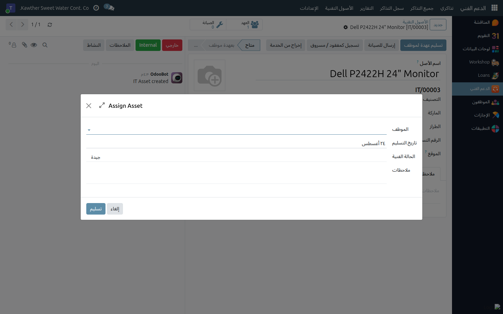
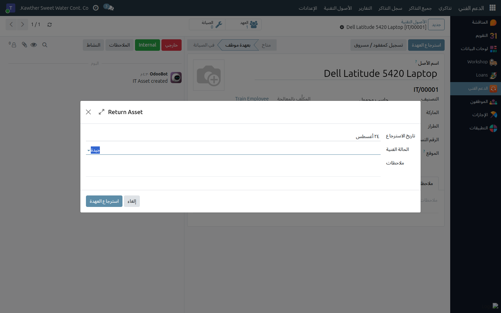
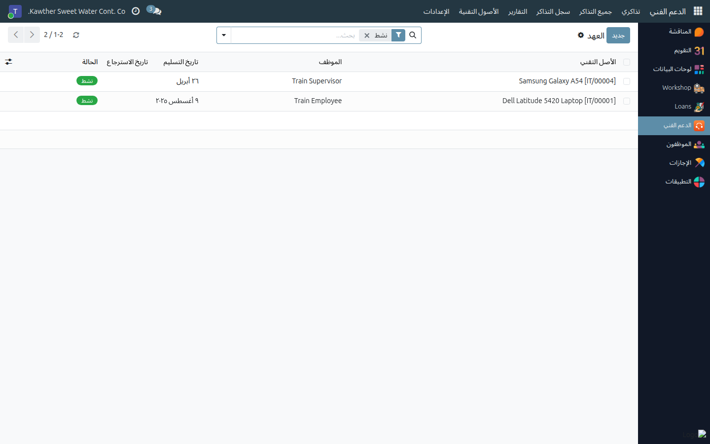

# تسليم العهد واسترجاعها

**الفئة المستهدفة:** فريق تقنية المعلومات
**الوقت المقدّر:** دقيقة واحدة في كل اتجاه

---

## ما الذي تفعله هذه الشاشة

توثّق العهدة: أي جهاز بحوزة أي موظف، ومنذ متى، وبأي حالة فنية — ثم تُقفل ذلك
السجل عند الاسترجاع. كل تسليم واسترجاع يُحفظ سطرًا مؤرخًا، فيمكن لأي جهاز أن
يجيب بعد سنوات عن سؤال «من حمله ومتى؟»، ويمكن تصفية عهد أي موظف في آخر يوم
عمل له.

---

## قبل أن تبدأ

- يجب أن يكون الأصل **متاحًا** ليُسلَّم. فإن كان بعهدة أحد فاسترجعه أولًا،
  وإن كان في الصيانة فاستلمه منها أولًا.
- اتفق مع الموظف على **الحالة الفنية** عند التسليم — فهي ما يحمي الطرفين عند
  الاسترجاع.

---

## الخطوات — التسليم

١. **افتح الأصل** (**الدعم الفني ← الأصول التقنية ← الأصول**) واضغط **تسليم
   عهدة لموظف** في أعلى النموذج.

   

٢. **اختر الموظف**، وتحقّق من **التاريخ** (اليوم افتراضيًا)، وحدّد **الحالة
   الفنية** عند التسليم: جديدة أو جيدة أو مقبولة أو سيئة.

٣. **أضف ملاحظة** إن كان هناك ما يستحق التدوين: الملحقات المسلَّمة، خدش في
   الغطاء، إعارة مؤقتة بتاريخ إرجاع متفق عليه.

٤. **اضغط تسليم.** يتحوّل الأصل إلى **بعهدة موظف**، ويظهر اسم الموظف وقسمه،
   ويُفتح سطر جديد في سجل العهد.

ومن تلك اللحظة يستطيع الموظف اختيار هذا الجهاز في حقل **الأصل التقني
المرتبط** في تذاكره.

---

## الخطوات — الاسترجاع

١. **افتح الأصل** واضغط **استرجاع العهدة** في أعلى النموذج.

   

٢. **تحقّق من التاريخ**، وسجّل **الحالة الفنية عند الاسترجاع**. هذا هو مقصد
   خطوة الاسترجاع كلّها: مقارنة الحالة عند التسليم بالحالة عند الاسترجاع هي
   ما يكشف التلف في وقته.

٣. **أضف ملاحظة** — شاحن مفقود، شاشة مكسورة، الجهاز مُسح وأُعيد تجهيزه.

٤. **اضغط استرجاع.** يُقفل سطر العهدة المفتوح بتاريخ الاسترجاع وحالته، ويعود
   الأصل إلى **متاح**، ويُفرَّغ حقل الموظف.

---

## سجل العهد

**الدعم الفني ← الأصول التقنية ← العهد** يعرض كل تسليم سُجّل على الإطلاق،
لجميع الأصول، مع بحث حسب الموظف أو الأصل أو التصنيف، وحسب **نشطة** أو
**مُسترجَعة**.

ويجيب مباشرة عن أمرين:

- **إخلاء الطرف.** صفِّ حسب الموظف وحسب **نشطة** — فما يظهر هو ما يزال بعهدته،
  وهو ما يجب استرجاعه قبل آخر يوم عمل له.
- **تاريخ الجهاز.** من نموذج الأصل، يفتح زر **العهد** القائمة نفسها لهذا
  الجهاز وحده: كل من حمله، وكل التواريخ، والحالة عند التسليم والاسترجاع.

---

## أسئلة ومشكلات شائعة

| ما تراه | السبب | المعالجة |
|---|---|---|
| رسالة: لا يمكن تسليم إلا أصل متاح، استرجعه أو أصلحه أولًا | الأصل بعهدة أحد أو في الصيانة أو خارج الخدمة أو مفقود | استرجعه أو استلمه من الصيانة أولًا |
| رسالة: هذا الأصل ليس بعهدة أحد حاليًا | ضغطت **استرجاع العهدة** على أصل لا يحمله أحد | راجع شريط الحالة |
| لا يظهر زر **تسليم عهدة لموظف** | الأصل ليس **متاحًا** | كما سبق |
| سلّمت الجهاز للموظف الخطأ | — | **استرجعه** (بالتاريخ نفسه والحالة نفسها) ثم سلّمه للموظف الصحيح. يبقى السطران في السجل، وهذا أمانة لا ضرر فيه |
| الموظف غادر والجهاز ما يزال باسمه | لم يُسجَّل الاسترجاع | سجّل الاسترجاع الآن بالتاريخ الحقيقي؛ يحفظ السجل التواريخ الصحيحة |
| الموظف ما يزال لا يجد جهازه في التذكرة | لم يُحفظ التسليم، أو أن صاحب الطلب في التذكرة شخص آخر | تأكّد من تطابق الموظف في الأصل مع **صاحب الطلب** في التذكرة |

---

## أدلة ذات صلة

- [سجل الأصول التقنية](03-asset-register.md)
- [الصيانة والفقد والضمان](05-maintenance-and-warranty.md)

