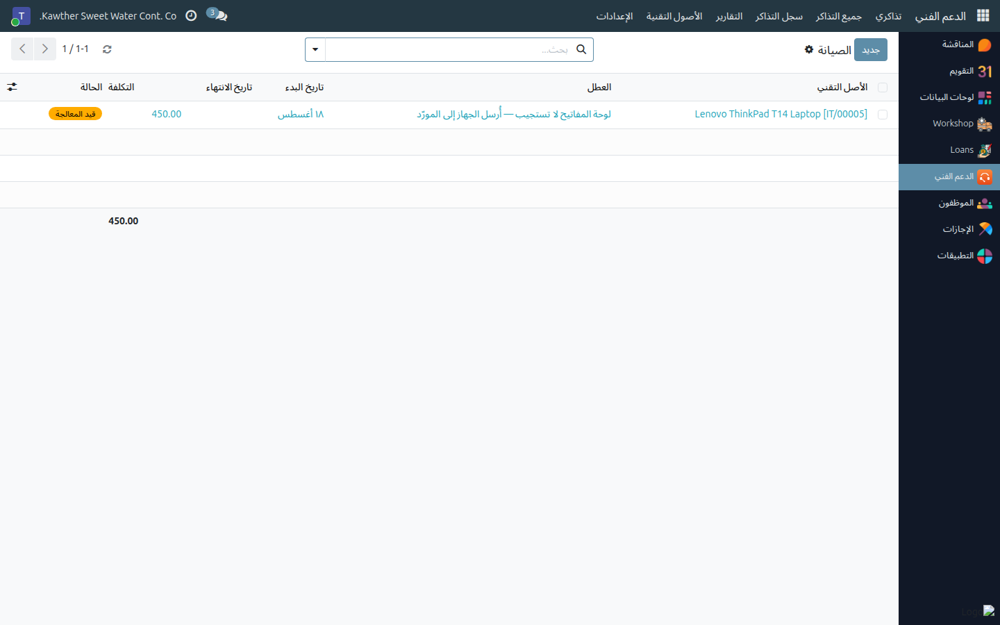

# الصيانة والفقد والإخراج من الخدمة والضمان

**الفئة المستهدفة:** فريق تقنية المعلومات
**الوقت المقدّر:** دقيقة واحدة لكل إجراء

---

## ما الذي تفعله هذه الشاشة

تغطّي بقية عمر الأصل بعد شرائه وتسليمه: إرساله للإصلاح واستلامه، وشطب المفقود
والمسروق، وإخراج ما انتهى عمره التشغيلي، ومتابعة الضمان حتى تُطالب بالإصلاح
بدل أن تدفع ثمنه.

---

## قبل أن تبدأ

- كل هذه الإجراءات تتطلب أن يكون الأصل في الحالة المناسبة؛ ولذلك تظهر الأزرار
  وتختفي تبعًا للحالة. **والأصل الذي بعهدة موظف يجب استرجاعه أولًا** — لا
  يمكن إرساله للصيانة وهو بعهدته.
- تحقّق من سريان الضمان قبل الالتزام بإصلاح مدفوع. النموذج يخبرك: شريط
  **الضمان يقارب الانتهاء** أو **الضمان منتهٍ** أعلى الشاشة، وحالة ملوّنة في
  القائمة.

---

## إرسال جهاز للإصلاح

١. **استرجعه من الموظف أولًا** إن كان بعهدة أحد — راجع
   [تسليم العهد واسترجاعها](04-assign-and-return-assets.md).

٢. **اضغط «إرسال للصيانة»** في أعلى النموذج. يتحوّل الأصل إلى **في الصيانة**،
   ويُفتح له سجل صيانة.

٣. **عبّئ سجل الصيانة** من **الدعم الفني ← الأصول التقنية ← الصيانة**، أو من
   زر **الصيانة** في نموذج الأصل نفسه: صف **العطل**، وحدّد **جهة الإصلاح**
   (المورّد)، وأدخِل **التكلفة** حين تعرفها.

   

٤. **عند عودة الجهاز**، افتح الأصل واضغط **استلام من الصيانة**. يُغلق سجل
   الصيانة المفتوح بحالة **منجزة** وبتاريخ اليوم، ويعود الأصل **متاحًا** جاهزًا
   للتسليم.

وزر **الصيانة** في أي أصل يعرض كل إصلاح مرّ به مع تكلفته. وثلاثة إصلاحات
مكلفة على جهاز واحد هي الحجة الكافية لاستبداله.

---

## المفقود أو المسروق

اضغط **تسجيل كمفقود / مسروق** (سيطلب منك النظام التأكيد). استخدمه حين يتعذّر
فعلًا تحديد مكان الجهاز — تظهر الحالة باللون الأحمر في السجل وفي كل تقرير.

> إن كان الجهاز بعهدة موظف حين فُقد، **فاسترجعه منه أولًا** مع تدوين الملابسات
> في ملاحظات الاسترجاع، ثم سجّله مفقودًا. بهذا يُقفل سجل العهدة بشكل صحيح
> ويقرأ التاريخ قراءة سليمة.

وإن ظهر الجهاز لاحقًا، اضغط **إخراج من الخدمة** ثم **إعادة التفعيل**، أو
أعِد تفعيله من قائمة المؤرشف مباشرة — فيعود **متاحًا**.

---

## الإخراج من الخدمة

**الإخراج من الخدمة** لنهاية العمر التشغيلي: الشطب أو التخلص أو البيع أو
الاستبدال. ويشترط أن يكون الأصل **متاحًا** أو **مفقودًا / مسروقًا** أولًا،
حتى لا يُخرَج جهاز من الخدمة وهو بعهدة موظف.

والإخراج من الخدمة **يؤرشف** الأصل: يحتفظ بسجله كاملًا لكنه يختفي من القائمة
المعتادة. تجده بمرشّح **مؤرشف** أو **خارج الخدمة**، وزر **إعادة التفعيل**
يعيده **متاحًا** إن أخرجته بالخطأ.

والإخراج من الخدمة أفضل من الحذف؛ فالأصل المحذوف يأخذ معه سجل عهده وصيانته.

---

## متابعة الضمان

عبّئ **تاريخ انتهاء الضمان** عند تسجيل الأصل، ويتولّى النظام مراقبته:

| حالة الضمان | متى |
|---|---|
| **ساري** | بقي أكثر من ٣٠ يومًا |
| **يقارب الانتهاء** | بقي ٣٠ يومًا أو أقل — شارة وشريط بلون كهرماني |
| **منتهٍ** | مضى التاريخ — شارة وشريط بلون أحمر |
| **بلا ضمان** | لم يُسجَّل تاريخ |

- **المرشّحات:** *ضمان يقارب الانتهاء* و*الضمان منتهٍ* في قائمة الأصول.
- **عرض التقويم:** يوزّع تواريخ انتهاء الضمان على الأشهر، وهو أسرع طريقة
  لمعرفة ما يوشك على الانتهاء.
- **تذكير تلقائي:** قبل **٣٠ يومًا بالضبط** من انتهاء ضمان أي أصل، يُنشئ
  النظام نشاطًا تذكيريًا **لكل عضو في فريق تقنية المعلومات**. يظهر في
  **الأنشطة** (أيقونة الساعة في الشريط العلوي) ويذكر اسم الأصل والتاريخ.

وهذا التذكير هو الغاية من تعبئة تاريخ الضمان: فهو اللحظة المناسبة لمطالبة
المورّد بأي إصلاح معلّق ما دام مجانيًا.

---

## أسئلة ومشكلات شائعة

| ما تراه | السبب | المعالجة |
|---|---|---|
| رسالة: لا يمكن إرسال إلا أصل متاح إلى الصيانة | الأصل بعهدة موظف أو خارج الخدمة أو في الصيانة أصلًا | استرجعه من الموظف أولًا |
| رسالة: هذا الأصل ليس في الصيانة | ضغطت **استلام من الصيانة** على أصل ليس في الصيانة | راجع شريط الحالة |
| رسالة: استرجع الأصل أو أصلحه قبل إخراجه من الخدمة | الإخراج من الخدمة لا يعمل إلا من **متاح** أو **مفقود / مسروق** | استرجعه أو استلمه من الصيانة أولًا |
| اختفى أصل أخرجته من الخدمة | الإخراج يؤرشفه | صفِّ حسب **مؤرشف** / **خارج الخدمة** ثم **إعادة التفعيل** |
| لا تصل تذكيرات الضمان | لا يوجد تاريخ انتهاء للضمان، أو أن الشخص ليس ضمن فريق تقنية المعلومات | عبّئ **تاريخ انتهاء الضمان**؛ التذكير يصل أعضاء الفريق فقط |
| وصل التذكير متأخرًا عن حاجتي | يصدر مرة واحدة قبل ٣٠ يومًا | اجعل مرشّح **ضمان يقارب الانتهاء** جزءًا من جولتك الشهرية أيضًا |

---

## أدلة ذات صلة

- [سجل الأصول التقنية](03-asset-register.md)
- [تسليم العهد واسترجاعها](04-assign-and-return-assets.md)

