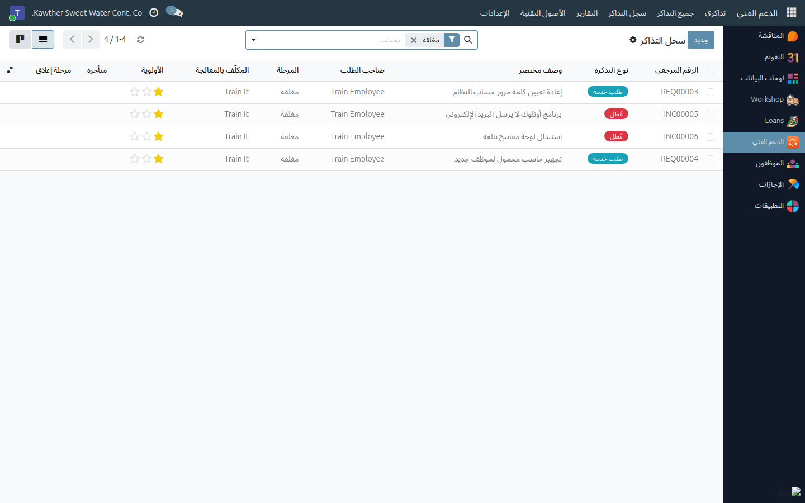
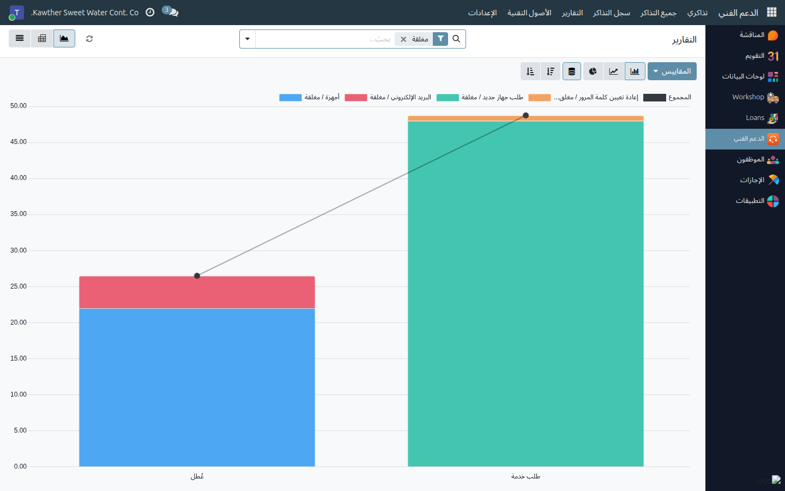

# التقارير وسجل التذاكر

**الفئة المستهدفة:** فريق تقنية المعلومات
**الوقت المقدّر:** ٥ دقائق

---

## ما الذي تفعله هذه الشاشة

تحوّل التذاكر المغلقة إلى أمرين قابلين للاستخدام: **سجل قابل للبحث** عمّا تمت
معالجته وكيف (سجل التذاكر)، و**أرقام** عن الأعداد والتوزيع والسرعة (التقارير).

وكلاهما لا ينظر إلا إلى التذاكر **المغلقة** — أي العمل المنجز فعلًا.

---

## سجل التذاكر — «هل مرّت علينا هذه المشكلة؟»

**الدعم الفني ← سجل التذاكر** يعرض كل تذكرة مغلقة في قائمة.

يطابق صندوق البحث **رقم التذكرة وعنوانها ووصفها** معًا، فالبحث بكلمة `VPN`
يستخرج كل مشكلات الشبكة الافتراضية الخاصة التي أُغلقت، بما فيها الحوارات التي
عالجتها. وقبل أن تبدأ تشخيص مشكلة غير مألوفة، ابحث في السجل أولًا — فكثيرًا ما
يكون الجواب عمره ثلاثة أشهر.

وهناك أعمدة مفيدة مخفية افتراضيًا؛ أظهرها من زر **الأعمدة الاختيارية (⚙)** في
طرف شريط العناوين: **التصنيف**، و**الموعد النهائي**، و**أنشئ في**، و**تاريخ
الإغلاق**، و**أغلقها**، و**زمن المعالجة**، و**مستوى الرضا**.

---

## التقارير — الأرقام

**الدعم الفني ← التقارير** يفتح التذاكر المغلقة نفسها على هيئة رسم بياني، مع
عرضي **المحوري** و**القائمة** على بعد ضغطة.

وهناك مقياسان: **عدد** التذاكر، و**زمن المعالجة (ساعة)** — أي الساعات بين
إنشاء التذكرة وإغلاقها.

وهذه أسئلة يجيب عنها مباشرة:

| السؤال | الطريقة |
|---|---|
| فيمَ يذهب وقتنا فعلًا؟ | جمّع الصفوف حسب **التصنيف** والمقياس **العدد** |
| الأعطال مقابل طلبات الخدمة | جمّع حسب **النوع** |
| من يغلق ماذا | جمّع حسب **المكلَّف بالمعالجة** |
| أين نحن بطيئون؟ | جمّع حسب **التصنيف** والمقياس **زمن المعالجة**، ثم حوّله إلى المتوسط |
| هل الوضع يتحسّن؟ | العرض المحوري مع **تاريخ الإغلاق : شهر** في الأعمدة |
| أي قسم يرفع أكثر التذاكر؟ | جمّع حسب قسم صاحب الطلب |

في العرض **المحوري**، استخدم قائمة **المقاييس** للتبديل بين العدد وزمن
المعالجة، ولتحويل زمن المعالجة إلى **متوسط** بدل المجموع — فمجموع الساعات على
٢٠٠ تذكرة لا يعني شيئًا، أما المتوسط فهو مستوى الخدمة. و**التنزيل إلى إكسل**
متاح من شريط أدوات العرض المحوري حين تحتاج الأرقام في تقرير.

> **اقرأ زمن المعالجة بإنصاف.** فهو زمن فعلي بالساعات يشمل الليل والعطلات،
> ويُحسب من الإنشاء إلى الإغلاق. تذكرة تُرفع مساء الخميس وتُغلق صباح الأحد
> تُقرأ كأنها ٤٠ ساعة من «البطء». استخدمه للمقارنة بين التصنيفات والأشهر، لا
> بوصفه التزامًا تعاقديًا بمستوى خدمة.

---

## صورة العمل المفتوح

التقارير تغطّي العمل المنجز. أما العمل الجاري فمن قائمة التذاكر نفسها:

- **جميع التذاكر ← متأخرة** — كل ما تجاوز موعده النهائي
- **جميع التذاكر ← غير مكلَّف بها أحد** — لا ينبغي أن يبقى شيء هنا طويلًا
- **جميع التذاكر** مجمّعة حسب **المكلَّف بالمعالجة** — حجم العمل لكل عضو
- عرض **التقويم** — المواعيد النهائية على مدى الشهر

---

## أسئلة ومشكلات شائعة

| ما تراه | السبب | المعالجة |
|---|---|---|
| تذكرة أغلقتها لا تظهر في التقارير | أُعيد فتحها فأصبحت مفتوحة | أغلقها حين تنتهي المعالجة فعلًا |
| أزمنة المعالجة تبدو مرتفعة جدًا | زمن فعلي يشمل العطلات، مع تذاكر تُغلق في جولات تنظيف متأخرة | أغلق التذاكر عند انتهاء العمل، وقارن نسبيًا لا مطلقًا |
| الرسم البياني فارغ | لا توجد تذاكر مغلقة في الفترة المصفّاة | وسّع الفترة |
| خانة الرضا فارغة في أغلب التذاكر | الموظفون لا يقيّمون إلا إذا طُلب منهم | اطلب التقييم عند تسليم المعالجة |
| أحتاج الأرقام في إكسل | — | استخدم زر التنزيل في العرض المحوري |

---

## أدلة ذات صلة

- [إدارة قائمة التذاكر](01-ticket-queue.md)
- [معالجة التذكرة وإغلاقها](02-resolve-and-close.md)

