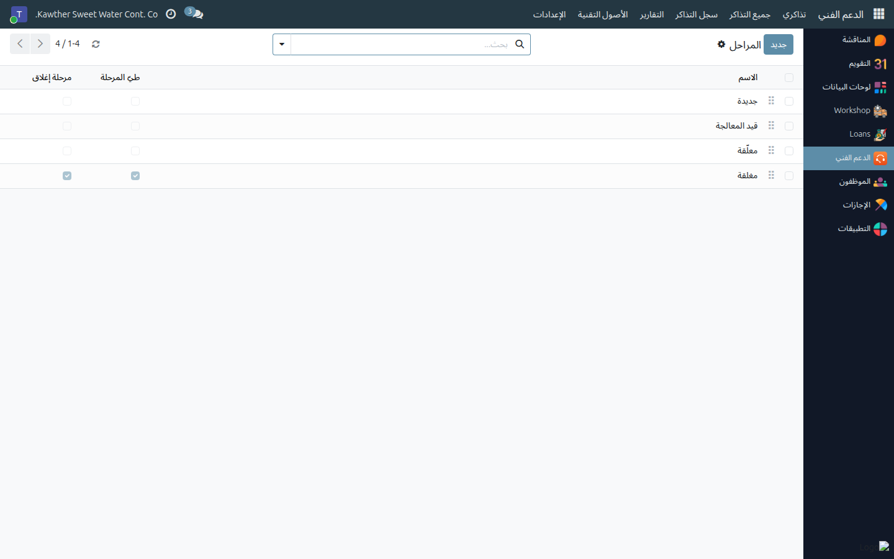
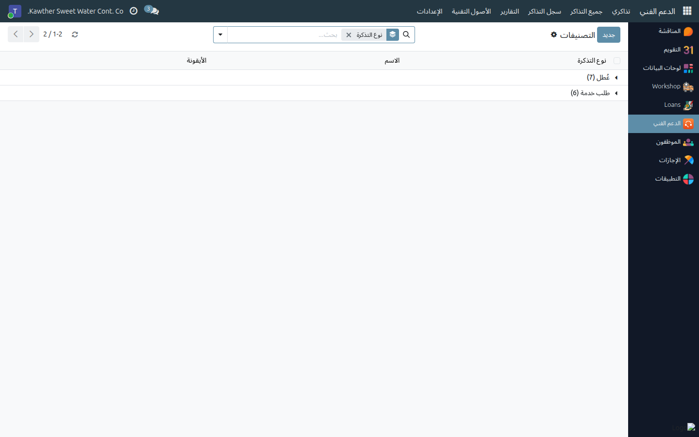
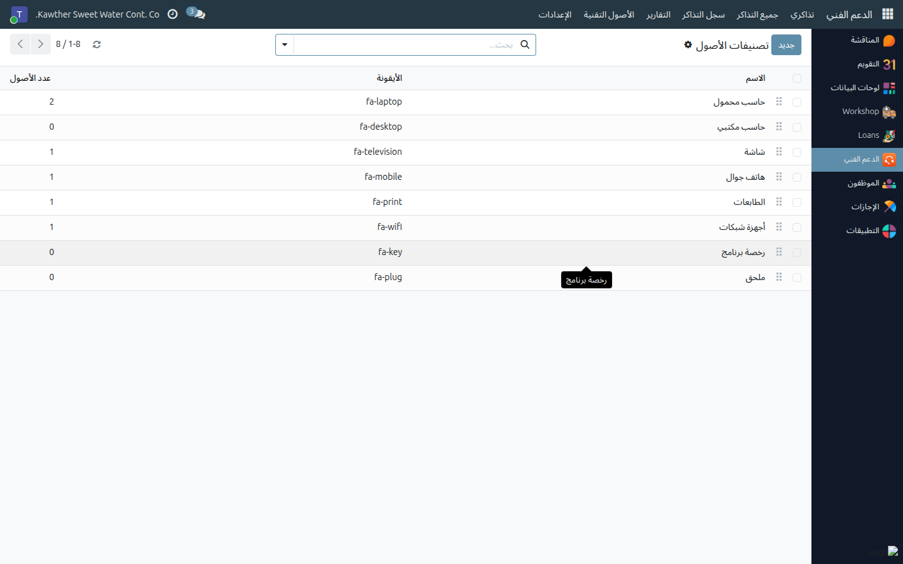

# إعداد المراحل والتصنيفات وتصنيفات الأصول

**الفئة المستهدفة:** فريق تقنية المعلومات
**الوقت المقدّر:** ٥ دقائق

---

## ما الذي تفعله هذه الشاشة

ثلاث قوائم إعداد قصيرة تشكّل التطبيق كله: **مراحل** سير التذكرة،
و**تصنيفات** التذاكر التي يختار منها الموظف، و**تصنيفات** تنظيم سجل الأصول.
وجميعها تحت **الدعم الفني ← الإعدادات**، ومقصورة على فريق تقنية المعلومات.

ويأتي النظام وقد عُبّئت الثلاث تعبئة منطقية. لا تغيّرها إلا حين يتغيّر
إجراؤكم فعلًا.

---

## مراحل التذكرة

**الدعم الفني ← الإعدادات ← مراحل التذكرة** — وهي أعمدة لوحة كانبان.

| الحقل | وظيفته |
|---|---|
| **الاسم** | عنوان العمود في اللوحة |
| **التسلسل** | ترتيب الأعمدة |
| **طيّ المرحلة** | يطوي العمود عند خلوّه — يُفعَّل على **مغلقة** |
| **مرحلة إغلاق** | **الحقل المهم.** التذاكر فيها تُعدّ منجزة |
| **الوصف** | يظهر كتلميح في اللوحة — استخدمه لبيان معنى المرحلة |

و**مرحلة إغلاق** هي ما يعتمد عليه بقية التطبيق: زر **إغلاق التذكرة** ينقل
التذكرة إلى **أول مرحلة مفعَّل فيها هذا الحقل**، وزر **إعادة فتح** يعيدها إلى
**أول مرحلة غير مفعَّل فيها**. وعلى الحقل نفسه تقوم التقارير وسجل التذاكر
ومرشّحات المفتوحة/المغلقة واحتساب التأخّر.

وقاعدتان تستحقان الالتزام:

- **أبقِ مرحلة إغلاق واحدة فقط** ما لم يكن لديك سبب حقيقي لغيرها. فمع
  مرحلتين يتوقف «المغلق» عن كونه رقمًا واحدًا.
- **المرحلة المستخدمة لا تُحذف** — يمنع النظام ذلك حمايةً للتذاكر التي فيها.
  غيّر اسمها، أو انقل تذاكرها أولًا.

---

## تصنيفات التذاكر

**الدعم الفني ← الإعدادات ← تصنيفات التذاكر** — وهي ما يختاره الموظف في
النموذج.

كل تصنيف تابع **لنوع واحد**، وهذا ما يجعل النموذج يتصرّف كما ينبغي: اختيار
**عُطل** يعرض تصنيفات الأعطال فقط، واختيار **طلب خدمة** يعرض تصنيفات الطلبات
فقط.

| النوع | التصنيفات الجاهزة |
|---|---|
| **عُطل** | أجهزة · برامج · الشبكة والإنترنت · البريد الإلكتروني · الطابعات · الوصول والصلاحيات · أخرى |
| **طلب خدمة** | طلب جهاز جديد · طلب تثبيت برنامج · طلب وصول أو صلاحية · إعادة تعيين كلمة المرور · استفسار أو إرشاد · أخرى |

- يجوز تكرار **الاسم مرة واحدة لكل نوع** — ولهذا يظهر «أخرى» في القائمتين —
  ولا يجوز تكراره داخل النوع الواحد.
- **اللون** يلوّن بطاقات التذاكر في اللوحة، و**التسلسل** يرتّب القائمة
  المنسدلة، فضع الشائع أولًا.
- لإيقاف عرض تصنيف دون فقد التذاكر المسجّلة تحته، **أرشِفه** بدل حذفه.

والتصنيفات هي المحور الذي تُجمَّع عليه كل التقارير؛ فإضافة تصنيف تجزّئ
سجلّكم. أبقِ القائمة قصيرة وذات معنى.

---

## تصنيفات الأصول

**الدعم الفني ← الإعدادات ← تصنيفات الأصول** — وهي تنظيم سجل الأصول.

تأتي جاهزة بـ **حاسب محمول، وحاسب مكتبي، وشاشة، وهاتف جوال، وطابعة، وأجهزة
شبكات، ورخصة برنامج، وملحق**. ولكل تصنيف اسم وتسلسل ولون (يلوّن بطاقات
الأصول) وأيقونة، ويعرض عدد الأصول المسجّلة تحته — ويمكنك فتحها بضغطة.

والأسماء فريدة على مستوى الشركة. وأرشِف بدل الحذف حين يتوقف استخدام تصنيف.

---

## من يملك هذه الصلاحيات

في التطبيق كله دوران لا ثالث لهما:

| الدور | ما يستطيعه |
|---|---|
| **مستخدم** (كل موظف تلقائيًا) | رفع التذاكر لنفسه أو لأحد موظفيه المباشرين، ومتابعتها، والتعليق عليها، وتقييم المعالجة. لا أصول ولا إعدادات |
| **فريق تقنية المعلومات** | كل شيء: جميع التذاكر، وتغيير المرحلة والتكليف وحالة المعالجة، وسجل الأصول التقنية، وقوائم الإعدادات هذه |

وتُمنح الأدوار من **الإعدادات ← المستخدمون والشركات ← المستخدمون**، في قسم
**الدعم الفني** من بطاقة المستخدم. وكل مستخدم داخلي هو **مستخدم** في الدعم
الفني أصلًا، فلا حاجة لمنح ذلك؛ إنما تضيف الأشخاص إلى **فريق تقنية
المعلومات** فقط.

---

## أسئلة ومشكلات شائعة

| ما تراه | السبب | المعالجة |
|---|---|---|
| إغلاق التذكرة ينقلها إلى مرحلة غير متوقعة | أكثر من مرحلة مفعَّل فيها **مرحلة إغلاق** | أبقِ واحدة؛ الإغلاق يختار الأولى حسب التسلسل |
| **إعادة الفتح** تضع التذكرة في مرحلة غريبة | تذهب إلى أول مرحلة **غير** مفعَّل فيها الحقل | راجع تسلسل مراحلك المفتوحة |
| المرحلة لا تُحذف | ما تزال تذاكر مرتبطة بها | انقل تذاكرها، أو أرشِفها/غيّر اسمها بدل الحذف |
| رسالة: يوجد تصنيف بهذا الاسم لنوع التذكرة نفسه | الأسماء فريدة داخل النوع | غيّر الاسم، أو تحقّق من وجوده تحت النوع الآخر |
| الموظف لا يرى التصنيف الذي أضفته | التصنيف تابع للنوع الآخر | التصنيفات تتبع اختيار عُطل / طلب خدمة |
| زميل جديد في الفريق لا يرى إلا تذاكره | لم يُضف بعد إلى مجموعة **فريق تقنية المعلومات** | أضفه من **الإعدادات ← المستخدمون** |

---

## أدلة ذات صلة

- [إدارة قائمة التذاكر](01-ticket-queue.md)
- [سجل الأصول التقنية](03-asset-register.md)

