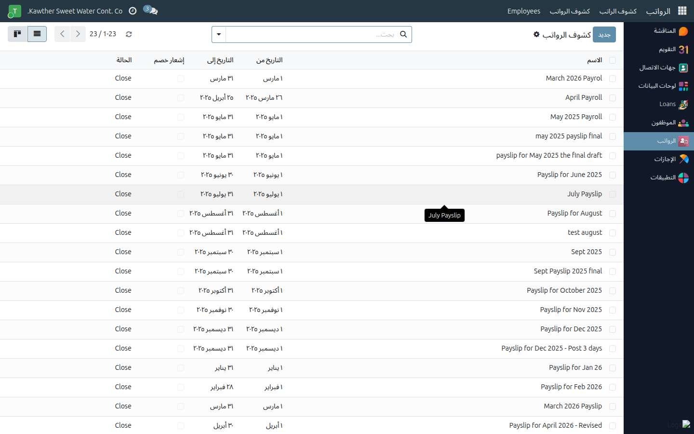
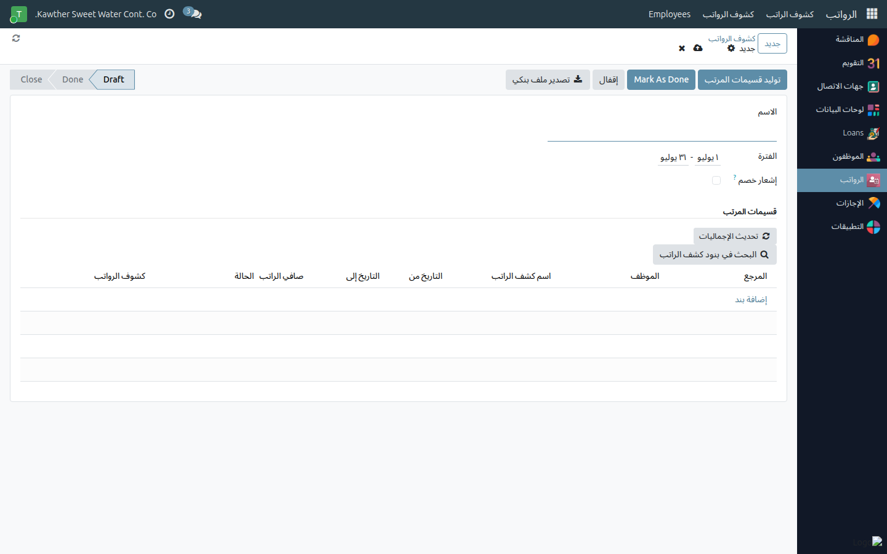

# تشغيل دفعة كشوف الرواتب الشهرية

**الفئة المستهدفة:** مُصدِر كشوف الرواتب
**الوقت المقدّر:** ٥–١٠ دقائق شهريًا

---

## قبل تشغيل الدفعة — قائمة التحقّق

تأكّد من إتمام البنود التالية قبل فتح شاشة الرواتب؛ أي بيانات مفقودة تُعقِّد
عملية المراجعة بعد التوليد:

- [ ] بيانات الحضور مكتملة ومراجعة للشهر المعني.
- [ ] إجازات سنوية معلّقة قيد التأكيد — تواصل مع المديرين المباشرين وأكِّد
  حلّها (**إجازة سنوية غير مؤكَّدة المباشرة = استبعاد تلقائي من الدفعة**).
- [ ] عمولات وبدلات الشهر الجاري أُدخلت في النظام.
- [ ] أي تعديلات على السلف الخاصة والخصومات حُفظت ونُشِّطت.

---

## الخطوات

١. افتح **الرواتب** من القائمة الجانبية، ثم اختر **كشوف الرواتب** ← أنشئ
   **دفعة جديدة** وحدّد **الفترة** (الشهر والسنة).

   

٢. حدّد نطاق الموظفين إن احتجت تشغيل مجموعة بعينها (أو اترك الحقل فارغًا
   لتشمل الجميع)، ثم اضغط **توليد**.

   

٣. يُنشئ النظام **كشف راتب لكل موظف** داخل الدفعة. يحتسب كل كشف:
   - الأجر الأساسي والبدلات → الإجمالي.
   - خصم الغياب والتأخير (بناءً على سجلات الحضور).
   - أقساط السلف الخاصة والخصومات السارية لهذا الشهر.
   - **صافي الراتب** = الإجمالي − مجموع الخصومات.

٤. **راجع الدفعة:**
   - افتح عينةً من الكشوف وتحقّق من صافي الراتب.
   - راجع قسم **الموظفون المستبعدون** (إن ظهر) لمعرفة من لم يُدرَج
     وسبب الاستبعاد — راجع [حلّ مشكلة الموظفين المستبعدين](02-skipped-employees.md).

٥. بعد التأكّد من صحة الكشوف، اضغط **تحديث الإجماليات** لتحديث إجماليات
   كل بنك، ثم انتقل إلى [تصدير ملف التحويل البنكي](03-bank-file-export.md).

---

## نقاط يجب مراعاتها

- **الاستبعاد التلقائي:** الموظف الذي لديه إجازة سنوية لم يُؤكَّد مباشرته
  يُستبعَد تلقائيًا من الدفعة لحماية دقة الراتب. لا يمكن تجاوز هذا الإجراء
  إلا بتأكيد المباشرة من المدير المباشر.
- **الاستبعاد اليدوي:** الموظفون المُعلَّمون يدويًا «مستبعد من الدفعات»
  في ملفاتهم لن يظهروا في الدفعة.
- **إعادة التوليد:** يمكنك إعادة توليد الدفعة بعد حلّ أسباب الاستبعاد —
  الكشوف الناجحة تُحدَّث والمستبعَدون السابقون يُدرَجون.

---

## مشكلات شائعة

| العَرَض | السبب | الحل |
|---------|-------|------|
| موظفون بلا كشوف | استُبعدوا تلقائيًا أو يدويًا | راجع [حلّ مشكلة المستبعدين](02-skipped-employees.md) |
| صافي راتب يبدو غير صحيح | خصم إضافي أو مشكلة حضور | افتح الكشف؛ تُفسّر بنوده التفصيلية الفارق. صحّح المصدر وأعِد التوليد |
| التوليد يستغرق وقتًا طويلًا | حجم الدفعة كبير | انتظر حتى الاكتمال؛ تجنّب تحديث الصفحة أثناء المعالجة |

---

## أدلة ذات صلة

- [حلّ مشكلة الموظفين المستبعدين](02-skipped-employees.md)
- [تصدير ملف التحويل البنكي](03-bank-file-export.md)

