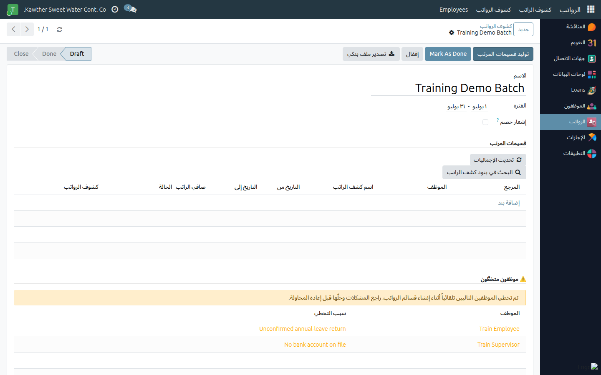

# الموظفون المستبعدون من دفعة الرواتب — التشخيص والحلول

**الفئة المستهدفة:** مُصدِر كشوف الرواتب
**الوقت المقدّر:** دقيقتان إلى خمس دقائق حسب السبب

---

## لماذا يُستبعَد موظف من الدفعة؟

النظام يستبعد الموظف تلقائيًا حماية لدقة الرواتب لا عقوبةً؛ الاستبعاد يعني
أن ثمّة بيانات ناقصة أو قرارًا إداريًا مُسجَّلًا يمنع المعالجة. أسباب ثلاثة
تُشكّل معظم حالات الاستبعاد:

---

## ١. إجازة سنوية دون تأكيد مباشرة

**السبب:** موظف عاد من إجازة سنوية لكن مديره المباشر لم يُؤكِّد مباشرته في
النظام بعد. يوقف النظام معالجة راتبه حتى يُحسَم الأمر.

**الحل:**
- تواصل مع **المدير المباشر** للموظف المعني.
- اطلب منه فتح الإجازة السنوية المعتمدة ← تعبئة **تاريخ المباشرة** ←
  الضغط على **تأكيد المباشرة**.
- أعِد توليد الدفعة — سيُدرَج الموظف في الكشف.

> **ملاحظة:** ابدأ بمتابعة تأكيدات المباشرة قبل يومين من موعد تشغيل الرواتب
> لتجنّب التأخير.

---

## ٢. مستبعَد يدويًا من الدفعات

**السبب:** تم تفعيل خيار **مستبعد من الدفعات** في ملف الموظف — عادةً لأسباب
إدارية (إجازة بدون راتب طويلة، إيقاف مؤقت…).

**الحل:**
- افتح ملف الموظف ← انتقل إلى تبويب **الرواتب**.
- أزِل تحديد **مستبعد من الدفعات** — لن يُحذَف هذا الخيار تلقائيًا؛ يتطلّب
  تدخّلًا يدويًا.
- احفظ ← أعِد توليد الدفعة.

---

## ٣. بيانات عقد أو راتب مفقودة

**السبب:** الموظف لا يملك عقدًا نشطًا أو لا توجد بيانات راتب مُدخَلة في
النظام — غالبًا موظف جديد أو نقص في إعداد ملفه.

**الحل:**
- تواصل مع **الموارد البشرية** لإكمال بيانات العقد في ملف الموظف.
- تأكّد من حالة العقد **نشط** وأن تاريخ البدء لا يتجاوز نهاية الشهر المعني.
- أعِد التوليد بعد إكمال البيانات.

---

## أين تجد قائمة المستبعدين

افتح الدفعة المعنية ← انتقل إلى قسم **الموظفون المستبعدون** في أسفل الصفحة.
يعرض كل سطر: اسم الموظف والسبب المحدَّد.

---

## بعد الإصلاح — خطوات الاسترداد

١. عالج سبب الاستبعاد (تأكيد المباشرة، رفع الاستبعاد اليدوي، إكمال العقد).
٢. ارجع إلى الدفعة واضغط **توليد** مرة أخرى — يُنشئ النظام كشوف الرواتب
   للموظفين المستردّين دون المساس بالكشوف الموجودة.
٣. راجع قسم **المستبعدين** مجددًا؛ يجب أن يكون فارغًا أو يحتوي فقط من تقرّر
   إدارياً استمرار استبعادهم.

---

## مشكلات شائعة

| العَرَض | السبب | الحل |
|---------|-------|------|
| لا يوجد قسم «مستبعدون» في الدفعة | جميع الموظفين مُدرَجون بنجاح | الدفعة مكتملة — تابع إلى المراجعة والتصدير |
| الموظف لا يزال مستبعدًا بعد التصحيح | سبب ثانوي لم يُعالَج | اقرأ نص السبب من جديد؛ تواصل مع مسؤول النظام إن لم يكن واضحًا |
| تعذّر تأكيد المباشرة | الإجازة ليست في الحالة الصحيحة | تأكّد أن الإجازة في حالة «معتمدة»؛ إن كانت في مرحلة وسيطة، أكمِل مسار الاعتماد أولًا |

---

## أدلة ذات صلة

- [إنشاء دفعة كشوف الرواتب](01-generate-payslip-batch.md)
- [تصدير ملف التحويل البنكي](03-bank-file-export.md)
- [اعتماد الإجازات — المدير المباشر](../supervisor/01-approve-time-off.md)

