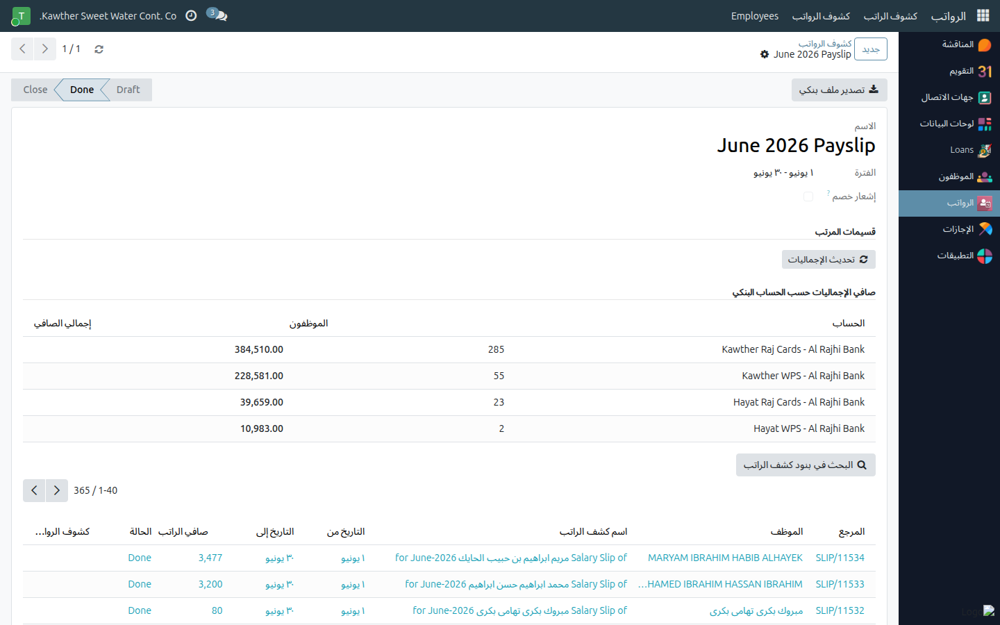
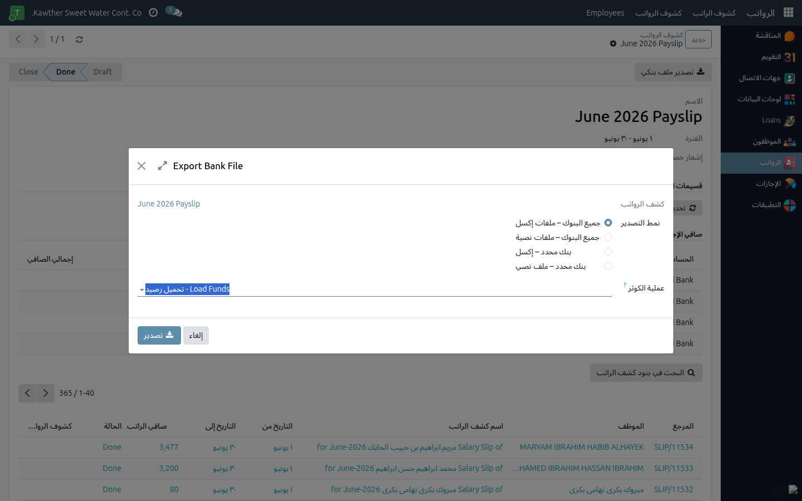

# تصدير ملف التحويل البنكي

**الفئة المستهدفة:** مُصدِر كشوف الرواتب (الموارد البشرية)
**الوقت المقدّر:** دقيقتان

## نظرة عامة

يُتيح لك هذا الدليل تصدير ملف تحويل الرواتب لدفعة كشوف مكتملة جاهز للرفع على
نظام البنك. تُعرض الإجماليات مجمَّعةً بحسب كل بنك للتحقّق قبل التنفيذ.

## ملاحظات أولية

- توليد الدفعة ومراجعتها وحلّ مشكلة المستبعدين خطوات سابقة لازمة.

## الخطوات

1. افتح دفعة كشوف الرواتب. اضغط **تحديث الإجماليات** لإعادة احتساب الإجماليات
   الصافية بحسب كل بنك، ثم راجع الجدول (البنك، عدد الموظفين، الإجمالي الصافي).
   

2. اضغط **تصدير ملف التحويل البنكي**، اختر الصيغة (WPS / بنك)، ونزّل الملف.
   

3. ارفع الملف على منصة البنك وفق إجراءاتك المعتادة.

## ما يحدث بعد ذلك

الملف المصدَّر هو سجل المدفوعات. احتفظ به مع الدفعة للمطابقة المحاسبية.

## مشكلات شائعة

| العَرَض | السبب | الحل |
|---|---|---|
| الإجماليات تبدو قديمة | لم يُحدَّث بعد تعديلات أُجريت | اضغط **تحديث الإجماليات** من جديد |
| موظف مفقود من الملف | مستبعد من الدفعة أو ليس لديه حساب بنكي | حلّ مشكلة الاستبعاد؛ تأكّد من إدخال الحساب البنكي للموظف |

## أدلة ذات صلة

- [إنشاء دفعة كشوف الرواتب](01-generate-payslip-batch.md)
- [حلّ مشكلة الموظفين المستبعدين](02-skipped-employees.md)

