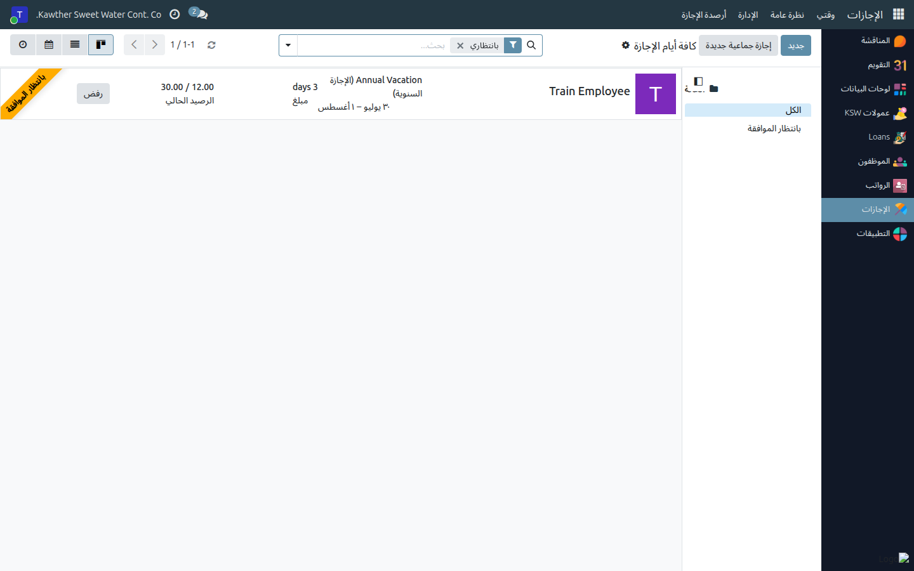
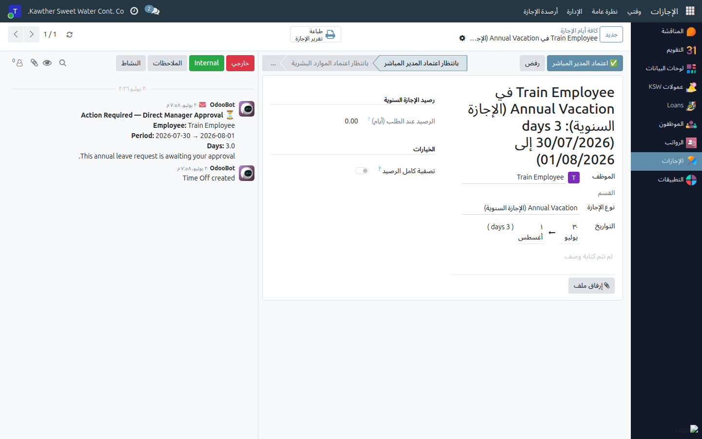

# اعتماد إجازات الفريق — مسؤوليات المدير المباشر

**الفئة المستهدفة:** المشرف / المدير المباشر
**الوقت المقدّر:** دقيقة لكل طلب

---

## دورك في مسار الإجازات

أنت **المرحلة الأولى** لكل طلب إجازة يرفعه أفراد فريقك؛ بمجرد موافقتك ينتقل
الطلب إلى الموارد البشرية. وتمتدّ مسؤوليتك إلى ما بعد عودة الموظف: **تأكيد
المباشرة** — وهو إجراء حصري بك لا يملكه الموظف.

---

## أين تجد طلبات فريقك

افتح تطبيق **الإجازات**، ثم اختر **الإدارة ← الإجازات**. تعرض هذه القائمة
طلبات من يتبعونك مباشرةً. استخدم مرشّح **بانتظاري** ليُظهر فقط الطلبات التي
في دورك.

---

## اعتماد طلب إجازة أو ردّه

١. **افتح الطلب** من القائمة (أو مباشرةً من صندوق الوارد).
٢. **راجع** نوع الإجازة، والتواريخ، وعدد الأيام، وأي ملاحظات أضافها الموظف.
٣. اتخذ قرارك:
   - **موافقة:** اضغط **اعتماد (المدير المباشر)**. ينتقل الطلب فورًا إلى
     الموارد البشرية.

     

   - **رفض:** اضغط **رفض**، أدخِل سبب الردّ في الحقل الإلزامي، ثم أكِّد.
     يُشعَر الموظف بالسبب فورًا.

٤. **(للموظفين غير المرتبطين بجهاز البصمة — كشف الحضور)** بعد الاعتماد قد
   تظهر نافذة تسألك عن تحديث كشف الحضور:
   - **تحديد الجميع كغائبين** — تُحدَّث أيام الإجازة تلقائيًا في كشف الحضور.
   - **سأحدّث يدويًا** — أغلق النافذة وحدّث الكشف لاحقًا بنفسك.

---

## تقديم إجازة لموظف بدون حساب في النظام

بعض موظفي الميدان لا يملكون حسابات في النظام. في هذه الحالة تُنشئ طلب
الإجازة نيابةً عنهم:

١. في **الإدارة ← الإجازات**، اضغط **جديد**.
٢. اختر **الموظف** ← نوع الإجازة ← التواريخ، ثم احفظ.
٣. اعتمد خطوة **المدير المباشر** كما هو موضّح أعلاه — ينتقل الطلب بعدها إلى
   الموارد البشرية كأي طلب عادي.

---

## تأكيد مباشرة الموظف من إجازته السنوية

عند عودة أحد أفراد فريقك من **إجازة سنوية**، أنت المنوط بتسجيل مباشرته — لا
الموظف نفسه. هذه الخطوة بالغة الأثر:

> **مهم:** تُوقَف معالجة راتب أي موظف لديه إجازة سنوية لم يُؤكَّد مباشرته.
> تأخير التأكيد = استبعاد الموظف من دفعة الرواتب الشهرية.

**خطوات التأكيد:**

١. افتح الإجازة السنوية المعتمدة من **الإدارة ← الإجازات**.
٢. عبّئ **تاريخ المباشرة** الفعلي للموظف.
٣. اضغط **تأكيد المباشرة**.

---

## ما يحدث بعد موافقتك

- **الإجازة السنوية:** تنتقل إلى **الموارد البشرية** ← المدير العام (أولي) ←
  المحاسبة ← المدير العام (نهائي) ← تأكيد الموارد البشرية للنموذج الموقَّع.
- **المرضية / بدون أجر / غيرها:** تنتقل إلى **الموارد البشرية** (الاعتماد
  الأخير والنهائي).

---

## مشكلات شائعة

| العَرَض | السبب | الحل |
|---------|-------|------|
| لا أرى طلب الموظف | ليس من فريقك المباشر، أو الطلب ليس في دورك | راجع **الإدارة ← الإجازات** وتأكّد من اسم الموظف |
| لا يوجد زر اعتماد المدير المباشر | الطلب مُعتمَد بالفعل أو في مرحلة أخرى | اقرأ شريط الحالة في أعلى نموذج الإجازة |
| لا يمكن تأكيد الردّ | حقل السبب فارغ | السبب حقل إلزامي — أدخِله ثم أكِّد |
| زر تأكيد المباشرة غير ظاهر | الإجازة لم تُعتمَد نهائيًا بعد | يظهر الزر فقط على الإجازات المعتمدة الكاملة |

---

## أدلة ذات صلة

- [كشوف الحضور](03-attendance-sheets.md)
- [اعتماد السلف الخاصة](02-approve-loan.md)

