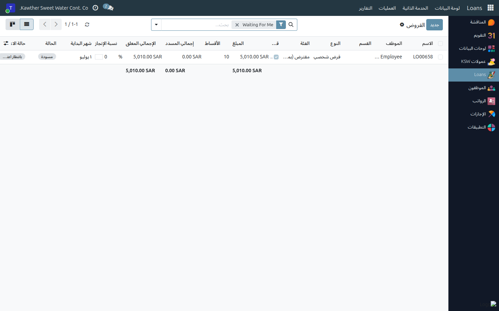
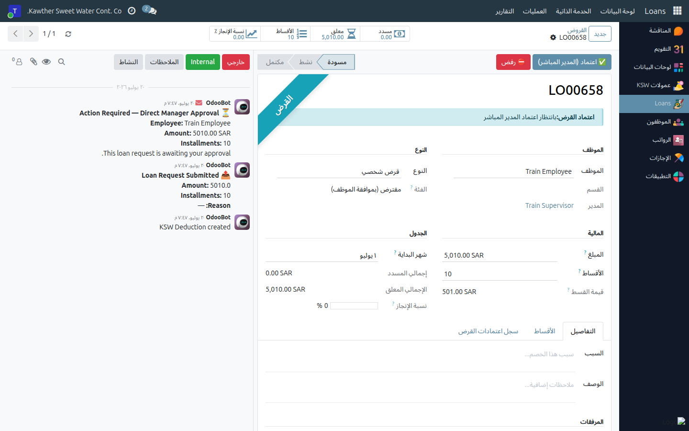

# اعتماد السلفة الخاصة (المدير المباشر)

**الفئة المستهدفة:** المشرف / المدير المباشر
**الوقت المقدّر:** دقيقة واحدة لكل طلب

## نظرة عامة

يُتيح لك هذا الدليل اعتماد طلبات السلف الخاصة المقدَّمة من مرؤوسيك المباشرين أو ردّها.
أنت **أول** مرحلة اعتماد؛ بعد موافقتك ينتقل الطلب إلى الموارد البشرية، ثم
المحاسبة، ثم المدير العام، ثم الصرف.

## ملاحظات أولية

- تتصرّف في طلبات **مرؤوسيك المباشرين فقط**.
- ردّ الطلب يستلزم ذكر **السبب**؛ سيرى الموظف هذا السبب.

## الخطوات

1. **افتح الخصومات ← العمليات ← السلف الخاصة** (أو اضغط رابط الطلب في صندوق
   الوارد). تفتح القائمة على **بانتظاري** تلقائيًا، وتعرض السلف الخاصة في مرحلتك فقط.
   

2. **افتح الطلب** وراجع: المبلغ، وعدد الأقساط، وقيمة القسط الشهري الناتج،
   وسبب الطلب والمرفقات.

3. **اتخذ قرارك:**
   - **اعتماد**: اضغط **اعتماد (المدير المباشر)**. تنتقل السلفة الخاصة إلى
     الموارد البشرية.
     
   - **ردّ**: اضغط **رفض**، أدخِل السبب، ثم أكِّد.

## ما يحدث بعد ذلك

تسير السلفة الخاصة المعتمَدة وفق المسار:
**الموارد البشرية ← المحاسبة ← المدير العام (نهائي) ← الصرف ← نشطة**.
يمكنك متابعة حالتها من **الخصومات ← العمليات ← السلف الخاصة**. أما السلفة الخاصة المردودة فتعود
إلى الموظف مرفقةً بسبب الردّ.

## مشكلات شائعة

| العَرَض | السبب | الحل |
|---|---|---|
| لا أجد الطلب | ليس لمرؤوسيك، أو ليس في مرحلتك | استخدم مرشّح **بانتظاري**؛ تحقّق من ارتباط الموظف بك |
| لا يوجد زر الاعتماد | السلفة الخاصة تجاوزت مرحلة المدير المباشر | راجع شريط حالة الاعتماد |

## أدلة ذات صلة

- [اعتماد الإجازات](01-approve-time-off.md)

