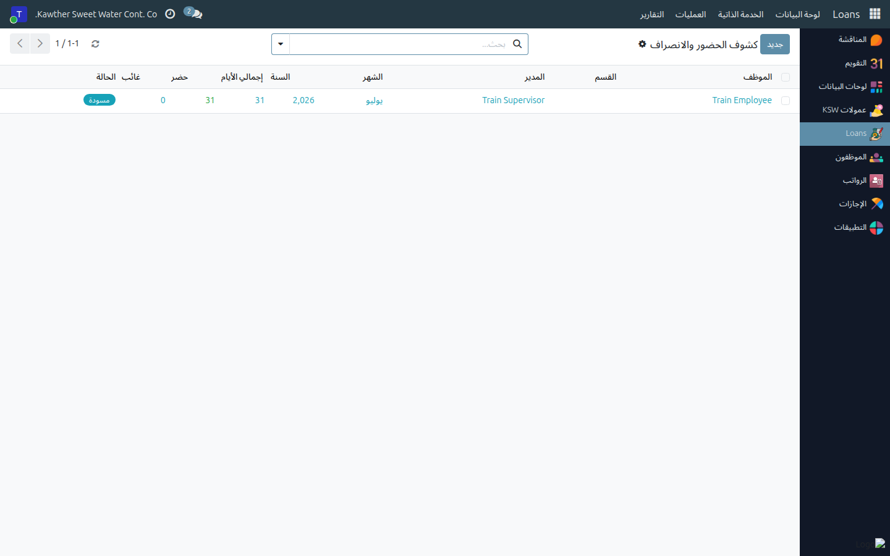
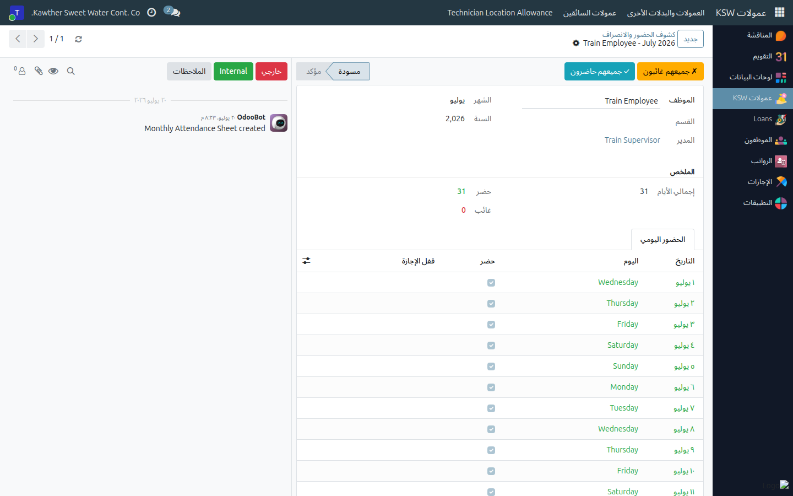

# كشوف الحضور (للموظفين غير المرتبطين بجهاز البصمة)

**الفئة المستهدفة:** المشرف / المدير المباشر
**الوقت المقدّر:** ٥ دقائق شهريًا

## نظرة عامة

يُتيح لك هذا الدليل تسجيل الحضور الشهري لأفراد فريقك الذين **لا يستخدمون جهاز
البصمة**. تُحدّد حضور أو غياب كل يوم عمل؛ يُغذّي الكشف بعدها نظام الرواتب
(الغياب غير المغطَّى ينتج خصمًا في الراتب).

## ملاحظات أولية

- هذا الكشف خاص **بالموظفين غير المرتبطين بجهاز البصمة** التابعين لك.
- يمكنك تعديل الكشف خلال الشهر الجاري؛ وبعد انتهاء الشهر يُقفَل تلقائيًا.
- الأيام المرتبطة بـ**إجازة معتمدة** تُحجَب ولا يمكن تغييرها.

## الخطوات

1. **افتح الحضور والانصراف ← كشوف الحضور.**
   

2. **أنشئ كشوف الشهر** إن لم تكن موجودة — استخدم زر **إنشاء جميع الكشوف** في
   القائمة.

3. **افتح كشف موظف.** في تبويب **الحضور اليومي** يظهر سطر واحد لكل يوم.

4. **سجّل الحضور:**
   - بدّل كل يوم بين حاضر (أخضر) وغائب (أحمر)، **أو**
   - استخدم **تحديد الجميع حاضرين** / **تحديد الجميع غائبين** ثم صحّح
     الاستثناءات يدويًا.
   

5. الأيام المرتبطة بإجازة معتمدة مُعبَّأة ومحجوبة — اتركها كما هي.

## ما يحدث بعد ذلك

يبقى الكشف قابلًا للتعديل طوال الشهر، ثم يُقفَل عند انتهائه. الإجازات المعتمدة
تُعبّئ وتحجب أيامها تلقائيًا. إن احتاج كشف مُقفَل إلى إعادة فتحه، يتولّى ذلك
**مسؤول الموارد البشرية / مسؤول الحضور** (راجع دليل الموارد البشرية).

## مشكلات شائعة

| العَرَض | السبب | الحل |
|---|---|---|
| يوم لا يُبدَّل | يرتبط بإجازة معتمدة (محجوب) | هذا متوقَّع — لا تُعدِّله |
| لا يوجد كشف لموظف | الكشوف لم تُنشأ بعد | استخدم **إنشاء جميع الكشوف** |
| الكشف للقراءة فقط | الشهر انتهى وأُقفِل | اطلب من الموارد البشرية إعادة فتحه إن لزم التصحيح |

## أدلة ذات صلة

- [اعتماد الإجازات](01-approve-time-off.md)
- [كشوف العمولات](04-commission-sheets.md)

