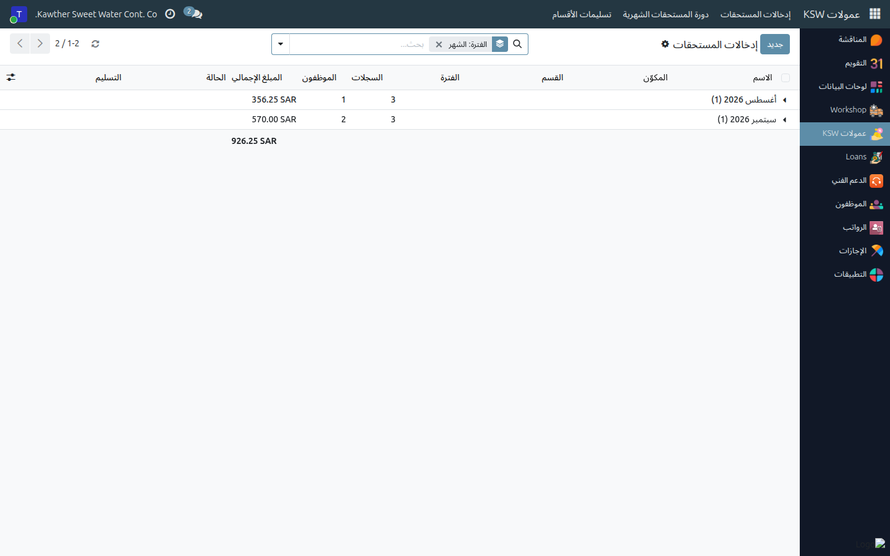
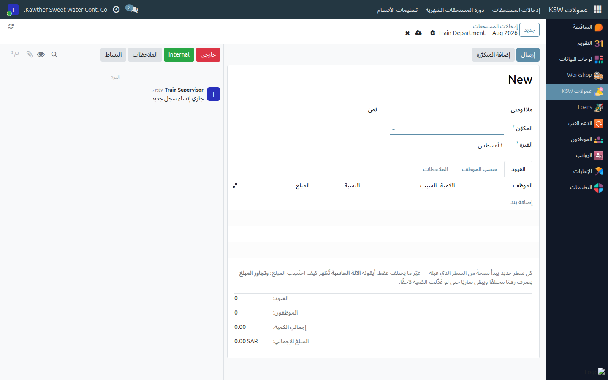
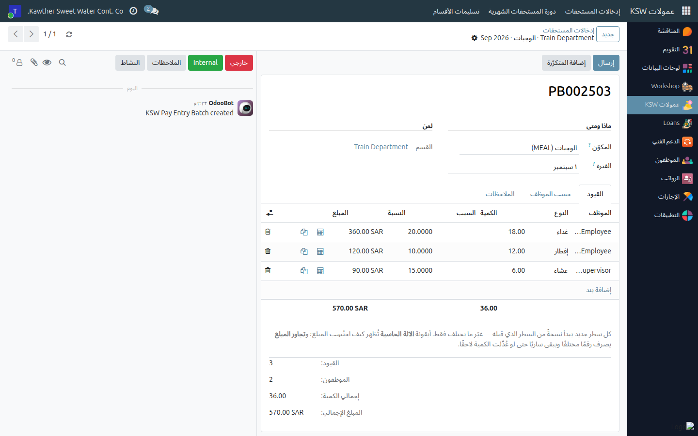
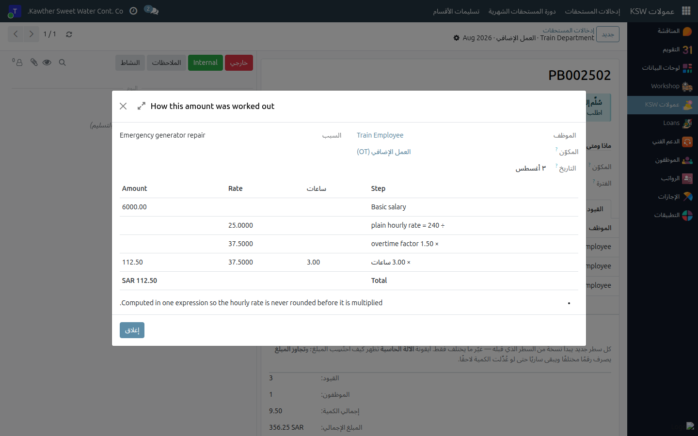

# تسجيل المستحقات الإضافية — إدخالات المستحقات

**الفئة المستهدفة:** المشرف / المدير المباشر
**الوقت المقدّر:** ١٠–٢٠ دقيقة شهريًا لكل نوع مستحق

## نظرة عامة

كل ما يستحقه فريقك **زيادةً على الراتب الأساسي** — العمل الإضافي، ردود السائقين،
الوجبات، البدلات، عمل يوم الجمعة، المكافآت — يُسجَّل في تطبيق **العمولات** على هيئة
**إدخالات مستحقات**، ثم يُسلَّم إلى المدير العام مرة واحدة شهريًا ويُصرَف عبر تحويل
بنكي مستقل.

يشرح هذا الدليل شاشة الإدخال نفسها وكيفية التعامل مع **كل نوع من أنواع
المستحقات**. ويتناول الدليلان التاليان المستحقات المتكرّرة شهريًا
([الإدخالات المتكرّرة](05-commission-recurring.md)) والدورة الشهرية كاملة
([الدورة الشهرية](06-commission-monthly-cycle.md)).

> **عمولات المبيعات والتحصيل ليست جزءًا من هذا.** تُحتسَب عمولة المبيعات والتحصيل
> في صفحتها الخاصة (**العمولات ← المبيعات والتحصيل**)، ويتولّاها موظفو المبيعات،
> وتُصرَف بشكل منفصل. لا ينطبق عليها شيء ممّا في هذه الأدلة الثلاثة.

## ملاحظات أولية

- يجب أن تكون مُعيَّنًا **مديرًا لقسمك** (أو مساعدًا لمديره). وإن لم تكن كذلك،
  سيُخبرك النظام بذلك ولن تجد ما تُسجّله — اطلب من الموارد البشرية ضبط ذلك.
- يجب أن تكون مُفعَّلًا **لأنواع المستحقات التي تتولّاها** (العمل الإضافي، عمولة
  السائقين، بدل الموقع). إن لم تجد نوعًا تتوقّعه، اطلب من مسؤول العمولات تفعيله لك.
- حدّد الشهر الذي تُسجّل له. الدفعة تغطّي دائمًا **شهرًا كاملًا**.

## ثلاثة مصطلحات لا بدّ منها

| المصطلح | معناه |
|---|---|
| **المكوّن** | نوع المستحق — العمل الإضافي، الوجبات، بدل الهاتف. أي الكتالوج. |
| **الإدخال** | سطر واحد: موظف واحد، واقعة واحدة، مبلغ واحد. |
| **الدفعة** | مكوّن واحد، قسم واحد (أو موقع عمل)، شهر واحد. وهي شاشتك. |

**دفعة واحدة لكل مكوّن في الشهر.** العمل الإضافي لقسم الصيانة في أغسطس دفعة واحدة
(`PB000123`)، والوجبات لنفس القسم والشهر دفعة أخرى. هذا ما يجعل كل شاشة تعرض فقط
الأعمدة التي يحتاجها ذلك النوع من المستحقات.

## الخطوات

1. **افتح العمولات ← إدخالات المستحقات ← دفعاتي.** القائمة مُجمَّعة حسب الشهر،
   ولا تظهر لك إلا دفعات الأقسام التي تديرها.
   

2. **أنشئ الدفعة.** اضغط **جديد**، ثم حدّد:
   - **المكوّن** — نوع المستحق.
   - **الفترة** — تفتح النافذة على شبكة الأشهر؛ اضغط الشهر المطلوب.
   - **القسم** — إن كنت تدير قسمًا واحدًا فقط، يُعبَّأ تلقائيًا ويُقفَل.
     أمّا **ردود السائقين** فتطلب **موقع العمل** بدلًا منه، لأنها تُصرَف حسب الموقع.
   

3. **أضف الأسطر** في تبويب **الإدخالات**. تتغيّر الأعمدة بحسب المكوّن — راجع الجدول
   أدناه لمعرفة ما يطلبه كل نوع.
   

   أمران يختصران وقتًا طويلًا:
   - **كل سطر جديد يبدأ نسخةً من السطر الذي قبله.** اضغط *إضافة سطر* وغيّر ما
     يختلف فقط — الموظف أو التاريخ أو عدد الساعات.
   - أيقونة **النسخ** في آخر السطر تُنشئ نسخة منه.

4. **راجع المبالغ.** اضغط أيقونة **الآلة الحاسبة** في أي سطر لترى بالتفصيل كيف
   نتج المبلغ — الراتب والمقسوم عليه ومعامل العمل الإضافي، أو كل شريحة من شرائح
   الردود بكميتها وسعرها.
   

5. اضغط **تقديم** عند الانتهاء من إدخال الدفعة.

## كيف تتعامل مع كل نوع من المكوّنات

| المكوّن | طريقة احتساب المبلغ | ما تُدخله أنت | ما يطلبه السطر أيضًا |
|---|---|---|---|
| **العمل الإضافي** | الراتب الأساسي ÷ ٢٤٠ × الساعات × ١٫٥ (نظام العمل السعودي، المادة ١٠٧) | **ساعات** | **التاريخ** و**الموقع** و**السبب** — الثلاثة مطلوبة في كل سطر |
| **ردود السائقين** | شرائح تصاعدية: ما يتجاوز الحد المجاني يمرّ على شرائح الموقع | **الرد المضاعف** | **عدد الردود** (للتوثيق فقط)، و**الحد المجاني** = الردود المطلوبة من السائق مقابل أيام عمله الفعلية. يُسجَّل **حسب موقع العمل**، ويوجد زر **استيراد** يسحب ردود الشهر من نظام BAS |
| **الوجبات** | الكمية × سعر الوجبة التي تختارها | **وجبات** (العدد) | **النوع** — إفطار أو غداء أو عشاء. دفعة وجبات واحدة تغطّي الثلاثة؛ لا تبحث عن ثلاثة مكوّنات منفصلة |
| **بدل عمل الجمعة** | الأيام × ١٠٠ | **الأيام** | **التاريخ** |
| **البدلات الثابتة** — إدارة المشاريع، الموقع، الإدخال، الهاتف | لا يُحتسَب شيء | **المبلغ** | بدل الموقع يطلب **الموقع** أيضًا |
| **مكافآت الأعياد** — يوم التأسيس، اليوم الوطني، عيد الفطر، عيد الأضحى | لا يُحتسَب شيء | **المبلغ** | مكوّن مستقل لكل مناسبة، عن قصد |
| **مكافأة موظف** و**أخرى** | لا يُحتسَب شيء | **المبلغ** | **السبب** مطلوب — وهو ما يقرأه المعتمِد |

**تجاوز المبلغ المحتسَب.** إن لزم أن يكون المبلغ المحتسَب رقمًا آخر، اكتبه في
**تجاوز المبلغ**. يتلوّن السطر بالكهرماني، ويُحفَظ الرقم الأصلي، ويُذكر في
شرح الاحتساب أن المبلغ جرى تجاوزه. وخلافًا لإعادة كتابة المبلغ مباشرة، يبقى هذا
التجاوز ساريًا حتى لو غيّرت الكمية لاحقًا.

## ما يحدث بعد ذلك

تنتقل الدفعة من **مسودة** إلى **مُقدَّم**. وهذا يعني فقط *«أنهيتُ إدخال هذه
الدفعة»* — فهي **ليست** بعدُ لدى المدير العام، ولا يزال بإمكانك الضغط على
**إعادة فتح** لتصحيحها.

لا يصل قسمك إلى المدير العام إلا حين تُسلّمه بنفسك. راجع
[الدورة الشهرية](06-commission-monthly-cycle.md).

## مشكلات شائعة

| العَرَض | السبب | الحل |
|---|---|---|
| رسالة «لست معيَّنًا مديرًا لأي قسم…» | حقل مدير القسم فارغ في قسمك | اطلب من الموارد البشرية تعيينك مديرًا للقسم أو مساعدًا لمديره |
| موظف لا يظهر في القائمة | ليس ضمن قسم/موقع هذه الدفعة ولا يتبعك إداريًا | سجّله في دفعة قسمه، أو اطلب تصحيح التسلسل الإداري |
| رسالة «تغطّي … بالفعل … لهذا النطاق وهذا الشهر» | لديك دفعة سابقة لنفس المكوّن والنطاق والشهر | افتح الدفعة الموجودة وأضف أسطرك فيها |
| رسالة «يجب أن يكون ساعات أكبر من صفر» | سطر بقي على الصفر في مكوّن محتسَب | أدخل الكمية أو احذف السطر |
| رسالة «… خارج فترة الدفعة …» | تاريخ السطر من شهر آخر | صحّح التاريخ أو انقل السطر إلى دفعة ذلك الشهر |
| رسالة «يجب أن يحدّد كل سطر من الوجبات أيَّها هو…» | عمود **النوع** فارغ | اختر إفطار / غداء / عشاء |
| رسالة «قُدِّمت الدفعة …» عند التعديل | الدفعة لم تعد في وضع المسودة | اضغط **إعادة فتح** — أو، إن كان قسمك مُسلَّمًا بالفعل، اضغط **سحب التسليم** أو اطلب من المدير العام إعادته |
| المكوّن الذي أحتاجه غير موجود | لست مُفعَّلًا لذلك النوع، أو لم يُنشَأ بعد | راجع مسؤول العمولات |

## أدلة ذات صلة

- [الإدخالات المتكرّرة](05-commission-recurring.md) — المستحقات التي تتكرّر شهريًا
- [الدورة الشهرية](06-commission-monthly-cycle.md) — التسليم والاعتماد والصرف
- [كشوف الحضور](03-attendance-sheets.md)

