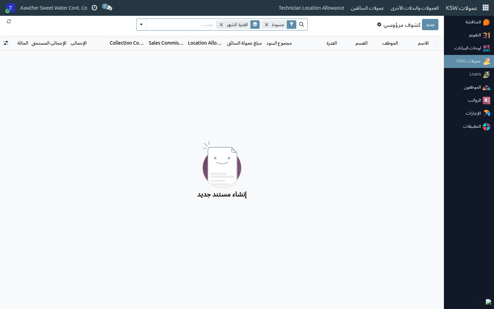
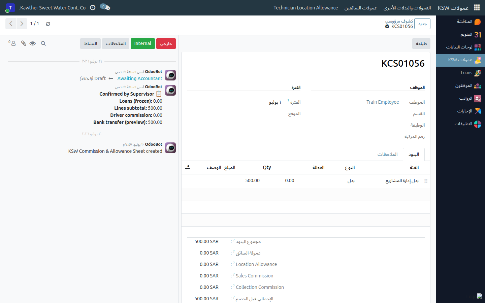

# كشوف العمولات والمكافآت (المشرف)

**الفئة المستهدفة:** المشرف / المدير المباشر
**الوقت المقدّر:** ١٠–١٥ دقيقة شهريًا

## نظرة عامة

يُتيح لك هذا الدليل إدخال وتأكيد عمولات أفراد فريقك الشهرية — مثل عدد الرحلات،
وأوامر التشغيل، والحوافز الأخرى. بعد اعتمادك تنتقل الكشوف إلى المحاسبة للتحويل
البنكي.

## ملاحظات أولية

- تُنشَأ كشوف العمولات تلقائيًا بداية كل شهر. إن لم تظهر، تواصل مع مسؤول النظام.
- اعتمادك لا رجوع فيه — تحقّق من الأرقام قبل الاعتماد النهائي.

## الخطوات

1. **افتح تطبيق العمولات ← الكشوف.** تظهر الكشوف الشهرية لفريقك.
   

2. **افتح كشف موظف** ← تبويب **التفاصيل** — أدخِل قيم العمولة (رحلات،
   ساعات، كميات) وفق نوع عمولة الموظف.

3. **اعتمد الكشف** بالضغط على **اعتماد**. إن كان الموظف لديه قسط سلفة خاصة مُستحقّ
   يتجاوز عمولته، يُنبّهك النظام بذلك — راجع الرقم قبل المتابعة.
   

## ما يحدث بعد ذلك

تنتقل الكشوف المعتمدة إلى **المحاسبة** للتجميع في دفعة وتصدير ملف التحويل
البنكي. بعد الإصدار يرى الموظف المبالغ في ملخّص العمولات لديه.

## مشكلات شائعة

| العَرَض | السبب | الحل |
|---|---|---|
| لا يوجد كشف لموظف | الكشوف لم تُولَّد بعد | انتظر توليدها التلقائي أو تواصل مع مسؤول النظام |
| تحذير من نقص رصيد السلفة الخاصة | قسط السلفة الخاصة أكبر من العمولة | راجع الرقم مع الموظف؛ المحاسبة ستتولّى معالجة الفرق |
| لا أستطيع تعديل كشف معتمَد | اعتمادك نهائي | تواصل مع المحاسبة لمعالجة الخطأ قبل التحويل |

## أدلة ذات صلة

- المحاسبة: [تصدير العمولات](../accounting/04-commission-export.md)

