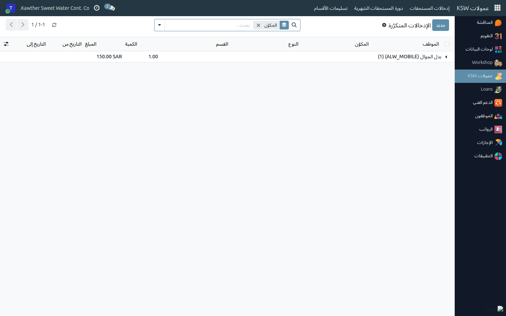
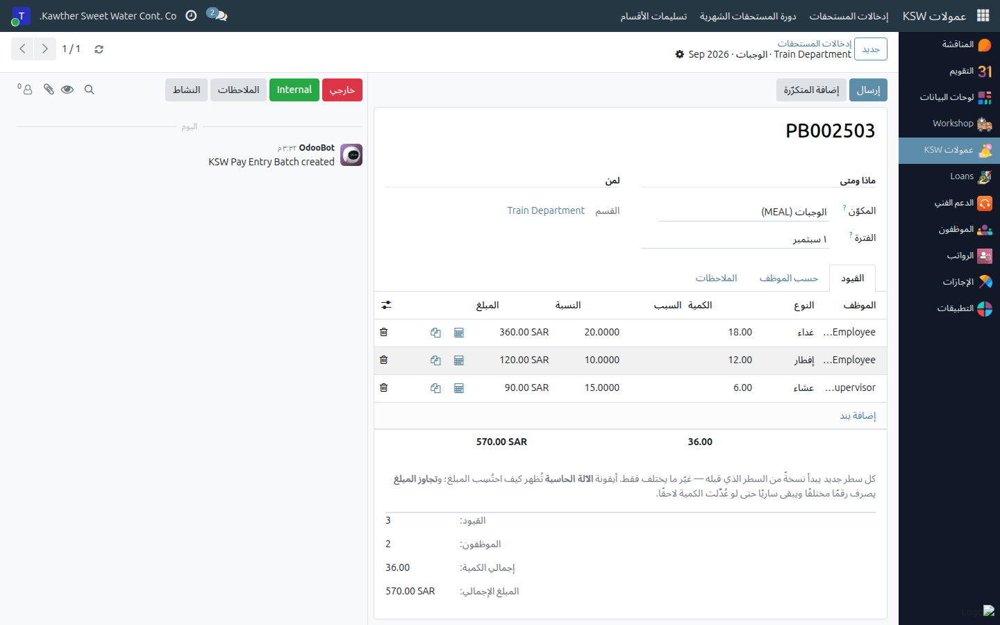

# الإدخالات المتكرّرة — المستحقات التي تتكرّر كل شهر

**الفئة المستهدفة:** المشرف / المدير المباشر
**الوقت المقدّر:** دقيقتان لإعداد الإدخال، ثم يوفّرهما عليك كل شهر

## نظرة عامة

**الإدخال المتكرّر** تعليمة دائمة تقول: *«هذا الموظف يستحق هذا
المكوّن، بهذا المبلغ، من هذا التاريخ إلى ذاك»*. فبدلًا من إدخال بدل الهاتف لأحد
عشر موظفًا اثنتي عشرة مرة في السنة، تُسجّله مرة واحدة ثم تسحبه إلى دفعة كل شهر
بضغطة واحدة.

> **الإدخال المتكرّر تعليمة، وليس صرفًا.** لا يُصرَف شيء حتى تسحبه إلى دفعة وتُقدّم
> تلك الدفعة. وهذا مقصود: تبقى أنت المسؤول عمّا تُسلّمه، ويمكنك تعديل المبلغ في
> الشهر الذي يتغيّر فيه.

## ملاحظات أولية

- تتولّى الإدخالات المتكرّرة **لفريقك أنت فقط** — قائمة الموظفين تعرض العاملين في
  الأقسام التي تديرها إضافةً إلى من يتبعك في التسلسل الإداري.
- جهّز المبلغ و**تاريخ البدء**. تاريخ البدء هو ما يُحدّد أول شهر يظهر فيه الإدخال.

## متى تُنشئ إدخالًا متكرّرًا — ومتى لا تفعل

**أنشئه عندما تتحقّق الشروط الثلاثة:**

- **الموظف نفسه**، شهرًا بعد شهر؛
- **المكوّن نفسه** بـ**المبلغ نفسه**؛
- **لا يحتاج تبريرًا لكل واقعة** — لا تاريخ، ولا سبب، ولا موقع.

أمثلة نموذجية: بدل الهاتف، بدل إدارة المشاريع، بدل الإدخال، استحقاق وجبة ثابت.

**لا تُنشئه لمستحق متغيّر.** العمل الإضافي وردود السائقين وعمل الجمعة والمكافآت
الاستثنائية تتغيّر كل شهر وتحمل تاريخًا وسببًا — تُدخَل واقعةً واقعة في الدفعة
نفسها. والإدخال المتكرّر هنا لن يمنحك إلا رقمًا خاطئًا تُصحّحه اثنتي عشرة مرة في
السنة.

**متى تُسجّله: قبل إعداد دفعة الشهر.** لا يسحب الزر إلا الإدخالات التي يقع
**التاريخ من** فيها في الشهر المُسجَّل أو قبله، ويكون **التاريخ إلى** فارغًا أو في
ذلك الشهر أو بعده. فالبدل الذي تضيفه يوم ٢٠ بتاريخ بدء يوم ١ يُسحَب لذلك الشهر،
أمّا المؤرَّخ بالشهر القادم فلا.

## الخطوات

1. **افتح العمولات ← إدخالات المستحقات ← الإدخالات المتكرّرة.** القائمة مُجمَّعة حسب
   المكوّن.
   

2. **أضف سطرًا** واملأ الحقول:

   | الحقل | ما تضعه فيه |
   |---|---|
   | **الموظف** | أحد أفراد فريقك. |
   | **المكوّن** | نوع المستحق. |
   | **النوع** | فقط للمكوّن ذي الخيارات (الوجبات) — أيّ خيار يتكرّر. |
   | **الكمية** | للمكوّن المحتسَب بـ«الكمية × السعر» — مثلًا ٢٢ وجبة غداء شهريًا. |
   | **المبلغ** | للمكوّن ذي المبلغ الثابت — ما يُصرَف كل شهر. |
   | **السبب** | اختياري، لكنه ما يقرأه المعتمِد لاحقًا. اذكر السبب. |
   | **التاريخ من** | افتراضيًا أول الشهر الحالي. أول شهر يسري فيه. |
   | **التاريخ إلى** | اتركه فارغًا ليستمرّ دون نهاية. |

   

3. **احفظ.** لا يحدث شيء آخر — التعليمة صارت مُسجَّلة فحسب.

4. **في كل شهر، اسحبه.** افتح (أو أنشئ) دفعة ذلك الشهر لنفس المكوّن واضغط
   **إضافة المتكرّرة**.
   

   تظهر الأسطر الناقصة. ويمكنك الضغط أكثر من مرة بأمان: الموظف الذي له سطر في
   الدفعة يُتخطّى، فلا يتكرّر شيء ولا يُستبدل ما أدخلته يدويًا.

5. **عدّل ما تغيّر** في هذا الشهر، ثم قدّم الدفعة كالمعتاد.

## إنهاء الإدخال أو تعديله

- **لإيقافه: ضع تاريخ الانتهاء، ولا تحذفه.** تاريخ الانتهاء يوقفه بنظافة اعتبارًا من
  الشهر التالي، ويبقى سجل سبب صرف البدل محفوظًا. أمّا الحذف فيُضيّع ذلك السجل.
- **لتغيير المبلغ نهائيًا:** عدّل المبلغ أو الكمية. يسري على كل شهر تسحبه بعد ذلك،
  ولا تتأثّر الأشهر المُقدَّمة سابقًا.
- **لتغييره لشهر واحد فقط:** اترك الإدخال المتكرّر كما هو، وعدّل السطر في دفعة ذلك
  الشهر بعد سحبه.
- **أُنشئ بالخطأ؟** أزل علامة **نشط** (أو احذفه إن لم يُسحَب إلى أي دفعة بعد).

## ما يحدث بعد ذلك

لا شيء، حتى تسحبه إلى دفعة. وتتصرّف الأسطر المسحوبة بعدها كأي إدخال آخر: تُقدَّم
مع الدفعة، وتُسلَّم مع القسم، ويعتمدها المدير العام، وتُصرَف ضمن تحويل العمولات.

## مشكلات شائعة

| العَرَض | السبب | الحل |
|---|---|---|
| **إضافة المتكرّرة** لم يُضِف شيئًا | التواريخ لا تغطّي هذا الشهر، أو الأسطر موجودة أصلًا، أو الموظف خارج نطاق الدفعة | راجع **التاريخ من** / **التاريخ إلى**، وراجع قسم الدفعة أو موقعها |
| موظف لا يظهر في القائمة | ليس في قسم تديره ولا يتبعك إداريًا | اطلب من الموارد البشرية تصحيح القسم أو التسلسل الإداري |
| رسالة «لدى … بالفعل … متكرّر يبدأ في ذلك التاريخ» | يوجد إدخال بنفس الموظف والمكوّن والخيار وتاريخ البدء | عدّل الإدخال الموجود بدل إضافة ثانٍ |
| رسالة «يجب أن يحدّد الوجبات المتكرّر أيَّها هو…» | المكوّن له خيارات وحقل **النوع** فارغ | اختر إفطار / غداء / عشاء |
| رسالة «لا يمكن أن يكون تاريخ الانتهاء قبل تاريخ البدء» | التاريخان معكوسان | صحّح التواريخ |
| السطر المسحوب بمبلغ غير متوقَّع | المكوّن محتسَب لا ثابت — المبلغ ناتج عن الكمية | صحّح **الكمية**، أو تجاوز المبلغ في سطر الدفعة |

## أدلة ذات صلة

- [تسجيل المستحقات الإضافية](04-commission-pay-entries.md)
- [الدورة الشهرية](06-commission-monthly-cycle.md)

