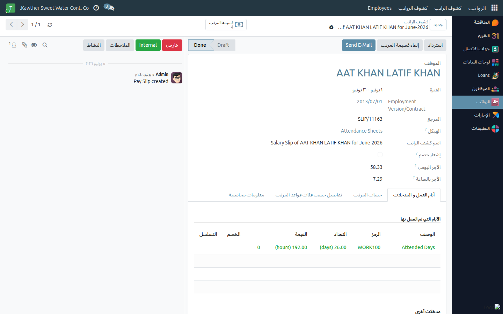

# الاطّلاع على كشوف رواتب الفريق

**الفئة المستهدفة:** المشرف / المدير المباشر
**الوقت المقدّر:** دقيقة واحدة

## نظرة عامة

يُتيح لك هذا الدليل الاطّلاع على **كشوف رواتب** أفراد فريقك — للتحقّق من
الخصومات أو الرد على استفسارات الموظفين.

## الخطوات

1. **افتح الرواتب ← كشوف الراتب.** فلتر القائمة تلقائيًا على فريقك.

2. **افتح كشف الموظف** المطلوب.
   

3. اقرأ بنود الراتب: **الأجر الأساسي ← الإجمالي ← الخصومات ← صافي الراتب**.

## ما يمكنك فعله

هذه الصفحة للاطّلاع فقط. إن لاحظت خطأً أو كانت لدى موظف استفسار، حوِّله إلى
**الموارد البشرية** أو **قسم الرواتب**.

## أدلة ذات صلة

- الموظف: [الاطّلاع على كشف راتبي](../employee/04-view-payslip.md)

