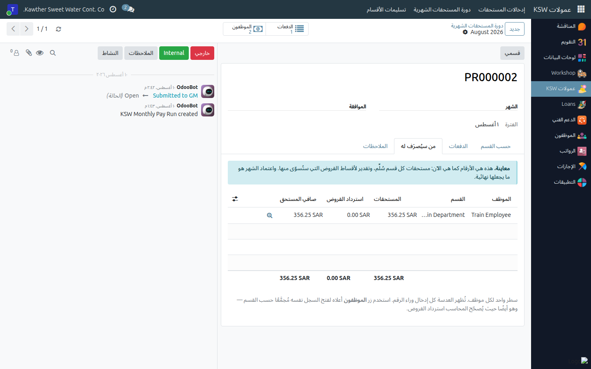
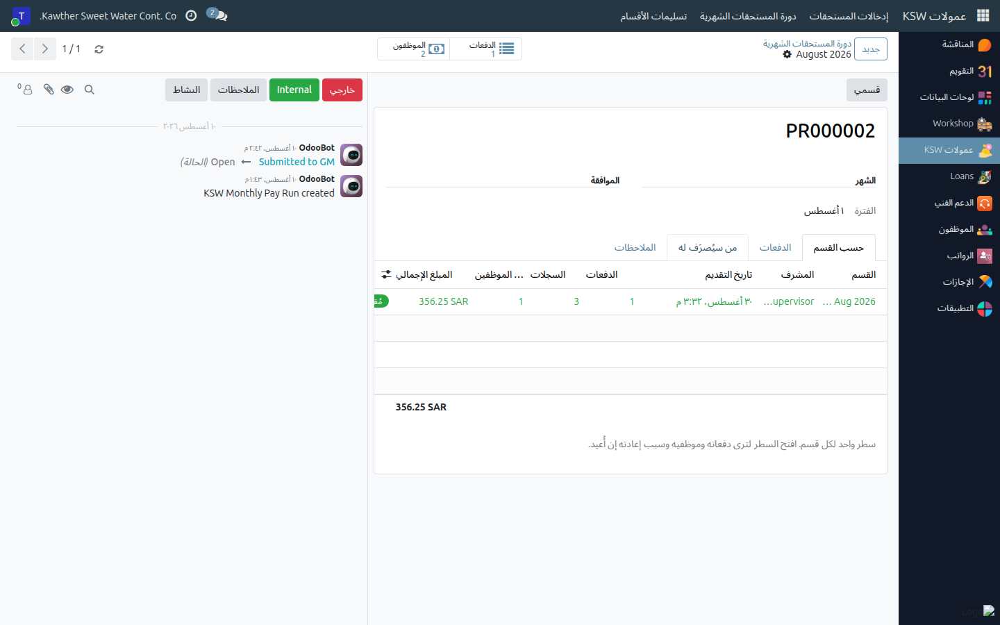

<div dir="rtl" markdown="1">

# الدورة الشهرية — التسليم والصرف

**الفئة المستهدفة:** المشرف / المدير المباشر
**الوقت المقدّر:** ١٠ دقائق في نهاية الشهر

## نظرة عامة

يشرح هذا الدليل ما يحدث لإدخالاتك بعد تسجيلها: كيف يُسلَّم قسمك، ومن يعتمده، وكيف
يُحتسَب المبلغ المصروف، وما الذي يُقفَل ومتى.


## السلسلة كاملة

```
إدخالاتك  ←  «تقديم» على الدفعة      («أنهيتُ إدخال هذه الدفعة»)
          ←  «تقديم إدخالاتي»          (قسمك يذهب إلى المدير العام)
          ←  المدير العام يعتمد قسمك
          ←  الشهر يُقفَل ويُبنى سجل الصرف
          ←  المحاسبة تُصدّر ملف التحويل البنكي
```

## زرّا التقديم ليسا الشيء نفسه

هذا أكثر ما يُلتبَس في التطبيق.

| | **تقديم** على الدفعة | **تقديم إدخالاتي** / **تقديم إلى المدير العام** |
|---|---|---|
| ما يعنيه | أنهيتُ إدخال هذه الدفعة الواحدة | قسمي كامل — أرجو الاعتماد |
| من يراه | لا أحد بعد | المدير العام، في صندوق الوارد وبالبريد |
| هل يمكن التراجع؟ | نعم — **إعادة فتح**، بنفسك | فقط **سحب التسليم** (ما دام المدير العام لم يتصرّف)، أو يُعيده هو |
| الأثر على دفعاتك | لا شيء — تبقى لديك | **تُجمَّد.** لا يمكنك تعديلها |

فالدفعة في حالة *مُقدَّم* **ليست** لدى المدير العام. وحتى تُسلّم القسم، يبقى
عملك على مكتبك.

## الخطوات

1. **أنهِ جميع دفعات الشهر وقدّمها.**

2. **راجع المبالغ قبل التسليم.** افتح **العمولات ← دورة المستحقات الشهرية**، اختر
   الشهر، وافتح تبويب **من سيُصرَف له**. سترى موظفيك أنت: ما استحقّوه، وما ستأخذه
   أقساط القروض، والصافي.
   

   وما دام الشهر مفتوحًا، فهذه الأرقام **معاينة** — أي تقدير لما سيُسدَّد.
   والاعتماد هو ما يحوّلها إلى تسوية فعلية.

3. **سلّم القسم.** من الشاشة نفسها، اضغط **تقديم إدخالاتي**. يُقدّم أي دفعة
   تركتها مسودةً في طريقه، ويُحرّك **أقسامك أنت فقط** — لا أقسام غيرك أبدًا.
   

   ويوجد الزر نفسه باسم **تقديم إلى المدير العام** في
   **العمولات ← تسليمات الأقسام** إن فضّلت العمل من هناك.

4. **انتظر المدير العام.** إمّا أن يعتمد قسمك أو يُعيده إليك.

## كيف يُحتسَب المبلغ المصروف

- تُصرَف المستحقات الإضافية عبر **تحويل بنكي مستقل**، ولا تمرّ عبر قسيمة الراتب.
- لكل موظف: **الصافي = المستحقات − استرداد القروض**.
- **استرداد القروض** هو الأقساط الموقوفة على العمولة لذلك الشهر. تُسدَّد من الأقدم
  فالأحدث من العمولة؛ وإن لم تغطِّ العمولة قسطًا كاملًا، يُقسَّم القسط ويبقى باقيه
  منتظرًا.
- الموظفون المُعلَّمون بخيار **تسوية الخصومات من العمولة أولًا** تُوقَف أقساط ذلك
  الشهر لهم تلقائيًا عند اعتماد الشهر. وما لا تغطّيه العمولة ينزل مباشرةً إلى
  قسيمة راتب ذلك الشهر بدل انتظار عمولة شهر قادم.

## إن أُعيد إليك

القسم المُعاد يحمل **سبب** المدير العام، ويظهر في شريط تنبيه كهرماني على تسليم
القسم **وعلى كل دفعة فيه**. صحّح ما طلبه، ثم اضغط **تقديم إدخالاتي** من جديد.

## بعد إقفال الشهر

عند اعتماد الشهر تُقفَل الفترة. فلا يمكن إنشاء شيء فيها ولا تعديله ولا حذفه ولا
تقديمه ولا إعادة فتحه — وكل محاولة تُظهر رسالة تذكر اسم الشهر وتطلب مراجعة المدير
العام. **وما فاتك يُسجَّل في دفعة الشهر التالي.**

## ما يحدث بعد ذلك

يُبنى سجل الصرف من الأقسام المعتمدة فقط، وتُسوَّى أقساط القروض، ثم تُصدّر المحاسبة
ملف التحويل البنكي وتُعلّم الشهر مصروفًا. والقسم الذي لم يُسلَّم لا يُصرَف هذا
الشهر ببساطة؛ ويبقى عمله مسودةً لتُقدّمه الشهر القادم.

## مشكلات شائعة

| العَرَض | السبب | الحل |
|---|---|---|
| زر **تقديم إدخالاتي** غير ظاهر | لا يوجد لديك ما تُسلّمه — إمّا لم تُسجّل شيئًا أو سلّمته أصلًا | راجع حالة الشهر في **تسليمات الأقسام** |
| رسالة «لا يوجد ما يُقدَّم — إذ لم تُسجَّل أي إدخالات لـ …» | دفعاتك فارغة | املأها أو احذف الفارغ منها |
| رسالة «هذه الدفعات بلا إدخالات» | دفعة فارغة تُعيق التسليم | احذفها أو املأها |
| أحتاج تصحيح دفعة مُقدَّمة | قسمك مُسلَّم بالفعل | اضغط **سحب التسليم** إن لم يتصرّف المدير العام، وإلّا اطلب منه إعادته |
| رسالة «معتمدة ومقفلة» | الشهر مُقفَل | سجّله في دفعة الشهر القادم |
| السجل يعرض أرقامًا غير متوقَّعة | هو معاينة حتى الاعتماد، ويشمل كل أقسامك المُسلَّمة | افتح إدخالات السطر لترى ما كوّن الرقم |

## أدلة ذات صلة

- [تسجيل المستحقات الإضافية](04-commission-pay-entries.md)
- [الإدخالات المتكرّرة](05-commission-recurring.md)
- [عرض قسائم رواتب الفريق](07-view-team-payslips.md)

</div>
