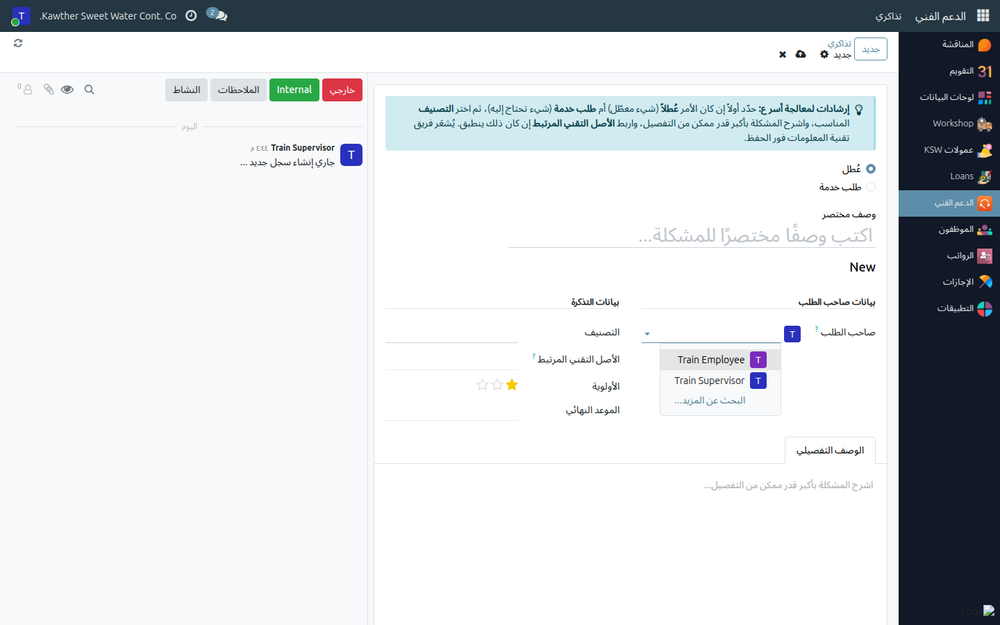
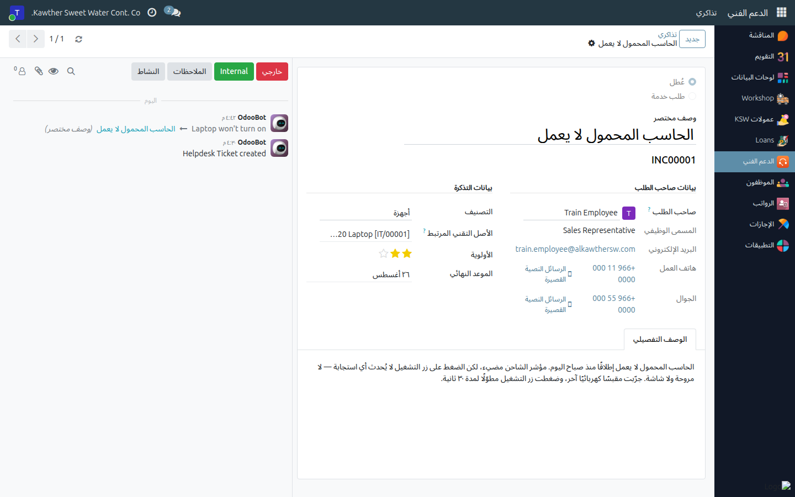

# رفع تذكرة دعم فني نيابة عن أحد موظفيك

**الفئة المستهدفة:** المشرف / أي مدير لديه موظفون مباشرون
**الوقت المقدّر:** دقيقتان

---

## ما الذي تفعله هذه الشاشة

تتيح لك رفع تذكرة دعم فني **نيابة عن موظف يتبع لك مباشرة** — غالبًا موظف
ميداني أو في الورشة لا يملك حسابًا على النظام، أو موظف تعطّل جهازه فلا يستطيع
الوصول إليه.

التذكرة تخصّه هو: يظهر اسمه وقسمه ومسماه الوظيفي وبيانات التواصل معه في قسم
**بيانات صاحب الطلب**، ليعرف فريق تقنية المعلومات بمن يتصل. وتبقى أنت منشئ
التذكرة ومتابعًا لها حتى إغلاقها.

---

## قبل أن تبدأ

- يجب أن يكون الموظف **تابعًا لك مباشرة** (حقل **المدير** في بطاقته يشير
  إليك). لا يعرض عليك النظام سوى نفسك وموظفيك المباشرين، لا أحد غيرهم.
- خذ التفاصيل منه أولًا: ما الذي يحدث، ومنذ متى، وأي جهاز.

---

## الخطوات

١. **افتح تطبيق الدعم الفني ← تذاكري** ثم اضغط **جديد**.

٢. **غيّر حقل «صاحب الطلب»** من اسمك إلى اسم الموظف.

   

   يُعاد تعبئة قسم **بيانات صاحب الطلب** تلقائيًا بمسماه الوظيفي وقسمه وبريده
   وأرقام هواتفه.

٣. **عبّئ التذكرة كالمعتاد:** النوع (عُطل أو طلب خدمة)، ووصف مختصر واضح،
   والتصنيف، والأصل التقني المرتبط إن كانت تخصّ جهازه، والأولوية، ثم الوصف
   التفصيلي.

   

٤. **احفظ.** يُشعَر فريق تقنية المعلومات مباشرة.

---

## ما الذي يحدث بعد ذلك

- تظهر التذكرة في قائمة **تذاكري** لديك ولدى الموظف، ويمكنكما متابعتها والردّ
  في صندوق الرسائل.
- يتواصل فريق تقنية المعلومات مع **صاحب الطلب** — أي الموظف — عبر البيانات
  الظاهرة في التذكرة، لا معك أنت. فتأكّد من صحة رقم هاتف العمل والجوال في
  بطاقة الموظف.
- ما عدا ذلك، تسير التذكرة تمامًا كتذاكرك الخاصة. راجع
  [رفع تذكرة دعم فني](../employee/05-raise-support-ticket.md) لشرح الحقول
  والنوعين وتقييم المعالجة عند الإغلاق.

---

## أسئلة ومشكلات شائعة

| ما تراه | السبب | المعالجة |
|---|---|---|
| اسم الموظف غير موجود في قائمة **صاحب الطلب** | ليس تابعًا لك مباشرة في النظام | اطلب من الموارد البشرية ضبط حقل **المدير** في بطاقته |
| تظهر رسالة: لا يمكنك إنشاء أو تعديل تذاكر إلا لنفسك أو لموظفيك المباشرين | السبب نفسه: خط التبعية غير مضبوط | كما سبق؛ وإلى حين ضبطه ارفع التذكرة باسمك مع بيان صاحب المشكلة في الوصف |
| قسم بيانات صاحب الطلب فارغ | بطاقة الموظف لا تحوي مسمى وظيفي أو قسمًا أو بيانات تواصل | اطلب من الموارد البشرية استكمال بطاقته |
| لا أرى تذكرة رفعها الموظف بنفسه | ترى تذاكر موظفيك المباشرين؛ تأكّد أنك مديره وليس معتمد إجازاته فقط | راجع الموارد البشرية للتأكد من حقل **المدير** |

---

## أدلة ذات صلة

- [رفع تذكرة دعم فني](../employee/05-raise-support-ticket.md) — شرح مفصّل لكل حقل
- [اعتماد طلبات الإجازة](01-approve-time-off.md)

