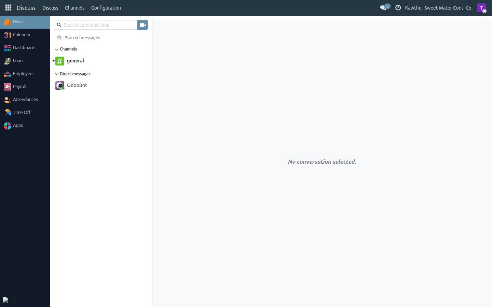
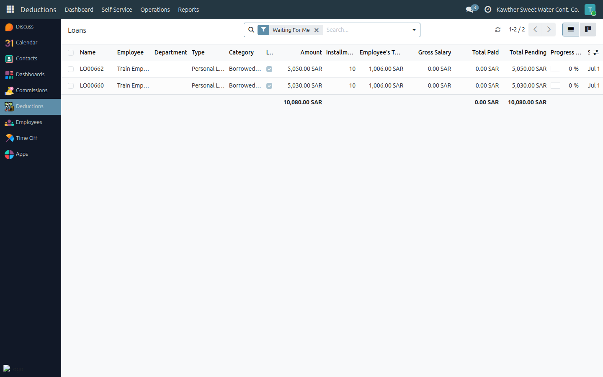

# Getting Started

**Who is this for:** Everyone — read this once before your role-specific guide.
**How long it takes:** 5 minutes

## What this does

This page covers the basics that every user needs no matter their role: how to
log in, move around the system, read your notifications, and — if you approve
requests — how to find the items waiting for *you*.

## Logging in

1. **Open the system** in your web browser at **https://alkawthersw.ddns.net**.
   (Add it to your bookmarks — this is the address you'll use every day.)
   

2. **Enter your email and password**, then click **Log in**. If you forgot your
   password, use **Reset Password** or ask HR.

3. The first thing you see is your home screen. The **apps** you can open depend
   on your role — you will only see what applies to you.

## Finding your way around

- **Top-left menu** switches between apps: **Time Off**, **Loans**, **Payroll**,
  **Commissions**, **Attendance**.
  

  > The **Loans** app is where you request and track loans. If you also manage
  > penalties or advances, this same app appears to you as **Deductions** and has
  > extra menus — that only happens when you've been granted those rights.

- Inside an app, the **breadcrumb** at the top-left shows where you are. Click
  any part of it to go back.

- **Lists** show many records; click a row to open its **form**. On a form, the
  **status bar** at the top-right shows where the record is in its workflow
  (for example *Draft → Active → Completed*).

- **Save** with the cloud/checkmark icon at the top-left, and **discard** with
  the ✗ next to it, whenever you have unsaved changes.

## Notifications (your Inbox)

Whenever something needs your attention — a request to approve, an approval you
were granted, a rejection — the system sends you a message.

1. Click the **bell / Inbox** icon at the top-right to see your messages.
   

2. Click a message to jump straight to the record it is about.

3. Important messages also arrive by **email**, so you do not have to be logged
   in to know something is waiting.

## For approvers: where to find what needs your decision

If your role includes approving requests (supervisor, HR, accounting, GM), each
type of request has one place to go:

- **Loans** — open the **Loans** app, then **Operations → Loans**. This list
  opens on **Waiting For Me**, so it already shows only the loans sitting at
  *your* step. Open one and use its green **Approve** button (or **Refuse**,
  with a reason).
  

- **Time off** — open the **Time Off** app, then **Management → Time Off**, and
  find the employee's request in the list. (See your role guide for the exact
  steps at each approval stage.)

> Tip: whenever you approve or refuse, your name and the time are recorded, and a
> refusal always needs a short reason that the requester can read.

## Switching to Arabic

The whole system is available in Arabic with a right-to-left layout.

1. Click your **user name → My Preferences** at the top-right.
2. Set **Language** to **العربية**, then save and refresh.
   

## Common issues

| Symptom | Cause | Fix |
|---|---|---|
| I don't see an app I expected | Your role doesn't include it | Ask your administrator to check your access |
| A button I was told about is missing | The record isn't at the right step, or it isn't yours | Check the status bar; confirm the record belongs to you / your team |
| I got no email notification | Email not configured for your account | Check your Inbox (bell icon); ask HR to verify your email |

## Where to next

Go to your role guide — see the table in the [manual index](../README.md).
Everyone should at least read the **Employee** guides, since every staff member
requests leave, loans, and views their own payslip.
