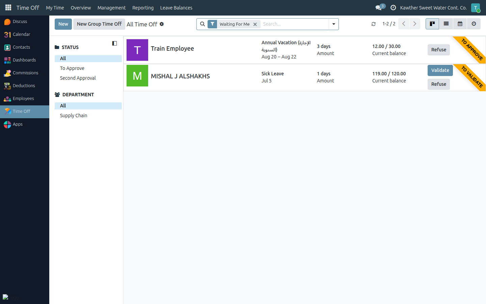
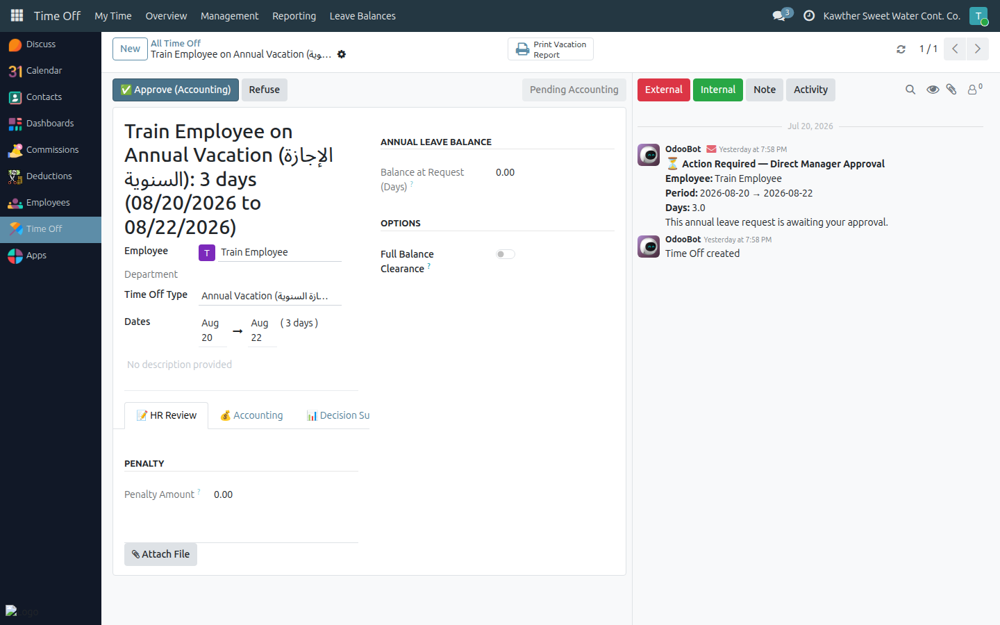

# Leave: Accounting Approval

**Who is this for:** Accounting
**How long it takes:** 2 minutes per request

## What this does

Lets you approve an **annual leave** at the **Accounting step** (step 4), where
you record the financial details tied to the vacation — remaining loans, flight
ticket, and any additional commissions to pay out.

## Before you start

- This step applies to annual (and EOS) leave, after the GM's initial review.
- Leave requests live in **Time Off → Management → Time Off**.

## Steps

1. **Open Time Off → Management → Time Off** and find the employee's request
   (it will be at **Pending Accounting**).
   

2. **Open the leave** and go to the **Accounting** tab (editable at this step).
   Fill in as applicable:
   - **Remaining loans** and description.
   - **Flight ticket** amount and description.
   - **Additional commissions** lines (label + amount each).
   

3. **Approve (Accounting).** The leave moves to the GM for final approval.

## What happens next

The leave goes to **Pending GM Final**. At the GM's final approval, a **vacation
payslip** is created from these figures. After that it returns to HR for the
signed-form confirmation.

## Common issues

| Symptom | Cause | Fix |
|---|---|---|
| Accounting tab is read-only | Leave isn't at your step | It's editable only at **Pending Accounting** |
| Figures didn't reach the payslip | Approved before entering them | Enter the amounts *before* clicking Approve |

## Related guides

- [Loan: approval & disbursement](02-loan-approval-disbursement.md)
