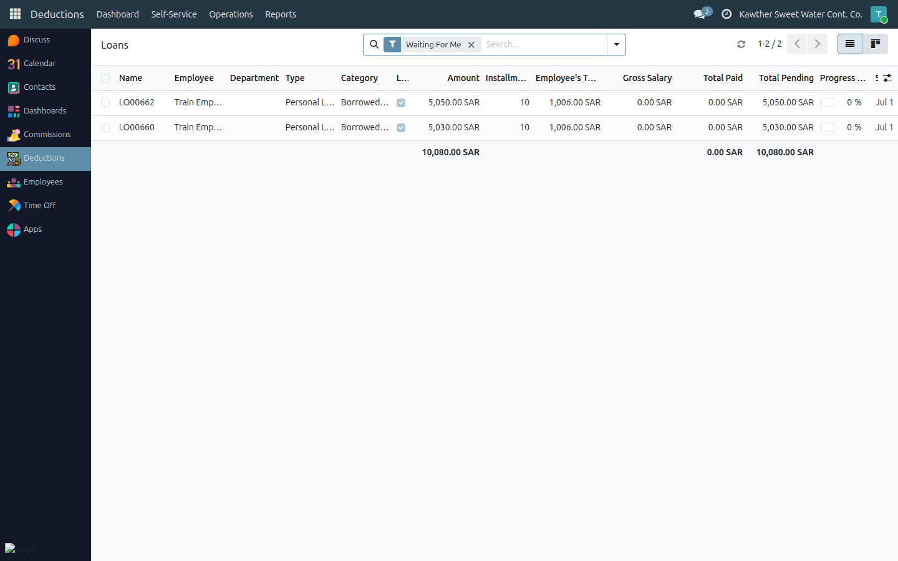
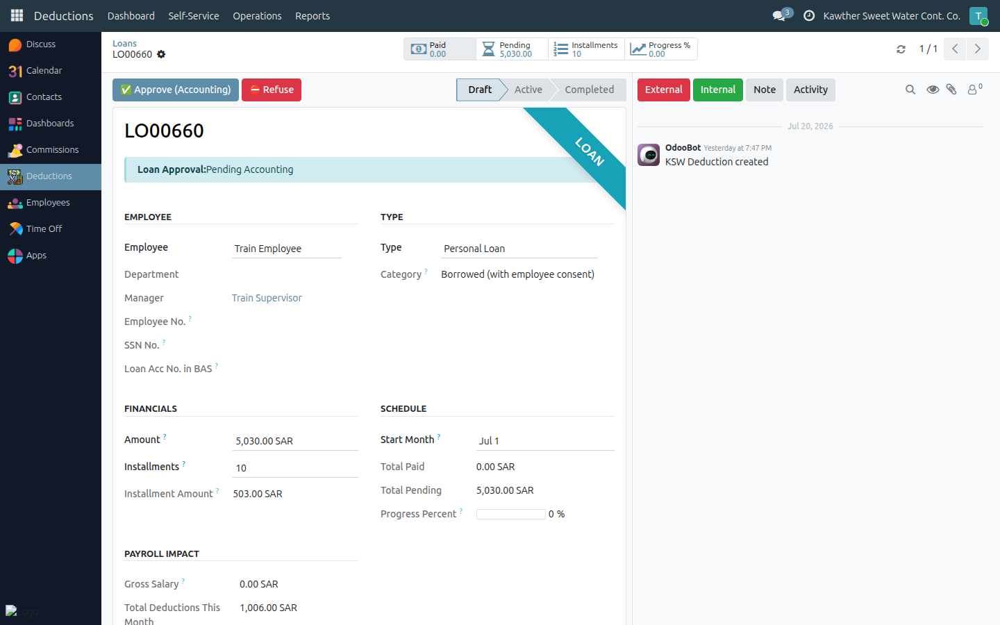
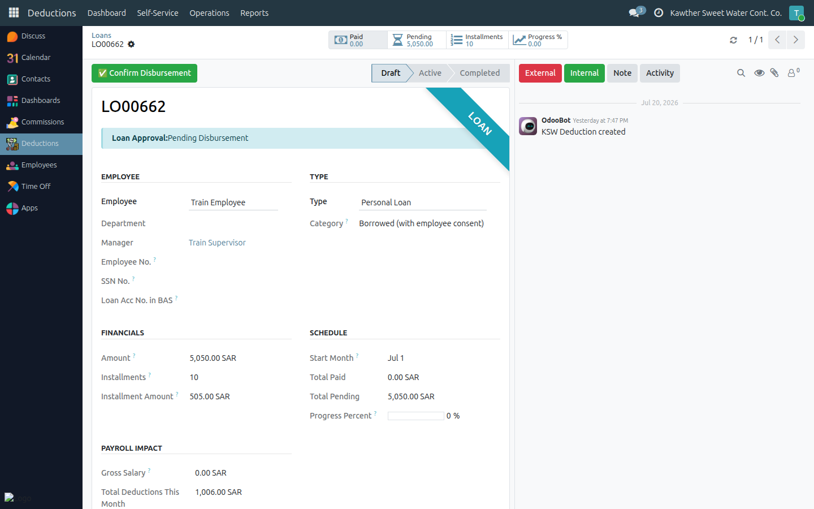

# Loan: Approval & Disbursement

**Who is this for:** Accounting
**How long it takes:** 1–2 minutes per loan

## What this does

Covers your two loan responsibilities:
1. The **Accounting approval** step (after HR, before the GM).
2. **Confirming disbursement** — the final action that activates the loan and
   starts its installments.

## Before you start

- Loans live in the **Loans** app under **Operations → Loans**; that list opens
  on **Waiting For Me**.

## Steps — Accounting approval

1. **Open the Loans app → Operations → Loans.** It opens on **Waiting For Me**.
   

2. **Open the loan**, review the amount, installments, and the employee's other
   deductions (Decision Support tab). Tick the budget confirmation if applicable.

3. Click **Approve (Accounting)** → the loan moves to **Pending GM Final**.
   (Or **Refuse** with a reason.)
   

## Steps — Confirm disbursement

After the GM's final approval, the loan arrives at **Pending Disbursement**.

1. Open the loan and click **Confirm Disbursement**.
   

2. The loan becomes **Active**. Its installments now appear on the employee's
   payslips automatically.

## What happens next

Once **Active**, each pending installment is deducted at payroll. If the employee
later pays outside payroll, that's handled by HR — see
[HR → Modify deductions & change installments](../hr/04-modify-deductions.md).

## Common issues

| Symptom | Cause | Fix |
|---|---|---|
| No **Confirm Disbursement** | Loan not yet at that step, or you lack the disbursement role | Check the state; confirm your access |
| Installments not deducting | Loan not disbursed yet | It must be **Active** first |

## Related guides

- [Create a penalty](05-create-penalties.md)
