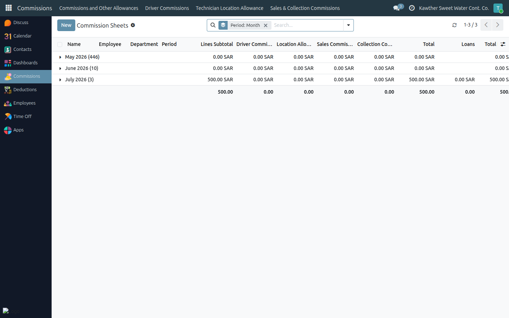
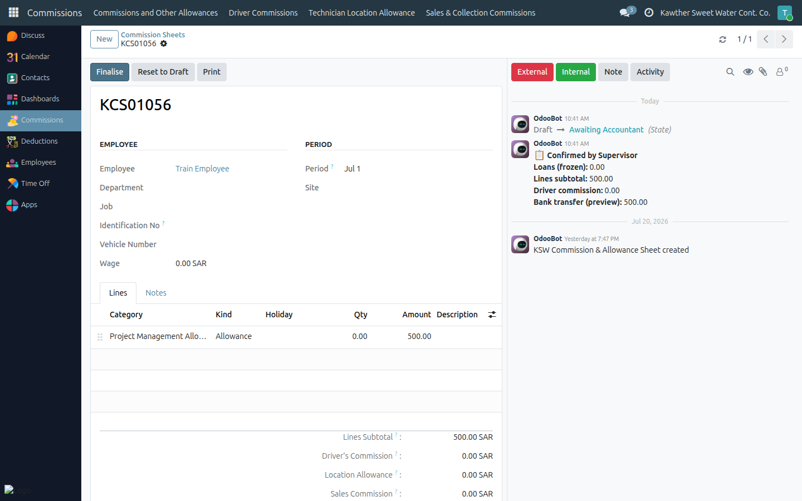
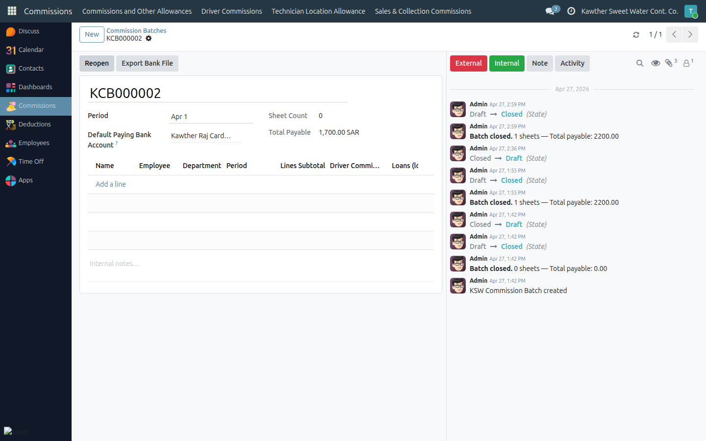

# Commissions: Finalise & Bank Export

**Who is this for:** Accounting (commission accountant)
**How long it takes:** 5 minutes per period

## What this does

Lets you take supervisor-confirmed commission sheets, **finalise** them, group
them into a **batch**, and export the **bank transfer file** for payment.

## Before you start

- Sheets must be **Confirmed** by the supervisor before you finalise them.
- You can adjust the frozen **Loans Deduction** on a confirmed sheet before
  finalising, if needed.

## Steps — Finalise a sheet

1. **Open Commissions → All Sheets** and filter to **Awaiting Accountant**
   (Confirmed) sheets.
   

2. Open a sheet, review the totals (and adjust the **Loans Deduction** if
   required), then click **Finalise**.
   

   The sheet moves to **Done**, and any manual loan-recovery lines are written
   back to the employee's loan.

## Steps — Close the batch

1. **Open Commissions → Commission Batches** and create/open a batch for the
   period; add the finalised sheets.
   

2. Click **Close Batch** to consolidate the totals.

> **The bank file itself is exported by HR, not Accounting.** Once you've closed
> the batch, HR runs the export and uploads it to the bank — see
> [Payroll → Bank file export](../payroll/03-bank-file-export.md). Your job ends
> at a closed, reconciled batch.

## What happens next

HR exports the bank file from the closed batch and uploads it to pay the
commissions. The **Bank Transfer Amount** per employee = Gross Total − Loans
Deduction.

## Common issues

| Symptom | Cause | Fix |
|---|---|---|
| Can't finalise a sheet | It's still Draft | The supervisor must **Confirm** it first |
| Sheet not in the batch | Not finalised (Done) | Finalise it before adding to the batch |
| HR can't export | Batch not closed | Close the batch first, then hand off to HR |

## Related guides

- Supervisor: [Commission sheets](../supervisor/04-commission-sheets.md)
- Payroll: [Bank file export](../payroll/03-bank-file-export.md)
