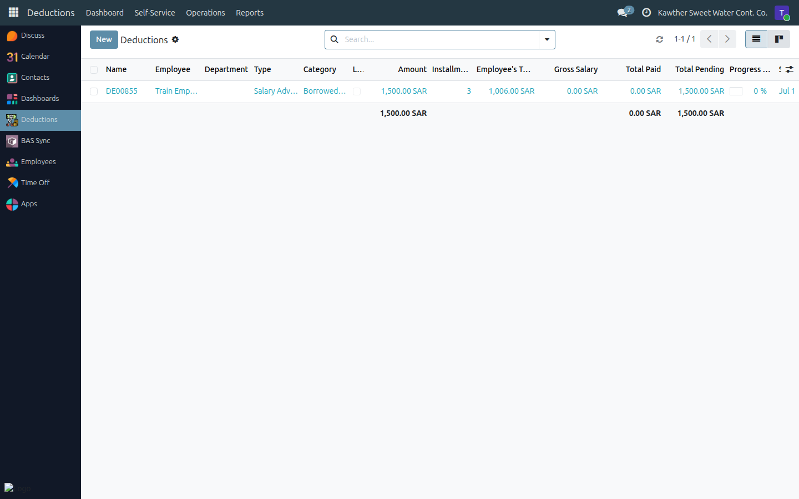

# Creating a Penalty (Government / Internal)

**Who is this for:** Accounting
**How long it takes:** 2 minutes

## What this does

Lets you record a **penalty** against an employee — a **Government Penalty**
(e.g. a traffic or labour fine the company paid on their behalf) or an
**Internal Penalty** (a disciplinary deduction). The amount is recovered from
the employee's salary. Penalties do **not** go through the loan approval chain.

> **Who creates what:** Accounting creates **penalties**. **Salary advances**
> are created by HR — see [HR → Create a salary advance](../hr/03-create-deductions.md).
> **Installment changes** on any deduction are handled by HR.

## Before you start

- Know the **employee**, the **penalty type** (Government / Internal), the
  **amount**, and the number of **installments** (usually one).

## Steps

1. **Open the deductions list** (Government/Internal penalties appear in your
   deductions menu).
   

2. **Create a new record.** Choose the **employee** and the type
   (**Government Penalty** or **Internal Penalty**).

3. **Enter the amount and installments**, then **Submit**. The penalty becomes
   active and is deducted on the employee's next payslip(s).

## What happens next

The penalty is **Active** and appears on the employee's payslip under
**Total Deductions**. If a schedule needs adjusting later, or an installment
needs marking paid, that's handled by **HR** — see
[HR → Modify deductions & change installments](../hr/04-modify-deductions.md).

## Common issues

| Symptom | Cause | Fix |
|---|---|---|
| I don't see the penalty types | Missing access | Ask an administrator to grant penalty rights |
| It's not deducting | Still in Draft | Click **Submit** so it becomes Active |

## Related guides

- [Loan: approval & disbursement](02-loan-approval-disbursement.md)
