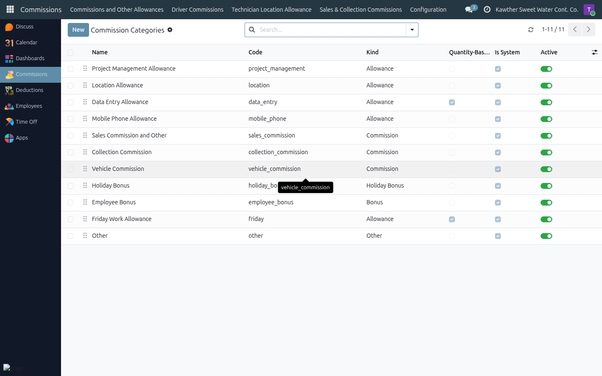
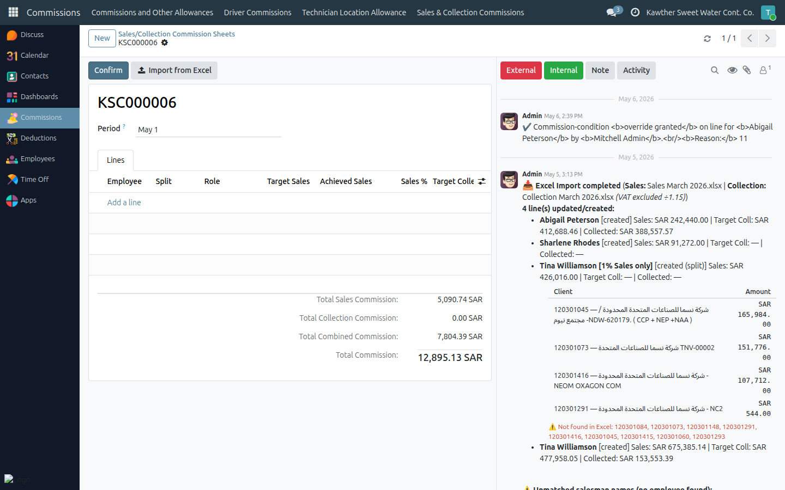

# Commissions Administration

**Who is this for:** Commission Admin (and Sales Commission Manager)
**How long it takes:** varies

## What this does

Lets you configure the building blocks the commission sheets rely on:
categories, work sites/trip tiers, sales & collection rules, and salesperson
profiles. Sales managers can additionally override a commission condition on an
individual sales line.

## Before you start

- These are **configuration** items — changes affect every future commission
  sheet. Change them deliberately.

## Steps — Configure the catalog

1. **Open Commissions → Configuration.** From here you manage:
   - **Commission Categories** — the allowance/commission types supervisors pick
     on a sheet line.
   - **Work Sites** — sites and their trip tiers (for location/driver
     allowances).
   - **Sales / Collection Commission Rules** — thresholds and conditions.
   

2. Add or edit an item and save. It becomes available on new sheets.

## Steps — Salesperson profiles

1. **Open Commissions → Sales & Collection → Salespeople** to maintain each
   salesperson's profile used by the sales/collection commission rules.

## Steps — Override a sales-line condition (Sales Manager)

1. On a sales/collection commission line that falls below the rule threshold,
   use the override to **grant** the commission anyway. The override is recorded
   with an audit trail.
   

## What happens next

New categories/sites/rules appear on the next commission sheets supervisors
create. Existing confirmed sheets are unaffected.

## Common issues

| Symptom | Cause | Fix |
|---|---|---|
| A supervisor can't find a category | Not added to the catalog | Add it under **Commission Categories** |
| Override option missing | You're not a sales commission manager | It's restricted to that role |

## Related guides

- Supervisor: [Commission sheets](../supervisor/04-commission-sheets.md)
- Accounting: [Commissions: finalise & batch](../accounting/04-commission-finalise-batch.md)
