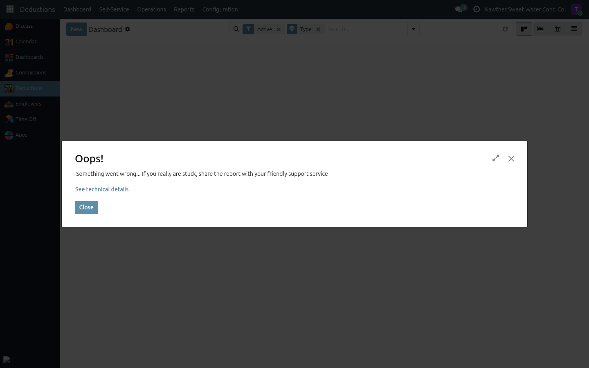
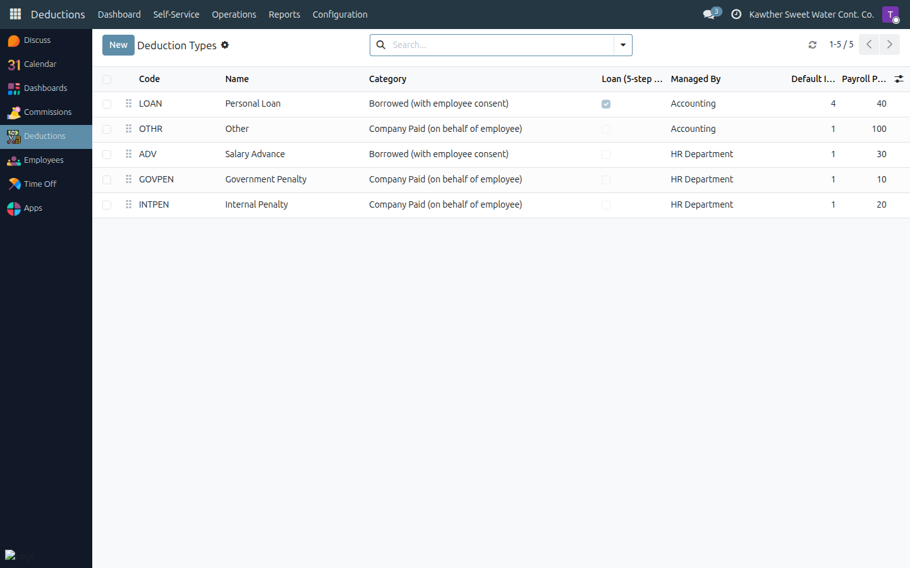

# Deductions Administration

**Who is this for:** Deduction Officer / Deduction Manager
**How long it takes:** varies

## What this does

Lets you oversee **all** deductions across the company from a single dashboard,
create any deduction type, and (as a manager) configure the deduction-type
catalog. Managers can also edit or delete loans **before** they're confirmed.

## Before you start

- Officers see and manage all deductions (loans + HR-managed). Managers add the
  ability to configure types and delete records.

## Steps — Oversee deductions

1. **Open Deductions → Dashboard** for a company-wide view (by state, type,
   department) with kanban, graph, and pivot.
   

2. **Open Deductions → All Deductions** to browse or create any deduction, or
   use the **Reports** (By Employee / Department / Type / Installment Schedule)
   to analyse the portfolio.

## Steps — Configure deduction types (Manager)

1. **Open Deductions → Configuration → Deduction Types.**
   

2. Review or edit a type's key settings:
   - **Is Loan** — whether it uses the full 4-step approval chain.
   - **Managed By** — HR or Accounting (who can close installments outside
     payroll).
   - **Default installments** and **priority**.

3. Save. New/edited types are available when creating deductions.

## Steps — Edit or delete a loan before confirmation (Manager)

1. Open a loan that is still **pre-confirmation** (before disbursement).
2. Adjust the amount/installments, or delete the record if it has no paid
   installments. (Once active/confirmed, use the Accounting payment tools
   instead.)

## What happens next

Config changes take effect immediately for new records. Existing active
deductions keep their original schedule.

## Common issues

| Symptom | Cause | Fix |
|---|---|---|
| I can't see the Configuration menu | You're an officer, not a manager | Type configuration is a manager privilege |
| Can't delete a loan | It has paid installments / is active | Deletion is limited once payments exist |

## Related guides

- HR: [Create a deduction](../hr/03-create-deductions.md)
- HR: [Modify deductions & change installments](../hr/04-modify-deductions.md)
