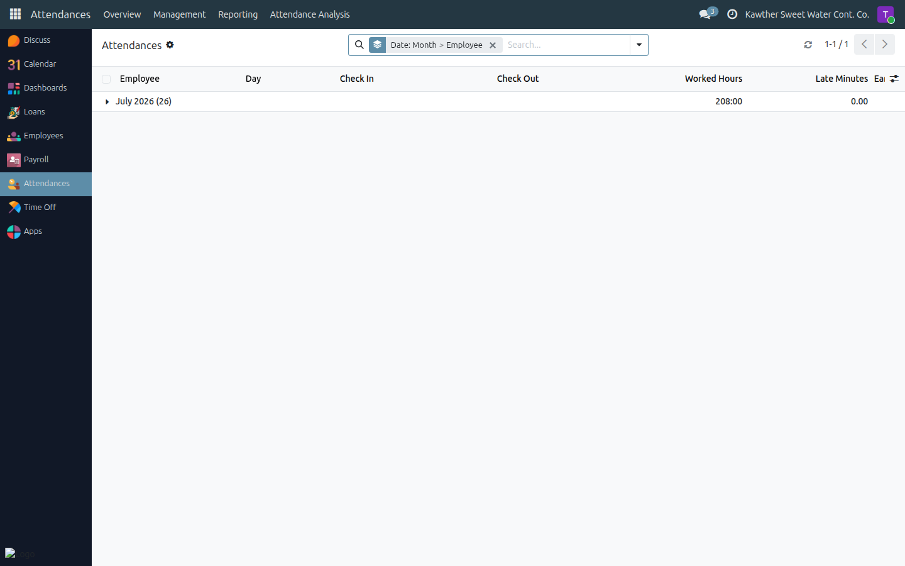
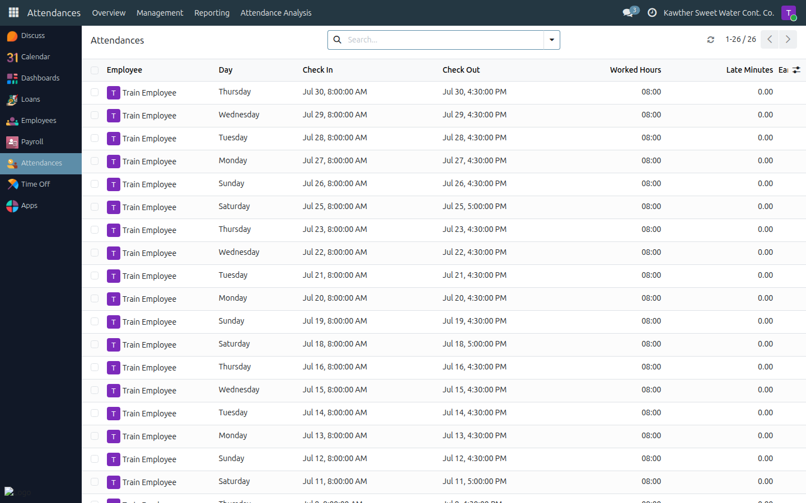

# Viewing My Attendance

**Who is this for:** Employee
**How long it takes:** 1 minute

## What this does

Lets you see your own attendance records — the days and hours you were present,
and whether you were late or left early.

## Before you start

- You can only see **your own** attendance.

## Steps

1. **Open the Attendances app** from the menu. You'll see your own attendance
   records, most recent first.
   

2. **Read your records** — each row shows the **day**, **check-in** and
   **check-out** times, **worked hours**, and any **late** or **early** minutes.
   Colour highlights make it easy to scan: green for a normal day, and a
   highlight on days where you were late or left early.
   

## What happens next

This view is read-only. If a record looks wrong (a day missing, or wrong
times), contact **HR** — they can check the device records and correct them.

## Common issues

| Symptom | Cause | Fix |
|---|---|---|
| A record looks wrong | Device or timing issue | Contact HR to check and correct it |
| A day I was on leave still shows | Coverage applies once the leave is approved | Track your leave in **Time Off** |

## Related guides

- [Request time off](02-request-time-off.md)
