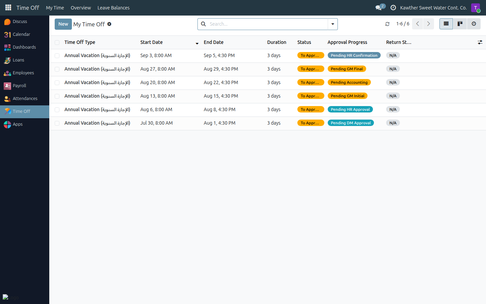
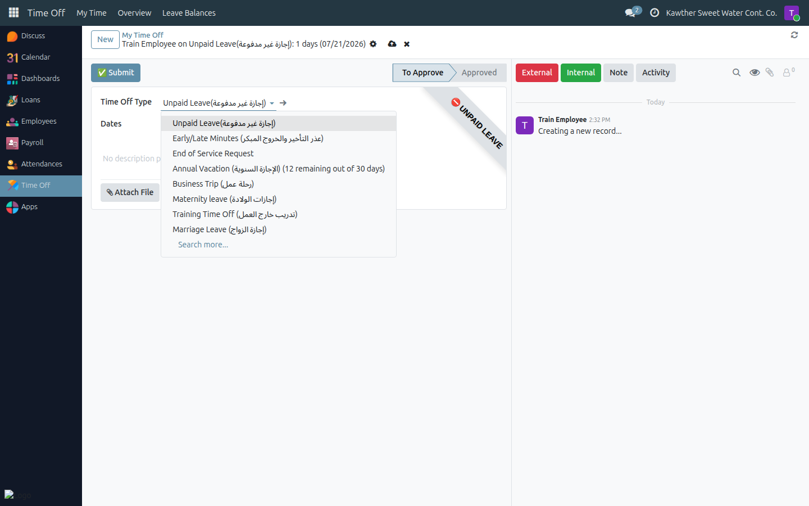
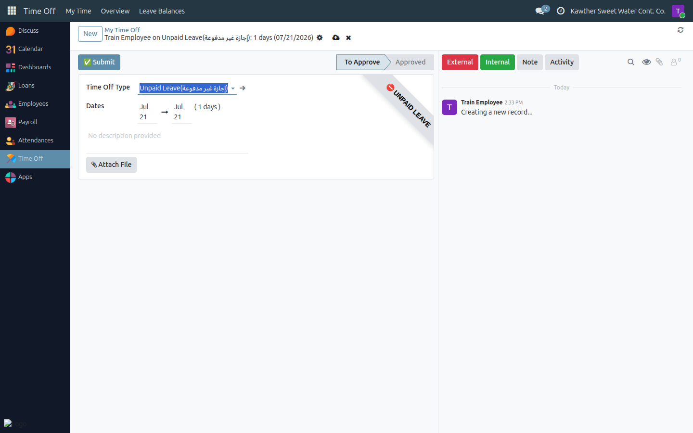

# Requesting Time Off

**Who is this for:** Employee (requesting for yourself)
**How long it takes:** 2–3 minutes

## What this does

Lets you request a leave — annual vacation, sick, unpaid, or another type — and
sends it through the approval chain. You can watch its progress the whole way.

## Before you start

- Know your **dates** (leave is counted in **calendar days, including weekends
  and holidays**).
- For **annual** leave, know your balance. If you want to take more days than
  your balance, decide whether to take the extra days **unpaid**.

## Steps

1. **Open Time Off.** From the main menu choose **Time Off → My Time Off → New**.
   

2. **Pick the leave type** — for example *Annual Vacation*, *Sick Leave*, or
   *Unpaid Leave*. The form adjusts to the type you choose.
   

3. **Choose your dates** (From / To). The number of days is calculated for you.

4. **(Annual leave only) Choose how to handle your balance**, if relevant:
   - **Full Balance Clearance** — use up your entire remaining balance.
   - **Accept Excess as Unpaid** — if you asked for more days than you have,
     the extra days are taken as unpaid instead of blocking the request.

5. **Submit.** Click **Submit**, then **Save**.
   

## What happens next

Your request moves to **Pending DM Approval** and your **direct manager** is
notified. From there, the path depends on the leave type:

- **Annual leave** follows a 6-step chain:
  **Direct Manager → HR → GM (initial) → Accounting → GM (final) → HR confirms
  the signed form**. You can follow each step on the status bar.
- **Sick / casual / other leaves** follow a 2-step chain:
  **Direct Manager → HR**.
- **Unpaid leave** follows a 2-step chain: **Direct Manager → HR**.

You are notified at each approval, and again if the request is **refused**
(with the reason). A refused request can be edited and re-submitted — open it
and use **Reset to Draft**.

To check status any time: **Time Off → My Time Off**, and read the
**Approval Progress** badge, or open the request and look at the status bar.

> **Coming back from annual leave?** You don't confirm your own return — your
> **direct manager** records it for you once you're back at work. If your next
> payslip is delayed, it may be waiting on that confirmation; remind your
> manager.

## Common issues

| Symptom | Cause | Fix |
|---|---|---|
| "Submit" button is missing | Already submitted | Check the status bar — it's already past Draft |
| My request was refused | An approver declined it | Open it, read the reason in the chatter, fix it, then **Reset to Draft** and re-submit |
| I can't pick more days than my balance | Annual balance too low | Enable **Accept Excess as Unpaid** to take the extra days unpaid |
| My manager can't see it | No direct manager set on your record | Ask HR to set your manager; meanwhile HR can approve the first step |

## Related guides

- [View my attendance](01-view-attendance.md)
- [Getting Started](../00-getting-started.md)
