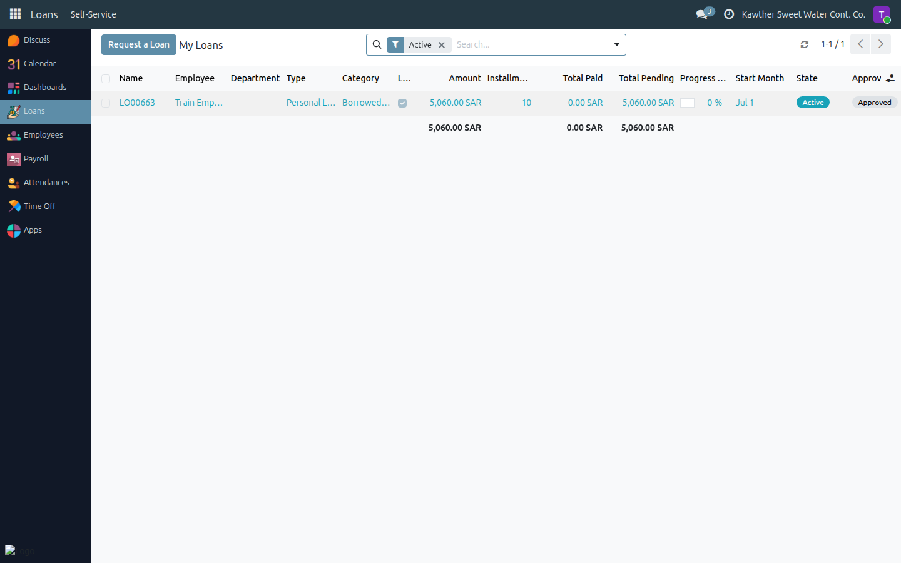
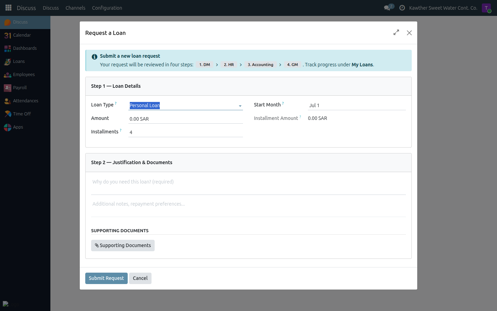

# Requesting a Loan

**Who is this for:** Employee (requesting for yourself)
**How long it takes:** 3–5 minutes

## What this does

Lets you apply for a personal loan that is repaid automatically in monthly
installments deducted from your salary. You fill in one form, attach any
supporting documents, and the request goes through four approval steps before
the money is disbursed.

## Before you start

- Decide the **amount** and how many **monthly installments** you want. The
  system shows the resulting monthly payment as you type.
- Have a clear **reason** ready (required) and any **documents** to attach.

## Steps

1. **Open your loans.** Open the **Loans** app, then **Self-Service → My Loans**.
   

2. **Start a request.** Click **Request a Loan** (top-right of the list — it is
   always visible).
   

3. **Fill in the loan details** — Type, Amount, number of Installments, and the
   Start Month. The **monthly installment** is calculated for you.
   

4. **Add your justification** — a **Reason** (required), an optional description,
   and any **attachments** (e.g. a quotation or supporting letter).

5. **Review the summary** at the bottom (amount, duration, approximate monthly
   payment, start date), then click **Submit Request**.
   

## What happens next

Your loan moves to **Pending DM Approval** and follows this chain:

**Direct Manager → HR → Accounting → GM (final) → Disbursement**

- After the **GM's final approval**, you receive a notification that your loan
  is **approved and ready for disbursement**. Go and **collect the funds** from
  the finance/disbursement officer.
- Once they hand over the money and click **Confirm Disbursement**, the loan
  becomes **Active** and its installments start being deducted from your
  payslips. (Practically: you receive the money first, and the officer confirms
  it in the system afterwards.)
- If any approver **refuses** the request, you are notified with the reason. The
  loan shows a red refusal banner; open it and use **Reset to Draft** to adjust
  and re-submit.

> You can also check your loan's progress any time in
> **Loans → Self-Service → My Loans**.

**Tracking your loan:** in **Loans → Self-Service → My Loans** you can see the approval
state, and once active, the **Total Paid / Total Pending** and a progress bar.
Open the loan and check the **Installments** tab for the full repayment schedule.

## Common issues

| Symptom | Cause | Fix |
|---|---|---|
| I don't see "Request a Loan" | You're not on the My Loans list | Go to **Loans → Self-Service → My Loans**; the button is at the top-right |
| Submit is disabled | A required field is empty | Fill the **Reason**; check Amount and Installments are set |
| My loan was refused | An approver declined it | Read the reason on the loan, then **Reset to Draft**, fix it, and re-submit |
| Installments haven't started | Loan not yet disbursed | It becomes Active only after **Confirm Disbursement** — check the status bar |

## Related guides

- [View my payslip](04-view-payslip.md) — where you'll see loan deductions
- [Getting Started](../00-getting-started.md)
